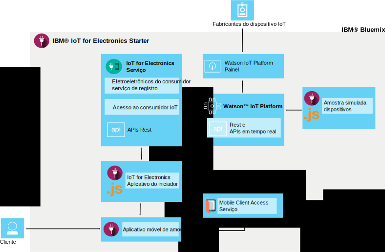

---

copyright:
  years: 2016

---

{:new_window: target="_blank"}
{:shortdesc: .shortdesc}

# Sobre o {{site.data.keyword.iotelectronics}}
{: #iotelectronics_about}
*Última atualização: 11 de junho de 2016*

{{site.data.keyword.iotelectronics_full}} é uma instância de produção IoT totalmente integrada que permite que os aplicativos
se comuniquem e consumam dados coletados por seus dispositivos, sensores e gateways conectados.
{:shortdesc}

O {{site.data.keyword.iotelectronics}} usa o serviço {{site.data.keyword.iot_full}} para conectar os dispositivos eletrônicos
inteligentes aos dispositivos que desenvolver. Ele
também usa o {{site.data.keyword.iot_full}} para ajudar a analisar e entender os dados dos seus dispositivos. É possível estabelecer
regras para identificar condições que precisem de atenção e definam respostas automatizadas, como enviar e-mail, executar um fluxo de trabalho Node-RED ou conectar a serviços da web.  

## Localizando o iniciador

É possível localizar o iniciador {{site.data.keyword.iotelectronics}}
na [Seção Modelos](https://console.{DomainName}/catalog/starters/iot-for-electronics-starter/)
do catálogo {{site.data.keyword.Bluemix_notm}}.  

## O que é Possível Executar com o {{site.data.keyword.iotelectronics}}
{: #Features_iote}
Explore rapidamente os recursos da solução {{site.data.keyword.iotelectronics}} usando dispositivos e dados simulados.

### Conectar dispositivos simulados
Crie dispositivos simulados e conecte-os à plataforma para ver os dados em transmissão em tempo real. Use um aplicativo baseado na web para
simular como um dispositivo recebe comandos e executa operações. Simule falhas para gerar avisos e alertas.

### Tentar um aplicativo móvel do consumidor de amostra
Use um telefone iOS para ver como um proprietário de dispositivo pode interagir com o dispositivo. Envie comandos para o dispositivo e
receba atualizações do dispositivo usando a plataforma e {{site.data.keyword.Bluemix_notm}}. Simule eventos de falha e visualize os
resultados no aplicativo móvel.

### Conectar seus próprios dispositivos eletrônicos
Conecte seus próprios dispositivos com segurança à nuvem e comece a customizar seus próprios aplicativos. Um conjunto de exemplos e
orientações verificados está disponível e pode ser modificado e usado para provas de conceito, teste e experimentação.

## O que há no iniciador {{site.data.keyword.iotelectronics}}
{: #whatsInStarter}
O modelo do iniciador implementa a solução integrada do {{site.data.keyword.iotelectronics}}.
Todos os componentes são ligados e implementados automaticamente para você. O aplicativo do iniciador permite explorar rapidamente os recursos da
solução usando dispositivos e dados simulados. O aplicativo móvel de amostra mostra como um consumidor pode registrar, receber alertas e controlar
um dispositivo conectado. É possível usar as amostras como pontos de início para criar seus próprios aplicativos e coletar dados de seus próprios
dispositivos. Os serviços e aplicativos a seguir são incluídos na solução:

**O serviço {{site.data.keyword.iotelectronics}}** suporta o registro e notificações do usuário e do
dispositivo.

**{{site.data.keyword.iot_full}}** permite que seus aplicativos se comuniquem e usem dados coletados por seus
dispositivos, sensores e gateways conectados.

<!-- **{{site.data.keyword.iotrtinsights_full}}** enables you to enrich and monitor data from your devices, visualize what's happening now, and respond to emerging conditions by using automated actions. -->

**{{site.data.keyword.amafull}}** permite que os usuários de aplicativos móveis efetuem login usando contas
sociais existentes e assegura que as comunicações com os sistemas backend sejam seguras.

**{{site.data.keyword.sdk4nodefull}}** permite desenvolver, implementar e ajustar a escala de aplicativos
JavaScript&reg; do lado do servidor e fornece desempenho, segurança e capacidade de manutenção aprimorados.

**Aplicativo móvel de amostra** permite visualizar o status e se comunicar com um dispositivo simulado usando seu telefone iOS. Descubra
como obter o aplicativo móvel [aqui](iotelectronics_config_mobile.html).

# Links Relacionados
{: #rellinks}
## Componentes
{: #general}
* [{{site.data.keyword.iot_short}}](https://new-console.ng.bluemix.net/docs/services/IoT/index.html#gettingstartedtemplate)
* [{{site.data.keyword.iotrtinsights_short}}](https://new-console.ng.bluemix.net/docs/services/iotrtinsights/index.html)   
* [{{site.data.keyword.amafull}}](https://new-console.ng.bluemix.net/docs/services/mobileaccess/index.html)
* [{{site.data.keyword.sdk4nodefull}}](https://new-console.ng.bluemix.net/docs/runtimes/nodejs/index.html#nodejs_runtime)

## Documentação da API
{: #api}
*  [{{site.data.keyword.iotelectronics}}](http://ibmiotforelectronics.mybluemix.net/public/iot4eregistrationapi.html)  
* [{{site.data.keyword.iotrtinsights_short}}](https://iotrti-prod.mam.ibmserviceengage.com/apidoc/)
* [{{site.data.keyword.iot_short}}](https://developer.ibm.com/iotfoundation/recipes/api-documentation/)
