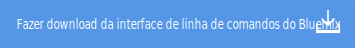
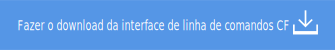

---

 

copyright:

  years: 2015, 2016

 

---

{:new_window: target="_blank"}
{:shortdesc: .shortdesc}
{:prereq: .prereq}
{:download: .download}
{:pre: .pre}
{:app_name: data-hd-keyref="app_name"}
{:app_key: data-hd-keyref="app_key"}
{:app_secret: data-hd-keyref="app_secret"}
{:app_url: data-hd-keyref="app_url"}
{:host: data-hd-keyref="host"}
{:org_name: data-hd-keyref="org_name"}
{:route: data-hd-keyref="route"}
{:space_name: data-hd-keyref="space_name"}
{:service_name: data-hd-keyref="service_name"}
{:service_instance_name: data-hd-keyref="service_instance_name"}
{:user_ID: data-hd-keyref="user_ID"}

# Implementando seu app com a interface da linha de comandos
*Última atualização: 24 de fevereiro de 2016*

É possível usar a interface da linha de comandos para implementar e modificar aplicativos e instâncias de serviço.
{:shortdesc}

Antes de iniciar, instale as interfaces da linha de comandos do {{site.data.keyword.Bluemix}} e do Cloud Foundry.

  

**Restrição:** as ferramentas de linha de comandos não são suportadas por Cygwin. Use as ferramentas em uma janela de linha de comandos diferente da janela de linha de comandos do Cygwin.
{:prereq}

Após as interfaces de linha de comandos serem instaladas, será possível iniciar:

  1. {: download} Faça o download de seu código de início. 
      
    
  
  2. Extraia o pacote em um novo diretório para configurar seu
ambiente de desenvolvimento.
  3. Alter para o seu novo diretório.
  
  <pre class="pre">cd <var class="keyword varname">your_new_directory</var></pre>
  
   4.  Faça mudanças no código de seu app conforme necessário. Sugerimos verificar se o app executa localmente antes de implementá-lo de volta no {{site.data.keyword.Bluemix}}.  Um arquivo que é necessário observar é o `manifest.yml`. Ao implementar seu app de volta no {{site.data.keyword.Bluemix}}, esse arquivo será usado para determinar a URL de seu aplicativo, a alocação de memória, o número de instâncias e outros parâmetros essenciais. É possível [ler mais sobre o arquivo manifest](https://docs.cloudfoundry.org/devguide/deploy-apps/manifest.html){: new_window} na documentação do Cloud Foundry.
  
  5. Conecte-se ao {{site.data.keyword.Bluemix}}.
  
  <pre class="pre">bluemix api https://api.DomainName</pre>
  
  6. Efetue login no {{site.data.keyword.Bluemix_notm}}.
 
  <pre class="pre">bluemix login -u <var class="keyword varname" data-hd-keyref="user_ID">username</var> -o <var class="keyword varname" data-hd-keyref="org_name">org_name</var> -s <var class="keyword varname" data-hd-keyref="space_name">space_name</var></pre>
  
  7. Implemente seu aplicativo no {{site.data.keyword.Bluemix_notm}}. Para obter mais informações sobre o comando cf push, consulte [Fazendo upload de seu aplicativo](./upload_app.html).
  
  <pre class="pre">cf push <var class="keyword varname" data-hd-keyref="app_name">app_name</var></pre>
  
  8. Acesse o app inserindo a URL a seguir no
navegador:
  
  <pre class="codeblock"><code><var class="keyword varname" data-hd-keyref="host">host</var>.AppDomainName</code></pre>
