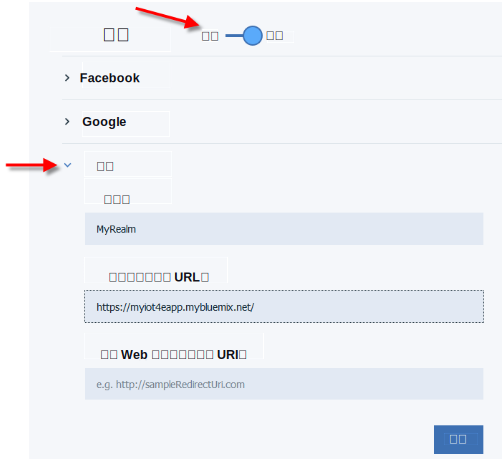
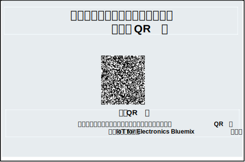
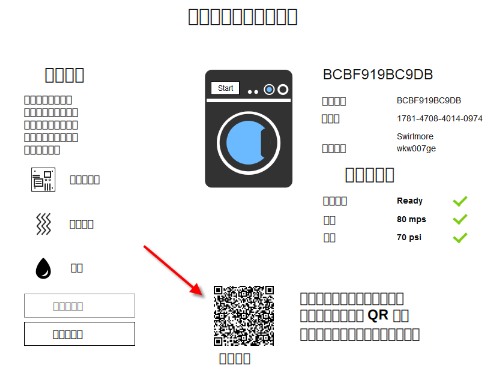

---

copyright:
  years: 2016

---

<!-- Common attributes used in the template are defined as follows: -->
{:new_window: target="_blank"}
{:shortdesc: .shortdesc}
{:screen:.screen}
{:codeblock:.codeblock}

# 使用移动应用程序
{: #iot4e_using_mobile}
*上次更新时间：2016 年 6 月 14 日*

开始使用 {{site.data.keyword.iotelectronics_full}} 移动应用程序，以查看您可以如何接收警报、发送命令，以及检查已连接设备的状态。
{:shortdesc}

完成以下任务：
1. [下载移动应用](#iot4e_downloadmobile)
2. [配置 {{site.data.keyword.amafull}}](#iot4e_configureMCA)
3. [将移动设备连接到 {{site.data.keyword.iotelectronics}} 环境](#iot4e_connecting_mobile)
4. [在移动设备上注册并控制设备](#iot4e_adding_appliance)

 ## 下载移动应用程序
 {: #iot4e_downloadmobile}
要获取移动应用程序，可从 Apple App Store 下载并安装到您的手机上。在您的手机上，打开 App Store，并搜索“ibm iot”。选择 **IBM IoT for Electronics** 并安装。

 或者，您也可以使用 [iTunes](https://itunes.apple.com/us/app/ibm-iot-for-electronics/id1103404928?ls=1&mt=8)，将其安装到您的手机上。

## 配置 {{site.data.keyword.amashort}}
{: #iot4e_configureMCA}

您必须先配置 {{site.data.keyword.amafull}}，才能连接移动应用程序。  

  1. 在 {{site.data.keyword.iotelectronics}} 的**连接**选项卡上，打开 {{site.data.keyword.amashort}} 应用程序。（您还可以从 {{site.data.keyword.Bluemix_notm}} 仪表板访问应用程序。）  

    

  2. 在**定制**部分中，单击**配置**。

     

  3. 输入下列认证凭证：
    - **域名**：输入 **myRealm**。
    - **URL**：以下列格式输入 URL，以识别 {{site.data.keyword.iotelectronics}} Starter 应用程序：**https://<*myIoT4eStarterApp*>.mybluemix.net**  

      **提示：**确保在 URL 中使用安全的 `https://` 前缀。您可以单击**移动选项**，查找入门模板应用程序的 URL。

    

  4. 保存。

## 将移动应用程序连接到 {{site.data.keyword.iotelectronics}} 环境
{: #iot4e_connecting_mobile}

要查看移动应用程序上的模拟设备，您必须将移动应用程序连接到 {{site.data.keyword.iotelectronics}} Bluemix 环境。

要连接移动应用程序，请遵循下列步骤：

  1. 在您的计算机上，启动 {{site.data.keyword.iotelectronics}} 应用程序，然后单击**查看应用程序**，以显示入门模板应用程序。  

    
  2. 选择**远程控制连接的设备**。

  

  3. 创建一个或多个洗衣机。只有创建洗衣机后，移动应用程序才能进行连接。

  4.	滚动到“连接 QR 码”，并使用移动设备对其进行扫描。“连接 QR 码”位于`要将应用程序连接到环境，您需要扫描此 QR 码`部分。

  

  5. 输入登录凭证。用户标识和密码可为任意长度。请记住您的登录凭证，以供未来会话使用。  

## 在移动设备上注册并控制设备
{: #iot4e_adding_appliance}

要查看设备状态并接收通知，您必须使用移动应用程序注册设备。

要注册设备，请完成下列步骤：

  1. 在您的计算机上，滚动到模拟洗衣机，然后单击它，以显示其数据和设备 QR 码。

  3.	使用移动设备，扫描洗衣机的 QR 码，以在手机上注册洗衣机。您将在手机上看到洗衣机的状态。

  4. 在您的计算机上，选择洗衣机的问题，如主板故障或振动剧烈。该问题会向您的手机发送警报。
