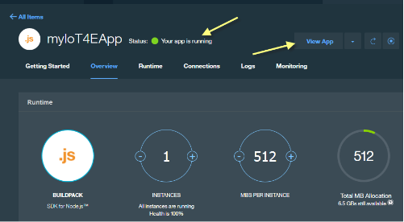

---

copyright:
  years: 2016

---

{:new_window: target="\_blank"}

{:shortdesc: .shortdesc}

# 使用入門範本應用程式
*前次更新：2016 年 9 月 15 日*
{: .last-updated}

在 {{site.data.keyword.iotelectronics_full}} 入門範本應用程式中建立模擬應用裝置。體驗企業製造商如何監視連接至 {{site.data.keyword.iot_short_notm}} 的應用裝置。手動與模擬應用裝置互動，以觸發警示、通知及動作。
{:shortdesc}

## 開啟入門範本應用程式
{: #iot4e_openAppMain}

因為根據使用的 {{site.data.keyword.Bluemix_notm}} 主控台版本，開啟入門範本應用程式的方法會略為不同，所以您應該閱讀適當版本的指示。

尋找下列選項，即可判定您正在使用的版本：
  - [全新 {{site.data.keyword.Bluemix_notm}}](#iot4e_openApp)。如果您使用的是「全新 {{site.data.keyword.Bluemix_notm}}」體驗，則*不* 會在標頭區段中顯示**試用新的 Bluemix**。
  - [一般 {{site.data.keyword.Bluemix_notm}}](#iot4e_openApp_c)。如果您使用的是「一般 {{site.data.keyword.Bluemix_notm}}」體驗，則**試用新的 Bluemix**會出現在標題區段中。  

**提示：**若要切換至「一般 {{site.data.keyword.Bluemix_notm}}」體驗，請按一下您在標頭區段中的使用者名稱，並向下捲動，然後按一下**切換至一般**。若要切換至「全新 {{site.data.keyword.Bluemix_notm}}」體驗，請按一下標頭區段中的**試用新的 Bluemix**。

### 在全新 {{site.data.keyword.Bluemix_notm}} 體驗中開啟入門範本應用程式。
{: #iot4e_openApp}
1. 在 {{site.data.keyword.Bluemix_notm}} 儀表板中，按一下入門範本應用程式磚，以啟動 {{site.data.keyword.iotelectronics}} 入門範本應用程式。

    

2. 等待標頭中出現*您的應用程式正在執行中* 狀態訊息，然後按一下**檢視應用程式**以顯示入門範本應用程式。  

    

### 在一般 {{site.data.keyword.Bluemix_notm}} 體驗中開啟入門範本應用程式。
{: #iot4e_openApp_c}

1. 在 {{site.data.keyword.Bluemix_notm}} 儀表板中，按一下入門範本應用程式磚，以啟動 {{site.data.keyword.iotelectronics}} 入門範本應用程式。

    

2. 等待「應用程式性能」區段中出現*您的應用程式正在執行中* 狀態訊息，然後在主視窗中，依應用程式名稱按一下**路徑** URL，以顯示入門範本應用程式。  

    

## 建立模擬應用裝置
{: #iot4eCreateAppliances}

在入門範本應用程式中，您可以使用應用裝置製造商或消費者身分來建立及控制模擬應用裝置。會儲存這些模擬應用裝置的狀態及事件資料，而且可以在 {{site.data.keyword.iot_full}} 中進行檢視。

1. 選取下列其中一個選項：
    - 以應用裝置製造商身分**連接及管理模擬應用裝置**，來建立模擬應用裝置
    - 以應用裝置擁有者身分**遠端控制已連接應用裝置**，來建立模擬應用裝置以及與[範例行動應用程式](iotelectronics_config_mobile.html)連接。

    

2. 捲動至標示為**接下來，選擇或新增模擬洗衣機**的區段，然後按一下 + 圖示。即會建立新的洗衣機。

    

3. 若要檢視洗衣機詳細資料、發出指令，以及失敗原因，請按一下洗衣機。

  

# 相關鏈結
{: #rellinks}

## API 文件
{: #api}
* [{{site.data.keyword.iotelectronics}} API](http://ibmiotforelectronics.mybluemix.net/public/iot4eregistrationapi.html)
* [{{site.data.keyword.iot_short}} API](https://developer.ibm.com/iotfoundation/recipes/api-documentation/)

## 元件
{: #general}

* [{{site.data.keyword.iotelectronics}} 文件](iotelectronics_overview.html)
* [{{site.data.keyword.iot_full}} 文件](https://new-console.ng.bluemix.net/docs/services/IoT/index.html)
*  [{{site.data.keyword.amashort}} 文件](https://new-console.ng.bluemix.net/docs/services/mobileaccess/overview.html)
* [{{site.data.keyword.sdk4nodefull}} 文件](https://new-console.ng.bluemix.net/docs/runtimes/nodejs/index.html#nodejs_runtime)

## 範例
{: #samples}
* [範例行動應用程式](https://new-console.ng.bluemix.net/docs/starters/IotElectronics/iotelectronics_config_mobile.html)
