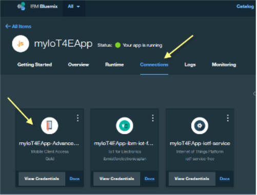
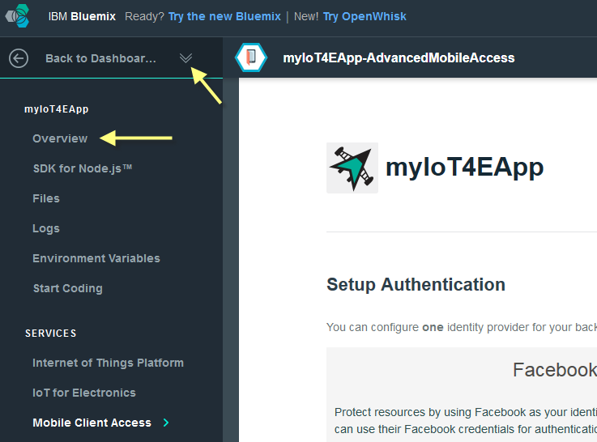

---

copyright:
  years: 2016

---

<!-- Common attributes used in the template are defined as follows: -->
{:new_window: target="\_blank"}
{:shortdesc: .shortdesc}
{:screen:.screen}
{:codeblock:.codeblock}

# 配置行動連線功能及安全
{: #iot4e_configureMCA}

*前次更新：2016 年 9 月 19 日*
{: .last-updated}

配置 {{site.data.keyword.amafull}}，以啟用行動通訊及安全。此作業是使用範例行動應用程式的必要項目，而且只需要執行一次。
{:shortdesc}

## 開始之前

開始之前，必須完成下列作業：
  - 在 {{site.data.keyword.Bluemix_notm}} 組織中，部署 {{site.data.keyword.iotelectronics}} 入門範本實例。部署入門範本實例時會自動部署元件應用程式及服務（包括 {{site.data.keyword.amafull}}）。

  - 因為根據使用的 {{site.data.keyword.Bluemix_notm}} 主控台版本，配置程序會略為不同，所以您應該閱讀適當版本的指示。

  尋找下列選項，即可判定您正在使用的版本：
    - [全新 {{site.data.keyword.Bluemix_notm}}](#configMCAnew)。如果您使用的是「全新 {{site.data.keyword.Bluemix_notm}}」體驗，則**移至一般經驗**選項會出現在儀表板的標題區段中。
    - [一般 {{site.data.keyword.Bluemix_notm}}](#configMCAclassic)。如果您使用的是「一般 {{site.data.keyword.Bluemix_notm}}」體驗，則**試用新的 Bluemix** 選項會出現在標題區段中。

## 在全新 {{site.data.keyword.Bluemix_notm}} 體驗中配置 {{site.data.keyword.amashort}}
{: #configMCAnew}

  1. 如果您剛剛部署 {{site.data.keyword.iotelectronics}} 入門範本，則會顯示入門範本應用程式的「開始使用」標籤，而且您應該繼續進行這些指示的下一步。如果未顯示入門範本應用程式，請開啟 {{site.data.keyword.Bluemix_notm}} 儀表板，然後按一下入門範本應用程式磚，以啟動 {{site.data.keyword.iotelectronics}} 入門範本應用程式。

    

  2. 在**連線**標籤上，按一下 {{site.data.keyword.amashort}} 服務予以開啟。

    

  3. 在**設定鑑別**頁面上，按一下**行動選項**，以找到 {{site.data.keyword.iotelectronics}} 入門範本應用程式的 URL。複製位於**路徑**欄位中的 URL。

      

  4. 在 ****「設定鑑別」頁面的「自訂」區段**中，按一下**配置**。

         

  5. 輸入下列鑑別認證，然後按一下**儲存**：
    - **領域名稱**：輸入 **myRealm**。
    - **自訂身分提供者 URL**：輸入先前複製的 URL 以識別 {{site.data.keyword.iotelectronics}} 入門範本應用程式，格式如下：**https://<*myIoT4eStarterApp*>.mybluemix.net**
    - **您的 Web 應用程式重新導向 URI**：將此欄位保留空白。

        

  6. 按一下入門範本應用程式的名稱（位在標題區段中），以回到 {{site.data.keyword.iotelectronics}} 入門範本主控台的「連線」標籤。

   

## 在一般 {{site.data.keyword.Bluemix_notm}} 體驗中配置 {{site.data.keyword.amashort}}
{: #configMCAclassic}

1. 在 {{site.data.keyword.Bluemix_notm}} 儀表板中，按一下入門範本應用程式磚，以啟動 {{site.data.keyword.iotelectronics}} 入門範本應用程式。

    

2. 在 {{site.data.keyword.iotelectronics}} 實例中，按一下 {{site.data.keyword.amashort}} 服務予以開啟。   

  

2. 在**設定鑑別**頁面上，按一下**行動選項**，以找到 {{site.data.keyword.iotelectronics}} 入門範本應用程式的 URL。複製位於**路徑**欄位中的 URL。

    

3. 在 ****「設定鑑別」頁面的「自訂」區段**中，按一下**配置**。

   

4. 輸入下列鑑別認證，然後按一下**儲存**：
   - **領域名稱**：輸入 **myRealm**。
   - **自訂身分提供者 URL**：輸入先前複製的 URL 以識別 {{site.data.keyword.iotelectronics}} 入門範本應用程式，格式如下：**https://<*myIoT4eStarterApp*>.mybluemix.net**
   - **您的 Web 應用程式重新導向 URI**：將此欄位保留空白。

      

5. 回到 {{site.data.keyword.iotelectronics}} 入門範本主控台的「連線」標籤，如下所示：
  1. 按一下標題區段中**回到儀表板**選項旁邊的雙箭頭，以顯示功能表。
  2. 按一下**概觀**，以回到入門範本主控台。  

    
