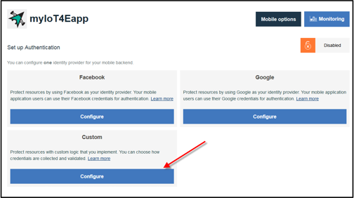
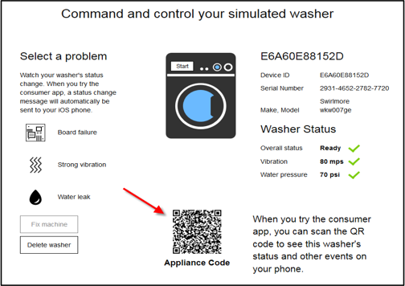

---

copyright:
  years: 2016

---

<!-- Common attributes used in the template are defined as follows: -->
{:new_window: target="_blank"}
{:shortdesc: .shortdesc}
{:screen:.screen}
{:codeblock:.codeblock}

# 使用行動應用程式
{: #iot4e_using_mobile}
*前次更新：2016 年 6 月 14 日*

開始使用 {{site.data.keyword.iotelectronics_full}} 行動應用程式，以瞭解您如何接收警示、傳送指令，以及檢查已連接應用裝置的狀態。
{:shortdesc}

請完成下列作業：
1. [下載行動應用程式](#iot4e_downloadmobile)
2. [配置 {{site.data.keyword.amafull}}](#iot4e_configureMCA)
3. [將您的行動裝置連接至 {{site.data.keyword.iotelectronics}} 環境](#iot4e_connecting_mobile)
4. [在您的行動裝置上登錄及控制應用裝置](#iot4e_adding_appliance)

 ## 下載行動應用程式
 {: #iot4e_downloadmobile}
若要取得行動應用程式，請從 Apple App Store 下載並安裝在您的手機上。在您的手機上，開啟 App Store 然後搜尋 "ibm iot"。選擇 **IBM IoT for Electronics** 然後安裝。

 或者，您也可以使用 [iTunes](https://itunes.apple.com/us/app/ibm-iot-for-electronics/id1103404928?ls=1&mt=8) 將它安裝到您的手機。

## 配置 {{site.data.keyword.amashort}}
{: #iot4e_configureMCA}

您必須先配置 {{site.data.keyword.amafull}}，才能連接行動應用程式。  

  1. 在 {{site.data.keyword.iotelectronics}} 的**連線**標籤，開啟 {{site.data.keyword.amashort}} 應用程式。（您也可以從 {{site.data.keyword.Bluemix_notm}} 儀表板存取該應用程式。）  

    

  2. 在**自訂**區段中，按一下**配置**。

     

  3. 輸入下列鑑別認證：
    - **領域名稱**：輸入 **myRealm**。
    - **URL**：輸入識別 {{site.data.keyword.iotelectronics}} Starter 應用程式用的 URL，格式如下：**https://<*myIoT4eStarterApp*>.mybluemix.net**  

      **提示：**請務必在 URL 中使用安全的 `https://` 字首。您可以按一下**行動選項**，找到入門範本應用程式的 URL。

    

  4. 儲存。

## 將行動應用程式連接至您的 {{site.data.keyword.iotelectronics}} 環境
{: #iot4e_connecting_mobile}

若要在行動應用程式上檢視您的模擬裝置，您必須將行動應用程式連接至您的 {{site.data.keyword.iotelectronics}} Bluemix 環境。

若要連接行動應用程式，請遵循下列步驟：

  1. 在電腦上，啟動 {{site.data.keyword.iotelectronics}} 應用程式，然後按一下**檢視應用程式**來顯示入門範本應用程式。  

    
  2. 選取**遠端控制您的已連接應用裝置**。

  

  3. 建立一台以上的洗衣機。必須先建立洗衣機，行動應用程式才能連接。

  4.	捲動至連線 QR 碼，然後使用您的行動裝置掃描它。連線 QR 碼位於標示 `To connect the app to the environment, you'll be asked to scan this QR Code` 的區段。

  

  5. 輸入登入認證。您的使用者 ID 和密碼可以是任意長度。請記住您的登入認證，以供未來的階段作業使用。  

## 在您的行動裝置上登錄及控制應用裝置
{: #iot4e_adding_appliance}

若要檢視應用裝置狀態及接收通知，您必須使用行動應用程式登錄應用裝置。

若要登錄應用裝置，請完成下列步驟：

  1. 在電腦上，捲動至模擬洗衣機並按一下它，以顯示其資料和應用裝置 QR 碼。

  3.	使用您的行動裝置掃描洗衣機的 QR 碼，以在您的行動電話上登錄洗衣機。您會在行動電話上看到洗衣機狀態。

  4. 在電腦上，選取洗衣機的問題，例如主機板故障或強烈振動。問題會將警示傳送至行動電話。
