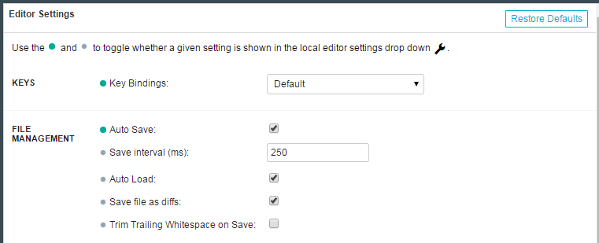

---

Copyright:
  Jahre: 2015, 2016

---

{:new_window: target="_blank"}
{:shortdesc: .shortdesc}
{:screen:.screen}
{:codeblock:.codeblock}
{:pre: .pre}

# Code mit der Eclipse Orion-{{site.data.keyword.webide}} bearbeiten
{: #web_ide}

Letzte Aktualisierung: 9. September 2016
{: .last-updated}

Die Eclipse Orion-{{site.data.keyword.webide}} ist eine browserbasierte Entwicklungsumgebung, in der Sie Anwendungen für das Web entwickeln können. Für die Entwicklung in JavaScript, HTML und CSS stehen Content-Assist-Funktionen, Codevervollständigung und Fehlerprüfung zur Verfügung. Die {{site.data.keyword.webide}} ist mit nahezu jeder Programmiersprache verwendbar und bietet Syntaxhervorhebung für die meisten [Dateitypen (Link wird in neuem Fenster geöffnet)](https://hub.jazz.net/docs/overview/#dev_support){: new_window}. Die Quellcodeverwaltung ist durch Git oder Jazz SCM integriert und Sie können Code lokal bereitstellen, um Ihre Apps zu testen und zu debuggen.
{:shortdesc}

Als weiterer wesentlicher Vorteil kommt hinzu, dass {{site.data.keyword.webide}} auf der Webtechnologie basiert. Es entsteht keinerlei Installations-, Wartungs- und Skalierungsaufwand. Für die Codeentwicklung benötigen Sie lediglich einen Internetanschluss.

## Editor einrichten
{: #editorsetup}

Die {{site.data.keyword.webide}} ist konfigurierbar, d. h. Sie können Farbschemen, technische Tools und Einstellungen wählen, die Ihren Entwicklunganforderungen entsprechen. Um die Einstellungen anzuzeigen und zu ändern, klicken Sie links im Menü auf das Symbol **Einstellungen** .

Wenn Sie bestimmte Einstellungen beim Bearbeiten häufig ändern müssen, können Sie auf diese Einstellungen schnell über das Symbol **Lokale Einstellungen für Editor**  in der rechten oberen Ecke des Editors zugreifen.


Standardmäßig werden die Einstellungen für den Editorstil und die Schriftgröße immer angezeigt. Führen Sie die folgenden Schritte aus, um weitere Einstellungen in das Menü aufzunehmen:

1. Klicken Sie auf das Symbol **Lokale Einstellungen für Editor** .

2. Klicken Sie auf **Editoreinstellungen**.

3. Um eine Einstellung in das Menü **Lokale Einstellungen für Editor** aufzunehmen oder daraus zu entfernen, klicken Sie auf den Kreis neben der betreffenden Einstellung.




## Code bearbeiten
{: #editcode}

Die {{site.data.keyword.webide}} setzt sich aus zwei Hauptabschnitten zusammen. Der erste Abschnitt ist der Dateinavigator auf der linken Seite, der Ihre Projektdateien in einer Baumstruktur zeigt. Über den Dateinavigator können Sie Dateien und Ordner erstellen, umbenennen, löschen und verwalten.

**Tipp:** Um Dateien in den Dateinavigator hochzuladen, ziehen Sie sie von Ihrem Computer in den Dateinavigator.

Der zweite Abschnitt ist das Editorteilfenster auf der rechten Seite. Der Editor bietet verschiedene Codierungsfunktionen, einschließlich Content-Assist und Syntaxprüfung.


### Mit mehreren Dateien arbeiten
1. Um mit zwei Dateien gleichzeitig zu arbeiten, klicken Sie auf das Symbol **Teilungsmodus des Editors ändern**  oben im Editor.
2. Wählen Sie in dem geöffneten Menü eine Ansicht aus.

 Wenn bereits eine Datei im Editor geöffnet war, wird sie nach Auswahl einer Ansicht in beiden Editoransichten angezeigt.

 Gehen Sie wie folgt vor, um eine Datei, die in einer der Editoransichten angezeigt wird, zu öffnen oder zu ändern:
 1. Bewegen Sie den Cursor zu der Editoransicht, die Sie ändern wollen.
 2. Klicken Sie im Dateinavigator auf eine Datei.

### Tastenkombinationen
Die meisten Befehle in der {{site.data.keyword.webide}} können nur über die Tastatur ausgeführt werden.

Verwenden Sie die Tastenkombination Alt+Umschalttaste+?, um eine Liste mit den Tastenbelegungen anzuzeigen. Wenn Sie Mac OS verwenden, lautet die Tastenkombination Strg+Umschalttaste+?.

## Quellcode verwalten
{: #sourcecontrol}

Die {{site.data.keyword.webide}} ist mit Quellcodeverwaltungstools integriert. Um mit dem Git-Repository zu arbeiten, klicken Sie auf das Symbol **Git-Repository** . Weitere Informationen finden Sie unter [Source control with Git (Link wird in neuem Fenster geöffnet)](https://hub.jazz.net/docs/git/){: new_window}.


## App vom Arbeitsbereich aus bereitstellen
{: #deploy}

1. Um die App von der Ausführungsleiste bereitzustellen, wählen oder [erstellen Sie (Link wird in neuem Fenster geöffnet)](https://hub.jazz.net/tutorials/livesync/#launch_configuration){: new_window} eine Startkonfiguration.
1. Klicken Sie auf das Symbol für die Bereitstellung . Bei der Bereitstellung einer Instanz Ihrer App werden der aktuelle Inhalt Ihres Arbeitsbereichs und die Umgebung verwendet, die in Ihrer Startkonfiguration definiert sind. 
2. Wenn Ihre App bereitgestellt wurde, können Sie die Ausführungsleiste verwenden, um Ihre App zu stoppen, erneut zu starten oder zu debuggen, um Protokolle anzuzeigen usw.


<!-- LH: I'm commenting out the following list because I think this information is obvious from the UI. I also updated the preceding sentence to mention a few things that you can do from the run bar.

 * Stop the app: 
 * Open the deployed app: 
 * View the logs of the deployed app: 
 * Open the app's Dashboard: 
 * If you are developing a Node.js app, enable Live Edit mode: 
 * With Live Edit mode enabled, restart the app quickly, without redeployment: 
 * With Live Edit mode enabled, access the debugger:  -->

 ## Editor außerhalb der {{site.data.keyword.webide}} verwenden
{: #editlocal}

Um einen Editor außerhalb der {{site.data.keyword.webide}} zu verwenden, richten Sie die {{site.data.keyword.Bluemix_live}} so ein, dass Sie in einem beliebigen Tool direkt mit Ihren Projektdateien arbeiten können. {{site.data.keyword.Bluemix_live_notm}} ist eine Befehlszeilenanwendung, die die Änderungen in Ihrem lokalen Dateisystem mit Ihrem Cloudarbeitsbereich in {{site.data.keyword.jazzhub}} synchronisiert. 

### Vorbemerkungen 

Laden Sie die [{{site.data.keyword.Bluemix_live_notm}}-Befehlszeilenschnittstelle herunter und installieren Sie sie (Link wird in neuem Fenster geöffnet)](http://livesyncdownload.ng.bluemix.net){: new_window}.

### Lokale Umgebung mit {{site.data.keyword.Bluemix_notm}} synchronisieren
{: #edit_local_download}

1. Öffnen Sie ein Befehlszeilenfenster.
2. Melden Sie sich bei {{site.data.keyword.Bluemix_notm}} an:

	```
	bl login
	```
	{: pre}

3. Geben Sie Ihre IBMid und das Kennwort ein, wenn Sie dazu aufgefordert werden.
4. Zeigen Sie eine Liste Ihrer {{site.data.keyword.Bluemix_notm}}-Projekte an: 

	```
	bl projects
	```
	{: pre}

4. Synchronisieren Sie Ihre lokale Umgebung mit Ihrem Projekt unter {{site.data.keyword.Bluemix_notm}}:

	```
	bl sync projektname
	```
	{: pre}

Dabei ist `projektname` der Name Ihrer {{site.data.keyword.Bluemix_notm}}-App.

Wenn Sie die Bearbeitung abgeschlossen haben, geben Sie `q` ein, um die Synchronisation zu beenden.

### Feature 'Desktop Sync' für lokale Codebearbeitung aktivieren

Das Feature 'Desktop Sync' entspricht dem Modus 'Livebearbeitung' für die Befehlszeile. Sie benötigen das Feature 'Desktop Sync' für das Debugging in der Befehlszeile.
1. Aktivieren Sie das Feature 'Desktop Sync' in einem anderen Befehlszeilenfenster:

	```
	cd localDirectory
	bl start
	```
	{: codeblock}

2. Verwenden Sie die Startkonfiguration, die Sie in der {{site.data.keyword.webide}} erstellt haben. Wenn Sie die Startkonfiguration ausgewählt haben, ist das Feature 'Desktop Sync' in Ihrer lokalen Umgebung aktiviert. In dem Befehlszeilenfenster, das Sie gerade geöffnet haben, können Sie die URL der App, die Debug-URL und die Verwaltungs-URL anzeigen und den Status von {{site.data.keyword.Bluemix_live_notm}} anzeigen.

3. Aktualisieren Sie die Browseranzeige und prüfen Sie, ob Sie die Änderungen sehen, die Sie in statischen Dateien im lokalen Arbeitsbereich gespeichert haben. 

### Feature 'Desktop Sync' inaktivieren

1. Geben Sie im zweiten Befehlszeilenfenster `bl stop` ein.
2. Geben Sie im ersten Befehlszeilenfenster `q` ein.
