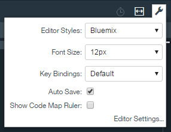

---

copyright:
  years: 2015, 2016

---

{:new_window: target="_blank"}
{:shortdesc: .shortdesc}
{:screen:.screen}
{:codeblock:.codeblock}
{:pre: .pre}

# Edición de código con Eclipse Orion {{site.data.keyword.webide}}
{: #web_ide}

Última actualización: 22 de julio de 2016
{: .last-updated}

Eclipse Orion {{site.data.keyword.webide}} es un entorno de desarrollo basado en navegador donde podrá desarrollar para la web. Puede desarrollar en JavaScript, HTML y CSS con la ayuda de asistencia de contenido, finalización del código y comprobación de errores. {{site.data.keyword.webide}} funciona prácticamente con todos los lenguajes y ofrece realce de la sintaxis [para la mayoría de tipos de archivo](https://hub.jazz.net/docs/overview/#dev_support){: new_window}. El control de origen está integrado a través de Git o Jazz SCM, y puede desplegar código localmente para probar y depurar sus apps.
{:shortdesc}

Y lo mejor de todo, {{site.data.keyword.webide}} está basado en la web. No hay nada que se deba instalar, mantener o escalar. Puede desarrollar en cualquier sitio donde tenga una conexión a Internet.

## Configuración del editor
{: #editorsetup}

El servicio {{site.data.keyword.webide}} es personalizable para que pueda elegir esquemas de color, herramientas técnicas y valores que se ajusten a sus necesidades de desarrollo. Para ver y modificar los valores, desde el menú de la izquierda, pulse el icono **Valores** .

<!-- LH: I don't think we need to include the following table, so I'm commenting it out. When you're viewing the settings in the Web IDE, this information should be obvious -->

<!--| Categories | Description  |
|---|---|
| Cloud Foundry  | Define a Cloud Foundry API and Manage URL  |
| CSS Validation | Define the severities for CSS linting rules that you use to check your code  |
| Editor Settings  | Configure editor-specific settings for key bindings, editor behavior, layout, and more  |
| Editor Styles  | Configure color schemes for the languages that you use, or import a theme from another editors  |
| Git  | Configure general settings for Git  |
| Globalization | Define globalization settings for your code |
| JavaScript Validation  | Define the severities for the JavaScript linting rules that you use to check your code  |
| Plug-ins  | Install, disable, or remove plug-ins from the editor  | -->

Si necesita a menudo cambiar determinados valores mientras edita, puede acceder a dichos valores rápidamente desde el icono **Valores de editor local**  en la esquina superior derecha del editor.



De forma predeterminada, los valores de estilo y tamaño de fuente del editor siempre se muestran. Para incluir otros valores de editor en el menú, siga estos pasos:

1. Pulse el icono **Valores de editor local** .

2. Pulse **Valores de editor**.

3. Para incluir o excluir un valor desde el menú **Valores de editor local**, pulse el círculo que está situado al lado del valor.


## Edición de código
{: #editcode}

{{site.data.keyword.webide}} tiene dos secciones principales. La primera sección es el navegador de archivos de la izquierda, que muestra los archivos de proyecto en una estructura de árbol. Desde el navegador de archivos, puede crear, renombrar, suprimir y gestionar archivos y carpetas.

**Consejo:** para cargar archivos al navegador de archivos, arrástrelos desde su equipo al navegador de archivos.

La segunda sección es el panel de editor situado a la derecha. El editor proporciona varias características de código, como la asistencia de contenido y la validación de sintaxis.


### Trabajar con varios archivos
1. Para trabajar con dos archivos a la vez, pulse el icono **Cambiar modo de editor de división**  en la parte superior del editor.
2. Desde el menú que se abra, seleccione una vista.

 Una vez seleccionada la vista, si ya se ha abierto un archivo en el editor, se mostrará en las dos vistas de editor.

 Para abrir o cambiar un archivo mostrado en una de las vistas de editor:
 1. Mueva el cursor a la vista de editor que desee cambiar.
 2. En el navegador de archivos, pulse un archivo.

### Accesos directos de teclado
La mayoría de los mandatos de {{site.data.keyword.webide}} solo son accesibles a través de accesos directos de teclado.

Para ver una lista de accesos directos de teclado en el editor, pulse Alt+Mayús+?. Si utiliza Mac OS, pulse Ctrl+Mayús+?.

## Gestión del código fuente
{: #sourcecontrol}

{{site.data.keyword.webide}} está integrado con herramientas de gestión del código fuente. Para trabajar con el repositorio de Git, pulse el icono **Repositorio de Git** . Para obtener más información, consulte [Control de origen con Git](https://hub.jazz.net/docs/git/){: new_window}.


## Despliegue de una aplicación desde el espacio de trabajo
{: #deploy}

1. Para desplegar su aplicación, desde la barra de ejecución, seleccione o [cree](https://hub.jazz.net/tutorials/livesync/#launch_configuration){: new_window} una configuración de inicio.
1. Pulse el icono de despliegue . Para desplegar una instancia de la aplicación, utilice el contenido actual del espacio de trabajo y el entorno definido en la configuración de inicio. 
2. Una vez despegada la aplicación puede utilizar la barra de ejecución para detener, reiniciar o depurar la aplicación, ver registros, etc.


<!-- LH: I'm commenting out the following list because I think this information is obvious from the UI. I also updated the preceding sentence to mention a few things that you can do from the run bar.

 * Stop the app: 
 * Open the deployed app: 
 * View the logs of the deployed app: 
 * Open the app's Dashboard: 
 * If you are developing a Node.js app, enable Live Edit mode: 
 * With Live Edit mode enabled, restart the app quickly, without redeployment: 
 * With Live Edit mode enabled, access the debugger:  -->

 ## Edición fuera de {{site.data.keyword.webide}}
{: #editlocal}

Para utilizar un editor además de {{site.data.keyword.webide}}, configure {{site.data.keyword.Bluemix_live}} para poder trabajar directamente con los archivos de proyecto en cualquier herramienta. {{site.data.keyword.Bluemix_live_notm}} es una aplicación de línea de mandatos que sincroniza los cambios del sistema de archivos local con el espacio de trabajo en la nube en {{site.data.keyword.jazzhub}}. 

### Antes de empezar 

[Descargue e instale la interfaz de línea de mandatos de {{site.data.keyword.Bluemix_live_notm}}](http://livesyncdownload.ng.bluemix.net){: new_window}.

### Sincronización del entorno local con {{site.data.keyword.Bluemix_notm}}
{: #edit_local_download}

1. Abra una ventana de línea de mandatos.
2. Inicie sesión en {{site.data.keyword.Bluemix_notm}}:

	```
	bl login
	```
	{: pre}

3. Cuando se le solicite, escriba el ID de IBM y la contraseña.
4. Visualice una lista con los proyectos de {{site.data.keyword.Bluemix_notm}}: 

	```
	bl projects
	```
	{: pre}

4. Sincronice su entorno local con el proyecto en {{site.data.keyword.Bluemix_notm}}: 

	```
	bl sync projectName
	```
	{: pre}

donde `projectName` es el nombre de la app de {{site.data.keyword.Bluemix_notm}}.

Cuando haya terminado de editar, introduzca `q` para finalizar la sincronización.

### Habilitación de la característica Desktop Sync para editar código localmente

La característica Desktop Sync es como la modalidad de edición en directo para la línea de mandatos. La característica Desktop Sync es necesaria para depurar la línea de mandatos.
1. En otra ventana de línea de mandatos, habilite la característica Desktop Sync:

	```
	cd localDirectory
	bl start
	```
	{: codeblock}

2. Utilice la configuración de lanzamiento creada en {{site.data.keyword.webide}}. Una vez seleccionada la configuración de lanzamiento, la característica Desktop Sync estará habilitada en el entorno local. En la ventana de línea de mandatos que se acaba de abrir, verá el URL de la app, el URL de depuración, el URL de gestión y el estado de {{site.data.keyword.Bluemix_live_notm}}.

3. Actualice el navegador y verifique que puede ver los cambios que ha guardado en los archivos estáticos en el espacio de trabajo local. 

### Inhabilitación de la característica Desktop Sync

1. En la segunda ventana de línea de mandatos, introduzca `bl stop`.
2. En la primera ventana de línea de mandatos, introduzca `q`.
