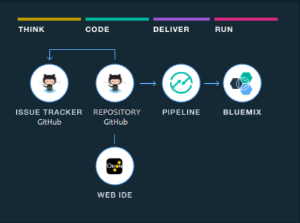

---

copyright:
  years: 2016

---
 
{:shortdesc: .shortdesc}
{:new_window: target="_blank"}

# Initiation aux chaînes d'outils (Bêta)
{: #toolchains_getting_started}

Dernière mise à jour : 7 octobre 2016
{: .last-updated}  

Les chaînes d'outils sont disponibles dans les environnements {{site.data.keyword.Bluemix}} public et dédié. Vous pouvez créer une chaîne d'outils de deux façons : à l'aide d'un modèle ou à partir d'une application. Sur {{site.data.keyword.Bluemix_notm}} public, les chaînes d'outils sont disponibles uniquement dans la région sud des Etats-Unis.
{: shortdesc}

## Initiation aux chaînes d'outils : public
{: #getting_started_public}

**Remarque :** Assurez-vous de travailler dans le nouvel environnement Bluemix en vérifiant la bannière supérieure.

 * Si vous voyez un message relatif à l'essai du nouveau Bluemix, vous êtes dans l'environnement Bluemix classique. Cliquez sur le lien pour accéder au nouvel environnement Bluemix.
 * Si vous ne voyez pas ce message, vous êtes bien déjà dans le nouvel environnement Bluemix.

Chaque chaîne d'outils est associée à une organisation spécifique (org) et tout membre de cette organisation peut accéder aux chaînes d'outils associées. Avant de créer une chaîne d'outils, assurez-vous de travailler dans l'organisation dans laquelle vous voulez créer la chaîne d'outils. L'organisation au sein de laquelle vous travaillez actuellement s'affiche dans la barre de menus. Pour passer à une autre organisation, cliquez sur l'organisation dans la barre de menus, puis sélectionnez l'organisation souhaitée.

### Création d'une chaîne d'outils à partir d'un modèle   
{: #creating_a_toolchain_from_a_template}

Vous pouvez utiliser un modèle comme point de départ pour créer une chaîne d'outils incluant un ensemble spécifique d'intégrations d'outils.

1. Si vous créez votre première chaîne d'outils, assurez-vous que les chaînes d'outils sont activées dans votre organisation :
   1. Ouvrez le tableau de bord DevOps et cliquez sur la page **Chaînes d'outils**.
   2. Si le bouton **Activer les chaînes d'outils** est affiché, cliquez dessus et suivez les invites pour créer votre chaîne d'outils.
   3. Si le bouton **Activer les chaînes d'outils** n'est pas affiché, les chaînes d'outils sont déjà activées. Passez à l'étape 2.
1. Dans le tableau de bord DevOps, page **Chaînes d'outils**, cliquez sur le bouton d'ajout (+) pour créer une chaîne d'outils.
1. Cliquez sur un modèle de chaîne d'outils. Ainsi, pour utiliser un exemple de magasin en ligne, cliquez sur **Chaîne d'outils de microservices**. 
1. Sur la page de création de chaîne d'outils, passez en revue le diagramme de la chaîne d'outils que vous allez créer. Ce diagramme montre chaque intégration d'outil dans sa phase de cycle de vie au sein de la chaîne d'outils. L'image suivante fournit un exemple de diagramme. Lorsque vous créez une chaîne d'outils, le diagramme représente chaque intégration d'outil faisant partie de la chaîne d'outils.

1. Passez en revue les informations par défaut des paramètres de chaîne d'outils. Le nom de la chaîne d'outils l'identifie dans {{site.data.keyword.Bluemix_notm}}. Si vous disposez déjà d'une chaîne d'outils portant ce nom, ou si vous souhaitez utiliser un nom différent, changez le nom de la chaîne d'outils.  
1. A la section Intégrations configurables, sélectionnez chaque intégration d'outil à configurer pour votre chaîne d'outils. Certaines intégrations d'outils ne nécessitent pas de configuration. Pour des informations sur la configuration des intégrations d'outils, voir [Configuration des intégrations d'outils (Lien s'ouvrant dans une nouvelle fenêtre)](../toolchains/toolchains_integrations.html){: new_window}.
1. Cliquez sur **Créer**.  Plusieurs étapes s'exécutent automatiquement pour configurer votre chaîne d'outils.

 * La chaîne d'outils est créée.
 * Si vous avez configuré l'intégration d'outil Delivery Pipeline, les pipelines sont déclenchés.
 * Si vous avez configuré l'intégration d'outil Sauce Labs, l'intégration de Sauce Labs est configurée pour ajouter des travaux aux pipelines et exécuter des tests.
 * Si vous avez configuré l'intégration d'outil PagerDuty, l'intégration de PagerDuty est configurée pour envoyer des notifications au canal configuré dans Slack. Ces notifications signalent quand un problème survient.
 * Si vous avez configuré l'intégration d'outil Slack, l'intégration de Slack est configurée pour envoyer des notifications au canal configuré dans Slack. Ces notifications indiquent la progression du déploiement, par exemple `Connected with Project XYZ` (connecté au projet xyz), `Pipeline Configured` (pipeline configuré) ou `Stage 'build' started` (étape de génération lancée).
 * Si vous avez configuré l'intégration d'outil GitHub, le référentiel exemple GitHub est cloné dans votre compte GitHub.

### Création d'une chaîne d'outils à partir d'une application
{: #creating_a_toolchain_from_an_app}

Vous pouvez créer une chaîne d'outils à partir de votre application. La chaîne d'outils peut prendre en charge le développement, le déploiement, la surveillance, etc. en continu, et elle est associée à votre application. Chaque application peut être associée à une chaîne d'outils. Lorsque vous envoyez des modifications au référentiel GitHub de la chaîne d'outils, le pipeline génère et déploie automatiquement l'application.  

1. Si vous créez votre première chaîne d'outils, assurez-vous que les chaînes d'outils sont activées dans votre organisation :
   1. Ouvrez le tableau de bord DevOps et cliquez sur la page
**Chaînes d'outils**.
   2. Si le bouton **Activer les chaînes d'outils** est affiché, cliquez dessus et suivez les invites pour créer votre chaîne d'outils.
   3. Si le bouton **Activer les chaînes d'outils** n'est pas affiché, les chaînes d'outils sont déjà activées. Passez à l'étape 2.
1. Depuis la page de présentation de votre application,
vignette de distribution continue, cliquez sur **Activer**. Vous pouvez également, dans {{site.data.keyword.Bluemix_notm}} Classic Experience, coin supérieur droit de la page de présentation de votre application, cliquer sur **Ajouter une chaîne d'outils**. Votre application est configurée pour la distribution continue depuis un nouveau référentiel GitHub rempli avec le code de démarrage d'application.
1. Sur la page de création de chaîne d'outils, passez en revue le diagramme de la chaîne d'outils que vous allez créer. Ce diagramme montre chaque intégration d'outil dans sa phase de cycle de vie au sein de la chaîne d'outils.
1. Passez en revue les informations par défaut des paramètres de chaîne d'outils. Le nom de la chaîne d'outils l'identifie dans {{site.data.keyword.Bluemix_notm}}. Si vous disposez déjà d'une chaîne d'outils portant ce nom, ou si vous souhaitez utiliser un nom différent, changez le nom de la chaîne d'outils.
1. A la section Intégrations configurables, sélectionnez chaque intégration d'outil à configurer pour votre chaîne d'outils. Certaines intégrations d'outils ne nécessitent pas de configuration .Pour des informations sur la configuration des intégrations d'outils, voir [Configuration des intégrations d'outils (Lien s'ouvrant dans une nouvelle fenêtre)](../toolchains/toolchains_integrations.html){: new_window}.
1. Cliquez sur **Créer**.  Plusieurs étapes s'exécutent automatiquement pour configurer votre chaîne d'outils.

 * La chaîne d'outils est créée.
 * Si vous avez configuré l'intégration d'outil Delivery Pipeline, les pipelines sont déclenchés.
 * Si vous avez configuré l'intégration d'outil Sauce Labs, l'intégration de Sauce Labs est configurée pour ajouter des travaux aux pipelines et exécuter des tests.
 * Si vous avez configuré l'intégration d'outil PagerDuty, l'intégration de PagerDuty est configurée pour envoyer des notifications au canal configuré dans Slack. Ces notifications signalent quand un problème survient.
 * Si vous avez configuré l'intégration d'outil Slack, l'intégration de Slack est configurée pour envoyer des notifications au canal configuré dans Slack. Ces notifications indiquent la progression du déploiement, par exemple `Connected with Project XYZ` (connecté au projet xyz), `Pipeline Configured` (pipeline configuré) ou `Stage 'build' started` (étape de génération lancée).
 * Si vous avez configuré l'intégration d'outil GitHub, le référentiel exemple GitHub est cloné dans votre compte GitHub.

## Initiation aux chaînes d'outils : dédié
{: #getting_started_dedicated}

Chaque chaîne d'outils est associée à une organisation spécifique (org) et tout membre de cette organisation peut accéder aux chaînes d'outils associées. Avant de créer une chaîne d'outils, cliquez sur l'icône **{{site.data.keyword.avatar}}**  dans la barre de menus pour ouvrir le widget Compte et support et afficher l'organisation dans laquelle vous travaillez. Si cette organisation n'est pas celle dans laquelle vous voulez créer la chaîne d'outils, passez à une autre organisation.

### Création d'une chaîne d'outils à partir d'un modèle   
{: #creating_a_toolchain_from_a_template_dedicated}

Vous pouvez utiliser un modèle comme point de départ pour créer une chaîne d'outils incluant un ensemble spécifique d'intégrations d'outils.

1. Si vous créez votre première chaîne d'outils, assurez-vous que les chaînes d'outils sont activées dans votre organisation :
   1. Ouvrez le tableau de bord DevOps et cliquez sur l'onglet **Chaînes d'outils**.
   2. Si le bouton **Activer les chaînes d'outils** est affiché, cliquez dessus et suivez les invites pour créer votre chaîne d'outils.
   3. Si le bouton **Activer les chaînes d'outils** n'est pas affiché, les chaînes d'outils sont déjà activées. Passez à l'étape 2.
1. Dans le tableau de bord {{site.data.keyword.Bluemix_notm}}, onglet **DEVOPS**, cliquez sur le bouton d'ajout (+) pour créer une chaîne d'outils.
1. Cliquez sur un modèle de chaîne d'outils. Par exemple, pour créer une chaîne d'outils simple à déployer sur une nouvelle application Cloud Foundry, cliquez sur **Chaîne d'outils Cloud Foundry simple**. 
1. Sur la page de création de chaîne d'outils, passez en revue le diagramme de la chaîne d'outils que vous allez créer. Ce diagramme montre chaque intégration d'outil dans sa phase de cycle de vie au sein de la chaîne d'outils. L'image suivante fournit un exemple de diagramme. Lorsque vous créez une chaîne d'outils, le diagramme représente chaque intégration d'outil faisant partie de la chaîne d'outils.

1. Passez en revue les informations par défaut des paramètres de chaîne d'outils. Le nom de la chaîne d'outils l'identifie dans {{site.data.keyword.Bluemix_notm}}. Si vous disposez déjà d'une chaîne d'outils portant ce nom, ou si vous souhaitez utiliser un nom différent, changez le nom de la chaîne d'outils.  
1. A la section Intégrations configurables, sélectionnez chaque intégration d'outil à configurer pour votre chaîne d'outils. Certaines intégrations d'outils ne nécessitent pas de configuration. 
Pour des informations sur la configuration des intégrations d'outils,
voir
[Configuration
des intégrations d'outils (Lien s'ouvrant dans une nouvelle
fenêtre)](../toolchains/toolchains_integrations.html){: new_window}.
1. Cliquez sur **Créer**.  Plusieurs étapes s'exécutent automatiquement pour configurer votre chaîne d'outils.

 * La chaîne d'outils est créée.
 * Si vous avez configuré l'intégration d'outil Delivery Pipeline, les pipelines sont déclenchés.
 * Si vous avez configuré l'intégration d'outil GitHub Enterprise, le référentiel exemple GitHub Enterprise est cloné dans votre compte GitHub Enterprise.

### Création d'une chaîne d'outils à partir d'une application
{: #creating_a_toolchain_from_an_app_dedicated}

Vous pouvez créer une chaîne d'outils à partir de votre application. La chaîne d'outils peut prendre en charge le développement, le déploiement, la surveillance, etc. en continu, et elle est associée à votre application. Chaque application peut être associée à une chaîne d'outils. Lorsque vous envoyez des modifications au référentiel GitHub Enterprise de la chaîne d'outils, le pipeline génère et déploie automatiquement l'application.  

1. Si vous créez votre première chaîne d'outils, assurez-vous que les chaînes d'outils sont activées dans votre organisation :
   1. Ouvrez le tableau de bord DevOps et cliquez sur l'onglet **Chaînes d'outils**.
   2. Si le bouton **Activer les chaînes d'outils** est affiché, cliquez dessus et suivez les invites pour créer votre chaîne d'outils.
   3. Si le bouton **Activer les chaînes d'outils** n'est pas affiché, les chaînes d'outils sont déjà activées. Passez à l'étape 2.
1. Dans le coin supérieur droit de la page de présentation de votre application, cliquez sur **Ajouter une chaîne d'outils**. Votre application est configurée pour la distribution continue depuis un nouveau référentiel GitHub Enterprise rempli avec le code de démarrage d'application.
1. Sur la page de création de chaîne d'outils, passez en revue le diagramme de la chaîne d'outils que vous allez créer. Ce diagramme montre chaque intégration d'outil dans sa phase de cycle de vie au sein de la chaîne d'outils.
1. Passez en revue les informations par défaut des paramètres de chaîne d'outils. Le nom de la chaîne d'outils l'identifie dans {{site.data.keyword.Bluemix_notm}}. Si vous disposez déjà d'une chaîne d'outils portant ce nom, ou si vous souhaitez utiliser un nom différent, changez le nom de la chaîne d'outils.
1. A la section Intégrations configurables, sélectionnez chaque intégration d'outil à configurer pour votre chaîne d'outils. Certaines intégrations d'outils ne nécessitent pas de configuration. Pour des informations sur la configuration des intégrations d'outils, voir [Configuration des intégrations d'outils (Lien s'ouvrant dans une nouvelle fenêtre)](../toolchains/toolchains_integrations.html){: new_window}.
1. Cliquez sur **Créer**.  Plusieurs étapes s'exécutent automatiquement pour configurer votre chaîne d'outils.

 * La chaîne d'outils est créée.
 * Si vous avez configuré l'intégration d'outil Delivery Pipeline, les pipelines sont déclenchés.
 * Si vous avez configuré l'intégration d'outil GitHub Enterprise, le référentiel exemple GitHub Enterprise est cloné dans votre compte GitHub Enterprise.

## Affichage d'une chaîne d'outils
{: #viewing_a_toolchain}

Une fois que vous avez configuré la chaîne d'outils et ses intégrations d'outils, vous pouvez afficher une représentation graphique de la chaîne d'outils sur la page Intégrations d'outils.

* Si vous utilisez {{site.data.keyword.Bluemix_notm}} public, dans le tableau de bord DevOps, page **Chaînes d'outils**, cliquez sur une chaîne d'outils pour ouvrir la page d'intégration d'outil correspondante. Vous pouvez également, depuis la page de présentation de l'application, vignette de distribution continue, cliquer sur **Afficher la chaîne d'outils**. Cliquez ensuite sur **Intégrations d'outils**. 
   
* Si vous utilisez {{site.data.keyword.Bluemix_notm}} dédié, dans le tableau de bord, onglet **DEVOPS**, cliquez sur la chaîne d'outils pour ouvrir la page d'intégration d'outil correspondante. Vous pouvez également, dans le coin supérieur droit de la page de présentation de l'application, cliquer sur **Afficher la chaîne d'outils**.

* Pour accéder à une intégration d'outil de votre chaîne d'outils, cliquez sur la vignette de l'outil. 
 
 **Conseil **: Si vous disposez de plusieurs référentiels GitHub ou GitHub Enterprise, plusieurs vignettes peuvent être disponibles pour une même intégration d'outil car chaque référentiel dispose de sa propre vignette.

 <!-- The toolchain in the following image is an example. When you create your own toolchain, the visual representation of the toolchain shows the tool integrations that you configure.
 -->

# Liens connexes
{: #rellinks}

## Tutoriels et exemples
{: #samples}

* 
[Create an application with three microservices (Beta) (Lien s'ouvrant dans une nouvelle fenêtre)](https://www.ibm.com/devops/method/tutorials/tutorial_microservices_part1){:new_window}
* [Create a toolchain from a template on {{site.data.keyword.Bluemix_notm}} Dedicated (Beta) (Lien s'ouvrant dans une nouvelle fenêtre)](https://www.ibm.com/devops/method/tutorials/tutorial_dedicated_toolchain_template_flow){:new_window}
* [Create a toolchain from an app on {{site.data.keyword.Bluemix_notm}} Dedicated (Beta) (Lien s'ouvrant dans une nouvelle fenêtre)](https://www.ibm.com/devops/method/tutorials/tutorial_dedicated_toolchain_app_flow){:new_window}

## Liens connexes
{: #general}

* [Microservices toolchain (Beta) (Lien s'ouvrant dans une nouvelle fenêtre)](https://www.ibm.com/devops/method/toolchains/microservices_toolchain){:new_window}
* [Simple toolchain (Beta) (Lien s'ouvrant dans une nouvelle fenêtre)](https://www.ibm.com/devops/method/toolchains/simple_toolchain){:new_window}
* [IBM Bluemix Garage Method (Lien s'ouvrant dans une nouvelle fenêtre)](https://www.ibm.com/devops/method){:new_window}
