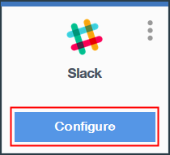

---

copyright:
  years: 2016

---

{:shortdesc: .shortdesc}
{:new_window: target="_blank"}

# Utilisation de chaînes d'outils sur {{site.data.keyword.Bluemix_notm}} public
{: #toolchains-using}

Dernière mise à jour : 7 octobre 2016
{: .last-updated}

Vous pouvez utiliser une chaîne d'outils pour améliorer la productivité de votre travail quotidien de développement, de déploiement et de vos opérations. Après avoir configuré une chaîne d'outils, vous pouvez ajouter, supprimer ou configurer des intégrations d'outils et gérer l'accès à la chaîne d'outils.
Les chaînes d'outils sont disponibles uniquement dans la région sud des Etats-Unis.
{: shortdesc}

**Remarque** : Assurez-vous de travailler dans le nouvel environnement Bluemix en vérifiant la bannière supérieure.

 * Si vous voyez un message relatif à l'essai du nouveau Bluemix, vous êtes dans l'environnement Bluemix classique. Cliquez sur le lien pour accéder au nouvel environnement Bluemix.
 * Si vous ne voyez pas ce message, vous êtes bien déjà dans le nouvel environnement Bluemix.

## Configuration d'une intégration d'outil
{: #configuring_a_tool_integration}

Si vous avez différé la configuration d'une intégration d'outil lors de la création d'une chaîne d'outils, un bouton **Configurer** s'affiche sur sa vignette. Si vous avez configuré une intégration d'outil à la création d'une chaîne d'outils, vous pouvez mettre à jour les paramètres de configuration.

1. Dans le tableau de bord DevOps, sur la page **Chaînes d'outils**, cliquez sur une chaîne d'outils afin d'ouvrir sa page Intégrations d'outils. Vous pouvez également, depuis la page de présentation de l'application, vignette de distribution continue, cliquer sur **Afficher la chaîne d'outils** puis sur **Intégrations d'outils**.
1. Si vous devez configurer une intégration d'outil pour la première fois, depuis sa vignette, cliquez sur **Configurer**.

  

 Lorsque vous avez terminé la configuration de l'intégration d'outil, cliquez sur **Sauvegarder l'intégration**.
 
1. Si vous devez mettre à jour la configuration d'une intégration d'outil, depuis sa vignette, cliquez sur le menu pour accéder aux options de configuration.

  
 
 Lorsque vous avez terminé la mis à jour des paramètres, cliquez sur **Sauvegarder l'intégration**.

## Ajout d'une intégration d'outil
{: #adding_a_tool_integration}

Vous pouvez ajouter et configurer des intégrations d'outils pour votre chaîne d'outils.

1. Dans le tableau de bord DevOps, sur la page **Chaînes d'outils**, cliquez sur une chaîne d'outils afin d'ouvrir sa page Intégrations d'outils. Vous pouvez également, depuis la page de présentation de l'application, vignette de distribution continue, cliquer sur **Afficher la chaîne d'outils** puis sur **Intégrations d'outils**.
1. Pour afficher la liste des intégrations d'outils à ajouter, cliquez sur le bouton d'ajout (+).
1. Cliquez sur une intégration d'outil à ajouter.
1. Entrez les informations requises pour configurer l'intégration d'outil. 
1. Cliquez sur **Créer une intégration** pour ajouter l'intégration d'outil à votre chaîne d'outils.

## Suppression d'une intégration d'outil
{: #deleting_a_tool_integration}

Si vous supprimez une intégration d'outil de votre chaîne d'outils, la suppression est irréversible. 

1. Dans le tableau de bord DevOps, sur la page **Chaînes d'outils**, cliquez sur une chaîne d'outils afin d'ouvrir sa page Intégrations d'outils. Vous pouvez également, depuis la page de présentation de l'application, vignette de distribution continue, cliquer sur **Afficher la chaîne d'outils** puis sur **Intégrations d'outils**.
1. Sur la vignette de l'intégration d'outil à supprimer, cliquez sur le menu pour accéder aux options de configuration.
1. Pour supprimer l'intégration d'outil de votre chaîne d'outils, cliquez sur **Supprimer**.
1. Confirmez en cliquant sur **Supprimer**.  

## Gestion des accès
{: #managing_access}

Vous pouvez accorder l'accès à une chaîne d'outils à des utilisateurs en les ajoutant à l'organisation (org) à laquelle la chaîne d'outils est associée. Chaque chaîne d'outils est associée à une organisation spécifique, et tout membre de cette organisation peut accéder aux chaînes d'outils associées. 
L'organisation au sein de laquelle vous travaillez actuellement s'affiche dans la barre de menus. Cliquez sur l'organisation et changez d'organisation pour accéder
à un ensemble différent de chaînes d'outils.

<!--CA: Commenting out the content on authentication for Interconnect since it applies to GitHub Enterprise. This content can be exposed again when GHE is supported for the Dedicated Beta 2.-->

<!--You have three authentication options for your Bluemix dedicated environment: LDAP, SAML, or Web ID. 

**Important:** For this beta, Web ID authentication requires additional user management on GitHub Enterprise.

If you use LDAP or SAML authentication in your Bluemix dedicated environment, when you add users to your Bluemix org and spaces, the users can log in to GitHub Enterprise by using their Bluemix ID and password, and accounts are created for them. When you add users to your Bluemix org and spaces, they are not automatically added to the GitHub Enterprise repo. Someone who has admin privileges for the repo must add them.  

If you use Web ID authentication, when you add users to your Bluemix org and spaces, a GitHub Enterprise site administrator must set up a GitHub Enterprise account for those users. Alternatively, new users can create a toolchain, in which case a GitHub Enterprise account is created for them. However, if those users want to access repos that are associated with toolchains besides their own, they must be granted access to those repos.

To add a user: -->

1. Dans le tableau de bord DevOps, sur la page **Chaînes d'outils**, cliquez sur la chaîne d'outils à gérer puis cliquez sur **Gérer**. Vous pouvez également, depuis la page de présentation de l'application, vignette de distribution continue, cliquer sur **Afficher la chaîne d'outils** puis sur **Gérer**.  
1. Cliquez sur le lien de votre organisation. 
1. Dans la page de gestion des organisations, cliquez sur **Inviter un utilisateur** et entrez l'adresse électronique de l'utilisateur.
1. Si vous souhaitez donner des droits avancés à des responsables {{site.data.keyword.Bluemix_notm}} d'organisations, sélectionnez une ou plusieurs des cases à cocher **Responsable**, **Responsable de la facturation** et **Auditeur**.
1. Cliquez sur **INVITER**.
1. Cliquez sur **SAUVEGARDER**.

## Suppression d'une chaîne d'outils
{: #deleting_a_toolchain}

Vous pouvez supprimer une chaîne d'outils et spécifier les intégrations d'outils associées à supprimer. Lorsque vous supprimez une chaîne d'outils, la suppression est irréversible.

1. Dans le tableau de bord DevOps, sur la page **Chaînes d'outils**, cliquez sur la chaîne d'outils à supprimer puis cliquez sur **Gérer**. Vous pouvez également, depuis la page de présentation de l'application, vignette de distribution continue, cliquer sur **Afficher la chaîne d'outils** puis sur **Gérer**.
1. Cliquez sur **Supprimer la chaîne d'outils**, examinez et modifiez éventuellement la liste des intégrations d'outils à supprimer.
1. Confirmez la suppression en entrant le nom de la chaîne d'outils et en cliquant sur **Supprimer**.  

 **Conseil **: Lorsque vous supprimer une intégration d'outil GitHub, le référentiel GitHub associé n'est pas supprimé de GitHub. Vous devez supprimer manuellement le référentiel depuis GitHub.
