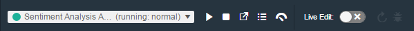

---

copyright:
  anni: 2015, 2016

---

{:new_window: target="_blank"}
{:shortdesc: .shortdesc}
{:screen:.screen}
{:codeblock:.codeblock}
{:pre: .pre}

# Modifica del codice con  Eclipse Orion {{site.data.keyword.webide}}
{: #web_ide}

Ultimo aggiornamento: 22 luglio 2016
{: .last-updated}

Eclipse Orion {{site.data.keyword.webide}} è un ambiente di sviluppo basato su browser in cui è possibile sviluppare per il Web. Puoi sviluppare in JavaScript, HTML e CSS con l'ausilio del content assist, del completamento del codice e del controllo errori. {{site.data.keyword.webide}} funziona con quasi tutte le lingue e offre l'evidenziazione della sintassi [per la maggior parte dei tipi di file](https://hub.jazz.net/docs/overview/#dev_support){: new_window}. Il controllo del codice sorgente viene integrato tramite l'SCM Git o Jazz e puoi distribuire il codice a livello locale per eseguire i test o il debug delle tue applicazioni.
{:shortdesc}

La parte migliore, è che {{site.data.keyword.webide}} è attivato dal Web. Non dovrai installare, gestire o ridimensionare nulla. Puoi sviluppare ovunque sia disponibile una connessione Internet.

## Impostazione dell'editor
{: #editorsetup}

{{site.data.keyword.webide}} è personalizzabile, consentendoti di scegliere gli schemi di colori, gli strumenti tecnici e le impostazioni che meglio soddisfano le tue esigenze di sviluppo. Per visualizzare e modificare le impostazioni, dal menu a sinistra, fai clic sull'icona **Impostazioni** .

<!-- LH: I don't think we need to include the following table, so I'm commenting it out. When you're viewing the settings in the Web IDE, this information should be obvious -->

<!--| Categories | Description  |
|---|---|
| Cloud Foundry  | Define a Cloud Foundry API and Manage URL  |
| CSS Validation | Define the severities for CSS linting rules that you use to check your code  |
| Editor Settings  | Configure editor-specific settings for key bindings, editor behavior, layout, and more  |
| Editor Styles  | Configure color schemes for the languages that you use, or import a theme from another editors  |
| Git  | Configure general settings for Git  |
| Globalization | Define globalization settings for your code |
| JavaScript Validation  | Define the severities for the JavaScript linting rules that you use to check your code  |
| Plug-ins  | Install, disable, or remove plug-ins from the editor  | -->

Se durante la modifica hai la necessità di cambiare spesso le impostazioni, puoi accedere rapidamente a esse utilizzando l'icona **Impostazioni editor locale**  nel lato superiore destro dell'editor


Per impostazione predefinita, le impostazioni per lo stile dell'editor e le dimensioni carattere vengono sempre visualizzate. Per includere altre impostazioni dell'editor nel menu, utilizza la seguente procedura:

1. Fai clic sull'icona **Impostazioni editor locale** .

2. Fai clic su **Impostazioni editor**.

3. Per includere o escludere un'impostazione dal menu **Impostazioni editor locale**, fai clic sul cerchio accanto all'impostazione.


## Modifica del codice
{: #editcode}

{{site.data.keyword.webide}} contiene due sezioni principali. La prima sezione è il navigatore di file sulla sinistra, che mostra i tuoi file di progetto in una struttura ad albero.  Dal navigatore di file, puoi creare, ridenominare, eliminare e gestire i tuoi file e cartelle.

**Suggerimento:** per caricare i file nel navigatore, trascinali dal computer al navigatore di file.

La seconda sezione è il riquadro dell'editor sulla destra. L'editor fornisce diverse funzioni di codifica, incluso il content assist e la convalida della sintassi. 


### Gestione di più file
1. Per lavorare con due file contemporaneamente, fai clic sull'icona **Passa a modalità di divisione editor**  nella parte superiore dell'editor.
2. Dal menu che viene visualizzato, seleziona una vista.

 Dopo aver selezionato una vista, se nell'editor è già stato aperto un file, questo viene visualizzato in entrambe le viste dell'editor.

 Per aprire o modificare un file visualizzato in una delle viste dell'editor: 
 1. Sposta il cursore nella vista dell'editor che vuoi modificare.
 2. Nel navigatore di file, fai clic su un file.

### Tasti di scelta rapida
La maggior parte dei comandi in {{site.data.keyword.webide}} sono accessibili solo tramite i tasti di scelta rapida.

Per visualizzare un elenco dei tasti di scelta rapida nell'editor, premi Alt+Maiusc+?. Se utilizzi un sistema operativo Mac OS, premi Ctrl+Maiusc+?.

## Gestione del codice sorgente
{: #sourcecontrol}

{{site.data.keyword.webide}} viene integrato con strumenti per la gestione del codice sorgente. Per lavorare con il tuo repository Git, fai clic sull'icona **Repository Git** . Per ulteriori informazioni, vedi [Source control with Git](https://hub.jazz.net/docs/git/){: new_window}.


## Distribuzione di un'applicazione dal tuo spazio di lavoro
{: #deploy}

1. Per distribuire la tua applicazione, dalla barra di esecuzione, seleziona o [crea](https://hub.jazz.net/tutorials/livesync/#launch_configuration){: new_window} una configurazione di avvio.
1. Fai clic sull'icona di distribuzione . Viene distribuita un'istanza della tua applicazione utilizzando il contenuto corrente dello spazio di lavoro e l'ambiente definito nella tua configurazione di avvio. 
2. Una volta che la tua applicazione è stata distribuita, puoi utilizzare la barra di esecuzione per arrestare, riavviare o eseguire il debug della tua applicazione, visualizzare i log e altro ancora.


<!-- LH: I'm commenting out the following list because I think this information is obvious from the UI. I also updated the preceding sentence to mention a few things that you can do from the run bar.

 * Stop the app: 
 * Open the deployed app: 
 * View the logs of the deployed app: 
 * Open the app's Dashboard: 
 * If you are developing a Node.js app, enable Live Edit mode: 
 * With Live Edit mode enabled, restart the app quickly, without redeployment: 
 * With Live Edit mode enabled, access the debugger:  -->

 ## Modifica al di fuori di {{site.data.keyword.webide}}
{: #editlocal}

Per utilizzare un editor al di fuori di {{site.data.keyword.webide}}, imposta {{site.data.keyword.Bluemix_live}} in modo che tu possa lavorare direttamente con i tuoi file di progetto in qualsiasi strumento.{{site.data.keyword.Bluemix_live_notm}} è un'applicazione da riga di comando che consente di sincronizzare le modifiche nel file system locale con il tuo spazio di lavoro cloud in {{site.data.keyword.jazzhub}}. 

### Prima di iniziare 

[Scarica e installa l'{{site.data.keyword.Bluemix_live_notm}} interfaccia riga di comando ](http://livesyncdownload.ng.bluemix.net){: new_window}.

### Sincronizzazione dell'ambiente locale con {{site.data.keyword.Bluemix_notm}}
{: #edit_local_download}

1. Apri una finestra della riga comandi.
2. Accedi a {{site.data.keyword.Bluemix_notm}}:

	```
	bl login
	```
	{: pre}

3. Quando ti viene richiesto, immetti il tuo ID IBM e la tua password.
4. Visualizza un elenco dei tuoi progetti {{site.data.keyword.Bluemix_notm}}: 

	```
	bl projects
	```
	{: pre}

4. Sincronizza il tuo ambiente locale con il tuo progetto su {{site.data.keyword.Bluemix_notm}}:

	```
	bl sync projectName
	```
	{: pre}

dove `projectName` è il nome della tua applicazione {{site.data.keyword.Bluemix_notm}}.

Dopo aver completato la modifica, immetti `q` per terminare la sincronizzazione.

### Abilitazione della funzione Desktop Sync per modificare il codice a livello locale

La funzione Desktop Sync è simile alla modalità Live Edit per la riga comandi. La funzione Desktop Sync ti permette di eseguire il debug sulla riga comandi.
1. In un'altra finestra della riga comandi, abilita la funzione Desktop Sync:

	```
	cd localDirectory
	bl start
	```
	{: codeblock}

2. Utilizza la configurazione di avvio che hai creato nel {{site.data.keyword.webide}}. Una volta selezionata la configurazione di avvio, la funzione Desktop Sync viene abilitata nel tuo ambiente locale. Nella finestra della riga comandi appena aperta, puoi visualizzare l'URL dell'applicazione, l'URL di debug, l'URL di gestione e verificare lo stato di {{site.data.keyword.Bluemix_live_notm}}.

3. Aggiorna il browser e verifica che sia possibile vedere le modifiche precedentemente salvate nei file statici all'interno del tuo spazio di lavoro. 

### Disabilitazione della funzione Desktop Sync

1. Nella seconda finestra della riga comandi, immetti `bl stop`.
2. Nella prima finestra della riga comandi, immetti `q`.
