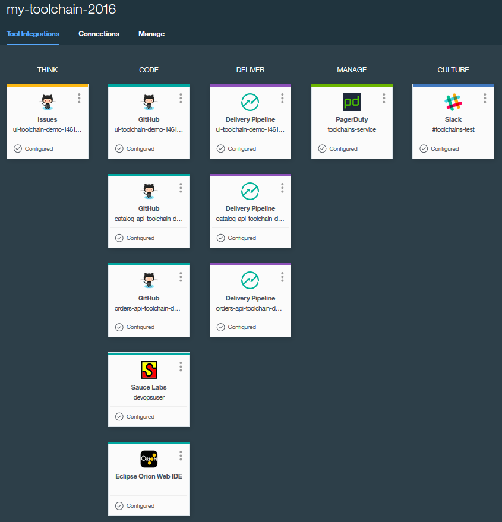

---

copyright:
  years: 2016

---
 
{:shortdesc: .shortdesc}
{:new_window: target="_blank"}

# ツールチェーン (ベータ版) の概要
{: #toolchains_getting_started}

最終更新日: 2016 年 10 月 7 日
{: .last-updated}  

ツールチェーンは、{{site.data.keyword.Bluemix}} の Public と Dedicated の環境で使用できます。ツールチェーンを作成する方法は、2 つあります。テンプレートを使用してツールチェーンを作成する方法と、アプリからツールチェーンを作成する方法です。{{site.data.keyword.Bluemix_notm}} Public の場合、ツールチェーンは米国南部地域でのみ利用可能です。
{: shortdesc}

##ツールチェーンの概要: Public
{: #getting_started_public}

**注記:** トップ・バナーをチェックして、新しい Bluemix エクスペリエンスで作業していることを確認してください。

 * 新しい Bluemix の試行についてのメッセージが表示される場合、クラシック Bluemix エクスペリエンスで作業しています。リンクをクリックして、新しい Bluemix エクスペリエンスを開きます。
 * メッセージが表示されない場合、すでに新しい Bluemix エクスペリエンスで作業しています。

それぞれのツールチェーンは特定の組織に関連付けられており、その組織のメンバーであるユーザーはだれでも、関連付けられたツールチェーンにアクセスできます。ツールチェーンを作成する前に、ツールチェーンを作成する組織内で作業していることを確認してください。現在作業中の組織は、メニュー・バーに表示されます。別の組織に切り替えるには、メニュー・バーの組織をクリックして、切り替えたい組織を選択します。

###テンプレートからのツールチェーンの作成   
{: #creating_a_toolchain_from_a_template}

テンプレートを開始点として使用して、特定のツール統合のセットが含まれたツールチェーンを作成できます。

1. 最初のツールチェーンを作成する場合は、ツールチェーンが組織内で有効になっていることを確認してください。
   1. DevOps ダッシュボードを開き、**「ツールチェーン」**ページをクリックします。
   2. **「ツールチェーンを有効にする (Enable Toolchains)」**ボタンが表示されたら、そのボタンをクリックし、画面の指示に従ってツールチェーンを作成します。
   3. **「ツールチェーンを有効にする (Enable Toolchains)」**ボタンが表示されない場合、ツールチェーンはすでに有効になっています。ステップ 2 に進みます。
1. DevOps ダッシュボードの**「ツールチェーン」**ページで追加ボタン (+) をクリックし、ツールチェーンを作成します。
1. ツールチェーン・テンプレートをクリックします。例えば、オンライン・ストアのサンプルを使用してツールチェーンを作成する場合は、**「マイクロサービス・ツールチェーン (Microservices toolchain)」**をクリックします。 
1. ツールチェーン作成ページで、作成しようとしているツールチェーンの図を確認します。この図は、各ツール統合のツールチェーンにおけるライフサイクル・フェーズを表しています。次のイメージの図はその例です。ツールチェーンを作成するときは、この図に、ツールチェーンを構成する各ツール統合が表示されます。

1. ツールチェーンの設定値のデフォルトの情報を確認します。{{site.data.keyword.Bluemix_notm}} にツールチェーンの名前が示されます。同じ名前のツールチェーンが既に存在する場合や、別の名前を使用したい場合は、ツールチェーンの名前を変更してください。  
1. 「構成可能な統合 (Configurable Integrations)」セクションで、ツールチェーンに構成する各ツール統合を選択します。一部のツール統合では、構成は不要です。ツール統合の構成については、[ツール統合の構成 (リンク先が新しいウィンドウで開きます)](../toolchains/toolchains_integrations.html){: new_window} を参照してください。
1. **「作成」**をクリックします。以下のようないくつかのステップが自動で実行されて、ツールチェーンがセットアップされます。

 * ツールチェーンが作成されます。
 * Delivery Pipeline ツール統合を構成した場合は、それらのパイプラインが起動されます。
 * Sauce Labs ツール統合を構成した場合は、ジョブをパイプラインに追加してテストを実行するように Sauce Labs 統合が構成されます。
 * PagerDuty ツール統合を構成した場合は、Slack で構成したチャネルに通知を送信するように PagerDuty 統合が構成されます。これらの通知は、いつ問題が発生したかを示します。
 * Slack ツール統合を構成した場合は、Slack で構成したチャネルに通知を送信するように Slack 統合が構成されます。これらの通知は、デプロイメントの進捗 (例えば、「`プロジェクト XYZ に接続しました (Connected with Project XYZ)`」、「`パイプラインが構成されました (Pipeline Configured)`」、「 `'build' ステージを開始しました (Stage 'build' started)`」など) を示します。
 * GitHub ツール統合を構成した場合は、サンプルの GitHub リポジトリーが GitHub アカウント内に複製されます。

###アプリからのツールチェーンの作成
{: #creating_a_toolchain_from_an_app}

アプリからツールチェーンを作成できます。ツールチェーンは、継続的な開発、デプロイメント、モニタリングなどをサポートでき、使用するアプリに関連付けられます。それぞれのアプリをツールチェーンに関連付けることができます。ツールチェーンの GitHub リポジトリーに変更内容をプッシュすると、パイプラインによってアプリが自動的に作成されてデプロイされます。  

1. 最初のツールチェーンを作成する場合は、ツールチェーンが組織内で有効になっていることを確認してください。
   1. DevOps ダッシュボードを開き、**「ツールチェーン」**ページをクリックします。
   2. **「ツールチェーンを有効にする (Enable Toolchains)」**ボタンが表示されたら、そのボタンをクリックし、画面の指示に従ってツールチェーンを作成します。
   3. **「ツールチェーンを有効にする (Enable Toolchains)」**ボタンが表示されない場合、ツールチェーンはすでに有効になっています。ステップ 2 に進みます。
1. 使用するアプリの「概要」ページの「継続的デリバリー (Continuous Delivery)」タイルで、**「有効にする (Enable)」**をクリックします。または、{{site.data.keyword.Bluemix_notm}} Classic Experience では、アプリの「概要」ページの右上隅にある**「ツールチェーンの追加」**をクリックしてください。使用するアプリに、アプリのスターター・コードが設定された新しい GitHub リポジトリーからの継続的デリバリーのための構成が行われます。
1. ツールチェーン作成ページで、作成しようとしているツールチェーンの図を確認します。この図は、各ツール統合のツールチェーンにおけるライフサイクル・フェーズを表しています。
1. ツールチェーンの設定値のデフォルトの情報を確認します。{{site.data.keyword.Bluemix_notm}} にツールチェーンの名前が示されます。同じ名前のツールチェーンが既に存在する場合や、別の名前を使用したい場合は、ツールチェーンの名前を変更してください。
1. 「構成可能な統合 (Configurable Integrations)」セクションで、ツールチェーンに構成する各ツール統合を選択します。一部のツール統合では、構成は不要です。ツール統合の構成については、[ツール統合の構成 (リンク先が新しいウィンドウで開きます)](../toolchains/toolchains_integrations.html){: new_window} を参照してください。
1. **「作成」**をクリックします。以下のようないくつかのステップが自動で実行されて、ツールチェーンがセットアップされます。

 * ツールチェーンが作成されます。
 * Delivery Pipeline ツール統合を構成した場合は、それらのパイプラインが起動されます。
 * Sauce Labs ツール統合を構成した場合は、ジョブをパイプラインに追加してテストを実行するように Sauce Labs 統合が構成されます。
 * PagerDuty ツール統合を構成した場合は、Slack で構成したチャネルに通知を送信するように PagerDuty 統合が構成されます。これらの通知は、いつ問題が発生したかを示します。
 * Slack ツール統合を構成した場合は、Slack で構成したチャネルに通知を送信するように Slack 統合が構成されます。これらの通知は、デプロイメントの進捗 (例えば、「`プロジェクト XYZ に接続しました (Connected with Project XYZ)`」、「`パイプラインが構成されました (Pipeline Configured)`」、「 `'build' ステージを開始しました (Stage 'build' started)`」など) を示します。
 * GitHub ツール統合を構成した場合は、サンプルの GitHub リポジトリーが GitHub アカウント内に複製されます。

##ツールチェーンの概要: Dedicated
{: #getting_started_dedicated}

それぞれのツールチェーンは特定の組織に関連付けられており、その組織のメンバーであるユーザーはだれでも、関連付けられたツールチェーンにアクセスできます。ツールチェーンを作成する前に、メニューバーの **{{site.data.keyword.avatar}}** アイコンをクリックして「アカウントとサポート」ウィジェットを開き、作業中の組織を表示してください。その組織でツールチェーンを作成するわけでない場合は、別の組織に切り替えます。

###テンプレートからのツールチェーンの作成   
{: #creating_a_toolchain_from_a_template_dedicated}

テンプレートを開始点として使用して、特定のツール統合のセットが含まれたツールチェーンを作成できます。

1. 最初のツールチェーンを作成する場合は、ツールチェーンが組織内で有効になっていることを確認してください。
   1. DevOps ダッシュボードを開き、**「ツールチェーン」**タブをクリックします。
   2. **「ツールチェーンを有効にする (Enable Toolchains)」**ボタンが表示されたら、そのボタンをクリックし、画面の指示に従ってツールチェーンを作成します。
   3. **「ツールチェーンを有効にする (Enable Toolchains)」**ボタンが表示されない場合、ツールチェーンはすでに有効になっています。ステップ 2 に進みます。
1. {{site.data.keyword.Bluemix_notm}} ダッシュボードの**「DEVOPS」**タブで追加ボタン (+) をクリックし、ツールチェーンを作成します。
1. ツールチェーン・テンプレートをクリックします。例えば、新しい Cloud Foundry アプリをデプロイするためのシンプルなツールチェーンを作成する場合は、**「簡易 Cloud Foundry ツールチェーン (Simple Cloud Foundry toolchain)」**をクリックします。 
1. ツールチェーン作成ページで、作成しようとしているツールチェーンの図を確認します。この図は、各ツール統合のツールチェーンにおけるライフサイクル・フェーズを表しています。次のイメージの図はその例です。ツールチェーンを作成するときは、この図に、ツールチェーンを構成する各ツール統合が表示されます。

1. ツールチェーンの設定値のデフォルトの情報を確認します。{{site.data.keyword.Bluemix_notm}} にツールチェーンの名前が示されます。同じ名前のツールチェーンが既に存在する場合や、別の名前を使用したい場合は、ツールチェーンの名前を変更してください。  
1. 「構成可能な統合 (Configurable Integrations)」セクションで、ツールチェーンに構成する各ツール統合を選択します。一部のツール統合では、構成は不要です。ツール統合の構成については、[ツール統合の構成 (リンク先が新しいウィンドウで開きます)](../toolchains/toolchains_integrations.html){: new_window} を参照してください。
1. **「作成」**をクリックします。以下のようないくつかのステップが自動で実行されて、ツールチェーンがセットアップされます。

 * ツールチェーンが作成されます。
 * Delivery Pipeline ツール統合を構成した場合は、それらのパイプラインが起動されます。
 * GitHub Enterprise ツール統合を構成した場合は、サンプルの GitHub Enterprise リポジトリーが GitHub Enterprise アカウント内に複製されます。

###アプリからのツールチェーンの作成
{: #creating_a_toolchain_from_an_app_dedicated}

アプリからツールチェーンを作成できます。ツールチェーンは、継続的な開発、デプロイメント、モニタリングなどをサポートでき、使用するアプリに関連付けられます。それぞれのアプリをツールチェーンに関連付けることができます。ツールチェーンの GitHub Enterprise リポジトリーに変更内容をプッシュすると、パイプラインによってアプリが自動的に作成されてデプロイされます。  

1. 最初のツールチェーンを作成する場合は、ツールチェーンが組織内で有効になっていることを確認してください。
   1. DevOps ダッシュボードを開き、**「ツールチェーン」**タブをクリックします。
   2. **「ツールチェーンを有効にする (Enable Toolchains)」**ボタンが表示されたら、そのボタンをクリックし、画面の指示に従ってツールチェーンを作成します。
   3. **「ツールチェーンを有効にする (Enable Toolchains)」**ボタンが表示されない場合、ツールチェーンはすでに有効になっています。ステップ 2 に進みます。
1. アプリの「概要」ページの右上隅にある**「ツールチェーンの追加」**をクリックします。使用するアプリに、アプリのスターター・コードが設定された新しい GitHub Enterprise リポジトリーからの継続的デリバリーのための構成が行われます。
1. ツールチェーン作成ページで、作成しようとしているツールチェーンの図を確認します。この図は、各ツール統合のツールチェーンにおけるライフサイクル・フェーズを表しています。
1. ツールチェーンの設定値のデフォルトの情報を確認します。{{site.data.keyword.Bluemix_notm}} にツールチェーンの名前が示されます。同じ名前のツールチェーンが既に存在する場合や、別の名前を使用したい場合は、ツールチェーンの名前を変更してください。
1. 「構成可能な統合 (Configurable Integrations)」セクションで、ツールチェーンに構成する各ツール統合を選択します。一部のツール統合では、構成は不要です。ツール統合の構成については、[ツール統合の構成 (リンク先が新しいウィンドウで開きます)](../toolchains/toolchains_integrations.html){: new_window} を参照してください。
1. **「作成」**をクリックします。以下のようないくつかのステップが自動で実行されて、ツールチェーンがセットアップされます。

 * ツールチェーンが作成されます。
 * Delivery Pipeline ツール統合を構成した場合は、それらのパイプラインが起動されます。
 * GitHub Enterprise ツール統合を構成した場合は、サンプルの GitHub Enterprise リポジトリーが GitHub Enterprise アカウント内に複製されます。

##ツールチェーンの表示
{: #viewing_a_toolchain}

ツールチェーンとツール統合を構成したら、「ツール統合 (Tool Integrations)」ページでそのツールチェーンのビジュアル表示を確認できます。

* {{site.data.keyword.Bluemix_notm}} Public を使用する場合は、DevOps ダッシュボードの**「ツールチェーン」**ページで、ツールチェーンをクリックして「ツール統合 (Tool Integrations)」ページを開きます。または、アプリの「概要」ページの「継続的デリバリー (Continuous Delivery)」タイルで、**「ツールチェーンの表示」**をクリックします。次に、**「ツール統合 (Tool Integrations)」**をクリックします。 
   
* {{site.data.keyword.Bluemix_notm}} Dedicated を使用する場合は、ダッシュボードの**「DEVOPS」**タブで、ツールチェーンをクリックして「ツール統合 (Tool Integrations)」ページを開きます。または、アプリの「概要」ページの右上隅にある**「ツールチェーンの表示」**をクリックします。

* ツールチェーン内のツール統合にアクセスするには、そのツールのタイルをクリックします。 
 
 **ヒント**: GitHub または GitHub Enterprise のリポジトリーが複数ある場合は、それぞれのリポジトリーに対応するタイルが表示されるので、同じツール統合に対して複数のタイルが表示されることがあります。

 <!-- The toolchain in the following image is an example. When you create your own toolchain, the visual representation of the toolchain shows the tool integrations that you configure.
 -->

# 関連リンク
{: #rellinks}

## チュートリアルとサンプル
{: #samples}

* [3 つのマイクロサービス (ベータ版) でアプリケーションを作成する方法 (リンク先が新しいウィンドウで開きます)](https://www.ibm.com/devops/method/tutorials/tutorial_microservices_part1){:new_window}
* [{{site.data.keyword.Bluemix_notm}} Dedicated (ベータ版) でテンプレートからツールチェーンを作成する方法 (リンク先が新しいウィンドウで開きます)](https://www.ibm.com/devops/method/tutorials/tutorial_dedicated_toolchain_template_flow){:new_window}
* [{{site.data.keyword.Bluemix_notm}} Dedicated (ベータ版) でアプリからツールチェーンを作成する方法 (リンク先が新しいウィンドウで開きます)](https://www.ibm.com/devops/method/tutorials/tutorial_dedicated_toolchain_app_flow){:new_window}

## 関連リンク
{: #general}

* [マイクロサービス・ツールチェーン (ベータ版) (リンク先が新しいウィンドウで開きます)](https://www.ibm.com/devops/method/toolchains/microservices_toolchain){:new_window}
* [簡易ツールチェーン (ベータ版) (リンク先が新しいウィンドウで開きます)](https://www.ibm.com/devops/method/toolchains/simple_toolchain){:new_window}
* [IBM Bluemix Garage Method (リンク先が新しいウィンドウで開きます)](https://www.ibm.com/devops/method){:new_window}
