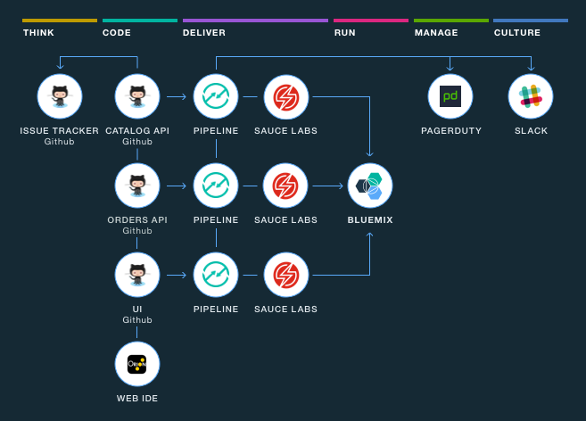

---

copyright:
  years: 2016

---
 
{:shortdesc: .shortdesc}
{:new_window: target="_blank"}

# 开始使用工具链 (Beta)
{: #toolchains_getting_started}

上次更新时间：2016 年 10 月 7 日
{: .last-updated}  

{{site.data.keyword.Bluemix}} 的 Public 和 Dedicated 环境中可使用工具链。您可以使用两种方法来创建工具链：使用模板创建工具链，或者通过应用程序创建工具链。在 {{site.data.keyword.Bluemix_notm}} Public 中，工具链仅在美国南部区域可用。
{: shortdesc}

## 开始使用工具链：Public
{: #getting_started_public}

**注：**请查看顶部条幅，以确保是在“新 Bluemix 体验”中执行操作。

 * 如果看到有关尝试新 Bluemix 的消息，那么说明您是在“经典 Bluemix 体验”中执行操作。单击该链接以打开“新 Bluemix 体验”。
 * 如果没有看到该消息，那么说们您已经在“新 Bluemix 体验”中。

每一个工具链都与特定组织相关联，且作为该组织成员的任何用户都可以访问其关联的工具链。创建工具链之前，请确保您在想要创建工具链的组织中工作。您当前正在哪个组织中工作会显示在菜单栏中。要切换到其他组织，请单击菜单栏中的该组织，然后选择您要切换到的组织。

### 通过模板创建工具链   
{: #creating_a_toolchain_from_a_template}

您可以使用模板作为起始点，来创建包含一组特定工具集成的工具链。

1. 如果是创建第一个工具链，请确保组织中已启用工具链：
   1. 打开 DevOps 仪表板，然后单击**工具链**页面。
   2. 如果显示**启用工具链**按钮，请在其上单击，并遵循提示来创建工具链。
   3. 如果未显示**启用工具链**按钮，表明工具链已启用。请转至步骤 2。
1. 在 DevOps 仪表板的**工具链**页面上，单击添加按钮 (+)，以创建工具链。
1. 单击工具链模板。例如，要使用网上商店样本来创建工具链，请单击**微型服务工具链**。 
1. 在工具链创建页面上，复查您要创建的工具链的图。该图显示工具链中处于其生命周期阶段的每一个工具集成。以下图像中的图是示例。创建工具链时，该图显示属于工具链的每一个工具集成。

1. 复查工具链设置的缺省信息。工具链名称使其可在 {{site.data.keyword.Bluemix_notm}} 中进行识别。如果您的工具链已经具有该名称，或者您想要使用不同的名称，请更改工具链的名称。  
1. 在“可配置的集成”部分中，选择要为工具链配置的每一个工具集成。有些工具集成无需进行任何配置。有关配置工具集成的信息，请参阅[配置工具集成（在新窗口中打开链接）](../toolchains/toolchains_integrations.html){: new_window}。
1. 单击**创建**。此时将自动运行数个步骤，以设置工具链：

 * 创建工具链。
 * 如果已配置 Delivery Pipeline 工具集成，那么会触发管道。
 * 如果已配置 Sauce Labs 工具集成，那么 Sauce Labs 集成会配置为向管道添加作业，并运行测试。
 * 如果已配置 PagerDuty 工具集成，那么 PagerDuty 集成会配置为向您在 Slack 中配置的通道发送通知。这些通知指示何时发生问题。
 * 如果已配置 Slack 工具集成，那么 Slack 集成会配置为向您在 Slack 中配置的通道发送通知。这些通知指示部署的进度；例如，`已与项目 XYZ 连接`、`已配置管道`和`已启动“构建”阶段`。
 * 如果已配置 GitHub 工具集成，那么样本 GitHub 存储库会克隆到 GitHub 帐户。

### 通过应用程序创建工具链
{: #creating_a_toolchain_from_an_app}

您可以从应用程序创建工具链。工具链可以支持持续开发、部署、监视等操作，且与应用程序相关联。每一个应用程序都可以与工具链相关联。当您将更改推送到工具链的 GitHub 存储库时，管道会自动构建和部署应用程序。  

1. 如果是创建第一个工具链，请确保组织中已启用工具链：
   1. 打开 DevOps 仪表板，然后单击**工具链**页面。
   2. 如果显示**启用工具链**按钮，请在其上单击，并遵循提示来创建工具链。
   3. 如果未显示**启用工具链**按钮，表明工具链已启用。请转至步骤 2。
1. 在应用程序“概述”页面的“持续交付”磁贴上，单击**启用**。或者，在 {{site.data.keyword.Bluemix_notm}}“典型经验”中，在应用程序的“概述”页面的右上角，单击**添加工具链**。此时，将会对您的应用程序进行配置，以便可通过填充应用程序入门模板代码的新 GitHub 存储库，进行持续交付。
1. 在工具链创建页面上，复查您要创建的工具链的图。该图显示工具链中处于其生命周期阶段的每一个工具集成。
1. 复查工具链设置的缺省信息。工具链名称使其可在 {{site.data.keyword.Bluemix_notm}} 中进行识别。如果您的工具链已经具有该名称，或者您想要使用不同的名称，请更改工具链的名称。
1. 在“可配置的集成”部分中，选择要为工具链配置的每一个工具集成。有些工具集成无需进行任何配置。有关配置工具集成的信息，请参阅[配置工具集成（在新窗口中打开链接）](../toolchains/toolchains_integrations.html){: new_window}。
1. 单击**创建**。此时将自动运行数个步骤，以设置工具链：

 * 创建工具链。
 * 如果已配置 Delivery Pipeline 工具集成，那么会触发管道。
 * 如果已配置 Sauce Labs 工具集成，那么 Sauce Labs 集成会配置为向管道添加作业，并运行测试。
 * 如果已配置 PagerDuty 工具集成，那么 PagerDuty 集成会配置为向您在 Slack 中配置的通道发送通知。这些通知指示何时发生问题。
 * 如果已配置 Slack 工具集成，那么 Slack 集成会配置为向您在 Slack 中配置的通道发送通知。这些通知指示部署的进度；例如，`已与项目 XYZ 连接`、`已配置管道`和`已启动“构建”阶段`。
 * 如果已配置 GitHub 工具集成，那么样本 GitHub 存储库会克隆到 GitHub 帐户。

## 开始使用工具链：Dedicated
{: #getting_started_dedicated}

每一个工具链都与特定组织相关联，且作为该组织成员的任何用户都可以访问其关联的工具链。创建工具链之前，请单击菜单栏中的 **{{site.data.keyword.avatar}}** 图标 ，以打开“帐户和支持”窗口小部件，并查看您正在其中工作的组织。如果该组织不是您要创建工具链的组织，请切换为其他组织。

### 通过模板创建工具链   
{: #creating_a_toolchain_from_a_template_dedicated}

您可以使用模板作为起始点，来创建包含一组特定工具集成的工具链。

1. 如果是创建第一个工具链，请确保组织中已启用工具链：
   1. 打开 DevOps 仪表板，并单击**工具链**选项卡。
   2. 如果显示**启用工具链**按钮，请在其上单击，并遵循提示来创建工具链。
   3. 如果未显示**启用工具链**按钮，表明工具链已启用。请转至步骤 2。
1. 在 {{site.data.keyword.Bluemix_notm}} 仪表板的 **DEVOPS** 选项卡上，单击添加按钮 (+)，以创建工具链。
1. 单击工具链模板。例如，要创建简单工具链来部署新的 Cloud Foundry 应用程序，请单击**简单 Cloud Foundry 工具链**。 
1. 在工具链创建页面上，复查您要创建的工具链的图。该图显示工具链中处于其生命周期阶段的每一个工具集成。以下图像中的图是示例。创建工具链时，该图显示属于工具链的每一个工具集成。

1. 复查工具链设置的缺省信息。工具链名称使其可在 {{site.data.keyword.Bluemix_notm}} 中进行识别。如果您的工具链已经具有该名称，或者您想要使用不同的名称，请更改工具链的名称。  
1. 在“可配置的集成”部分中，选择要为工具链配置的每一个工具集成。有些工具集成无需进行任何配置。有关配置工具集成的信息，请参阅[配置工具集成（在新窗口中打开链接）](../toolchains/toolchains_integrations.html){: new_window}。
1. 单击**创建**。此时将自动运行数个步骤，以设置工具链：

 * 创建工具链。
 * 如果已配置 Delivery Pipeline 工具集成，那么会触发管道。
 * 如果已配置 GitHub Enterprise 工具集成，那么样本 GitHub Enterprise 存储库会克隆到 GitHub Enterprise 帐户。

### 通过应用程序创建工具链
{: #creating_a_toolchain_from_an_app_dedicated}

您可以从应用程序创建工具链。工具链可以支持持续开发、部署、监视等操作，且与应用程序相关联。每一个应用程序都可以与工具链相关联。当您将更改推送到工具链的 GitHub Enterprise 存储库时，管道会自动构建和部署应用程序。  

1. 如果是创建第一个工具链，请确保组织中已启用工具链：
   1. 打开 DevOps 仪表板，并单击**工具链**选项卡。
   2. 如果显示**启用工具链**按钮，请在其上单击，并遵循提示来创建工具链。
   3. 如果未显示**启用工具链**按钮，表明工具链已启用。请转至步骤 2。
1. 在应用程序“概述”页面的右上角，单击**添加工具链**。此时，将会对您的应用程序进行配置，以便可通过填充应用程序入门模板代码的新 GitHub Enterprise 存储库，进行持续交付。
1. 在工具链创建页面上，复查您要创建的工具链的图。该图显示工具链中处于其生命周期阶段的每一个工具集成。
1. 复查工具链设置的缺省信息。工具链名称使其可在 {{site.data.keyword.Bluemix_notm}} 中进行识别。如果您的工具链已经具有该名称，或者您想要使用不同的名称，请更改工具链的名称。
1. 在“可配置的集成”部分中，选择要为工具链配置的每一个工具集成。有些工具集成无需进行任何配置。有关配置工具集成的信息，请参阅[配置工具集成（在新窗口中打开链接）](../toolchains/toolchains_integrations.html){: new_window}。
1. 单击**创建**。此时将自动运行数个步骤，以设置工具链：

 * 创建工具链。
 * 如果已配置 Delivery Pipeline 工具集成，那么会触发管道。
 * 如果已配置 GitHub Enterprise 工具集成，那么样本 GitHub Enterprise 存储库会克隆到 GitHub Enterprise 帐户。

## 查看工具链
{: #viewing_a_toolchain}

配置工具链及其工具集成之后，您可以在“工具集成”页面中，查看工具链的可视化表示。

* 如果使用的是 {{site.data.keyword.Bluemix_notm}} Public，请在 DevOps 仪表板的**工具链**页面上单击工具链，以打开其“工具集成”页面。或者，在应用程序“概述”页面的“持续交付”磁贴上，单击**查看工具链**。然后，单击**工具集成**。 
   
* 如果使用的是 {{site.data.keyword.Bluemix_notm}} Dedicated，请在仪表板的 **DEVOPS** 选项卡上，单击该工具链，以打开其“工具集成”页面。或者，在应用程序“概述”页面的右上角，单击**查看工具链**。

* 要访问工具链中的工具集成，请单击工具的磁贴。 
 
 **提示**：如果您具有多个 GitHub 或 GitHub Enterprise 存储库，那么相同的工具集成可能具有多个磁贴，因为每一个存储库由其自己的磁贴表示。

 <!-- The toolchain in the following image is an example. When you create your own toolchain, the visual representation of the toolchain shows the tool integrations that you configure.
 -->

# 相关链接
{: #rellinks}

## 教程与样本
{: #samples}

* [Create an application with three microservices (Beta)（在新窗口中打开链接）](https://www.ibm.com/devops/method/tutorials/tutorial_microservices_part1){:new_window}
* [在 {{site.data.keyword.Bluemix_notm}} Dedicated (Beta) 上从模板创建工具链（在新窗口中打开链接）](https://www.ibm.com/devops/method/tutorials/tutorial_dedicated_toolchain_template_flow){:new_window}
* [在 {{site.data.keyword.Bluemix_notm}} Dedicated (Beta) 上从应用程序创建工具链（在新窗口中打开链接）](https://www.ibm.com/devops/method/tutorials/tutorial_dedicated_toolchain_app_flow){:new_window}

## 相关链接
{: #general}

* [Microservices toolchain (Beta)（在新窗口中打开链接）](https://www.ibm.com/devops/method/toolchains/microservices_toolchain){:new_window}
* [Simple toolchain (Beta)（在新窗口中打开链接）](https://www.ibm.com/devops/method/toolchains/simple_toolchain){:new_window}
* [IBM Bluemix Garage Method（在新窗口中打开链接）](https://www.ibm.com/devops/method){:new_window}
