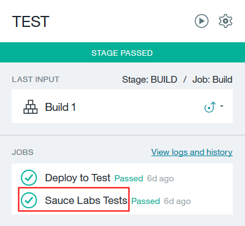

---

copyright:
  years: 2016

---

{:new_window: target="_blank"}
{:shortdesc: .shortdesc}
{:screen:.screen}
{:codeblock:.codeblock}

# 配置工具整合
{: #integrations}

前次更新：2016 年 10 月 18 日
{: .last-updated}

您可以在建立工具鏈時配置可支援開發、部署及操作作業的工具整合，也可以新增及配置用來自訂現有工具鏈的工具整合。  
{:shortdesc}

**重要事項**：在「{{site.data.keyword.Bluemix_notm}} 公用」上，工具鏈只適用於美國南部地區。

根據是在「{{site.data.keyword.Bluemix_notm}} 公用」還是在「{{site.data.keyword.Bluemix_notm}} 專用」上使用工具鏈，可用來新增及配置工具鏈的工具整合會不同。如果您在「{{site.data.keyword.Bluemix_notm}} 專用」上使用工具鏈，則可供您使用的工具整合取決於 {{site.data.keyword.jazzhub_title}} 在特定環境上的設定方式。

*表格 1. 可用於「{{site.data.keyword.Bluemix_notm}} 公用」及「專用」上之工具鏈的工具整合*

|工具整合 |可用於 {{site.data.keyword.Bluemix_notm}} 公用	|可用於 {{site.data.keyword.Bluemix_notm}} 專用（環境相依）|
|:----------|:------------------------------|:------------------|
|{{site.data.keyword.deliverypipeline}} 		|是	   	|是  		|
|{{site.data.keyword.DRA_short}} 		|是		|否			|
|Eclipse Orion {{site.data.keyword.webide}}		|是		|是			|
|GitHub		|是		|是		|
|專用 GitHub Enterprise			|否		|是		|
|其他工具			|是		|是		|
|PagerDuty			|是		|是		|
|Sauce Labs		|是		|否		|
|Slack			|是		|是		|

**提示**：如果您要在「{{site.data.keyword.Bluemix_notm}} 公用」上開始使用原始碼進行開發，請先配置 GitHub 工具整合，再配置 {{site.data.keyword.deliverypipeline}}。如果您要在「{{site.data.keyword.Bluemix_notm}} 專用」上開始使用程式碼進行開發，請先配置 {{site.data.keyword.ghe_short}} 工具整合或 GitHub 工作整合，再配置 {{site.data.keyword.deliverypipeline}}。 


## 配置 Delivery Pipeline
{: #deliverypipeline}

{{site.data.keyword.deliverypipeline}} 會透過數個系列的階段來自動化專案的持續部署，而這些階段會擷取輸入及執行工作（例如建置、測試及部署）。 

配置 {{site.data.keyword.deliverypipeline}} 來自動化您應用程式的持續建置、測試及部署： 

1. 如果您要在建立工具鏈時配置此工具整合，請按一下「可配置的整合」區段中的 **Delivery Pipeline**。根據您使用的範本，可能會有不同的欄位。請檢閱預設欄位值，並在必要時變更那些設定。
1. 如果您在「{{site.data.keyword.Bluemix_notm}} 公用」上有工具鏈，並且要在其中新增此工具整合，請在 DevOps 儀表板的**工具鏈**頁面上，按一下工具鏈來開啟它的「工具整合」頁面。或者，在應用程式之「概觀」頁面的「持續交付」磚上，按一下**檢視工具鏈**。然後，按一下**工具整合**。如果您是在「{{site.data.keyword.Bluemix_notm}} 專用」上使用工具鏈，請在「儀表板」的 **DevOps** 標籤上，按一下工具鏈來開啟它的「工具整合」頁面。或者，在應用程式之「概觀」頁面的右上角，按一下**檢視工具鏈**。然後，按一下**工具整合**。 
1. 按一下新增按鈕 (+)。
1. 在「工具整合」區段中，按一下 **Delivery Pipeline**。
1. 指定新管線的名稱。
1. 如果您計劃使用管線來部署使用者介面，請選取**可檢視的應用程式**勾選框。管線所建立的所有應用程式都會顯示在工具鏈之「工具整合」頁面的**檢視應用程式**清單中。
1. 按一下**建立整合**，以將 {{site.data.keyword.deliverypipeline}} 新增至您的工具鏈。
1. 按一下 {{site.data.keyword.deliverypipeline}} 的磚來檢視管線，並對其進行配置。若要瞭解如何配置管線的基本觀念，請參閱[建置及部署管線（在新視窗中開啟鏈結）](../services/DeliveryPipeline/build_deploy.html){: new_window}。

  **提示**：如果您要在將變更推送至 GitHub 或 {{site.data.keyword.ghe_short}} 儲存庫時觸發管線，必須先配置工具鏈的 GitHub 或 {{site.data.keyword.ghe_short}}，再定義管線的階段。管線階段需要儲存庫的 Git URL。每一個管線階段都只能參照與您工具鏈相關聯的其中一個 GitHub 或 {{site.data.keyword.ghe_short}} 儲存庫。如需配置 GitHub 的指示，請參閱  [GitHub](#github) 一節。如需配置「專用 GitHub Enterprise」的指示，請參閱[開始使用 {{site.data.keyword.ghe_long}}（在新視窗中開啟鏈結）](../services/ghededicated/index.html){: new_window}。
  
1. 選用項目：如果您是在「{{site.data.keyword.Bluemix_notm}} 公用」上使用工具鏈，並且想要 Sauce Labs 對您的應用程式執行測試，請配置 {{site.data.keyword.deliverypipeline}} 來新增 Sauce Labs 測試工作。如需配置測試工作的指示，請參閱[在管線中配置 Sauce Labs 測試工作](#config_saucelabs)一節。

### 在管線中配置 Sauce Labs 測試工作
{: #config_saucelabs}

您需要工作中管線有建置並部署應用程式的階段，而且必須為工具鏈配置 Sauce Labs，再於管線中配置 Sauce Labs 測試工作。如需配置 Sauce Labs 的指示，請參閱 [Sauce Labs](#saucelabs) 一節。

配置 {{site.data.keyword.deliverypipeline}} 來新增 Sauce Labs 測試工作：

1. 如果您沒有可部署您應用程式之測試版本的階段，請建立一個。
1. 在此階段中，於部署工作之後新增測試工作。將這些工作放在相同的階段中，它們即可存取一組相同的環境內容。
   

1. 配置階段： 

  a. 在**環境內容**標籤上，建立三個內容：CF_APP_NAME、SAUCE_USERNAME 及 SAUCE_ACCESS_KEY。
  
  b. 輸入 Sauce Labs 使用者名稱和存取金鑰。這麼做可以提出那些值，以將它們用於測試中。
  
1. 配置部署工作。在**部署 Script** 欄位中，包括下列指令：`export CF_APP_NAME="$CF_APP"`。該指令會將應用程式名稱匯出為環境內容。
1. 配置測試工作。下列影像中的值是範例。**服務實例**、**目標**、**組織**及**空間**欄位會移入您正在使用的 Sauce Labs 使用者名稱、地區、組織及空間。


  a. 針對測試器類型，選取 **Sauce Labs**。
  
  b. 針對服務實例，選取您為工具鏈配置 Sauce Labs 時所使用的 Sauce Labs 使用者名稱。 
  
   **提示**：若要查看您為工具鏈配置 Sauce Labs 時所使用的使用者名稱和存取金鑰，請按一下**配置**。 
  
  c. 在**測試執行指令**欄位中，輸入可安裝測試所需相依關係的指令，然後執行測試。例如，針對 Node.js 應用程式，您可以輸入下列指令：
     ```
     npm install
     node_modules/grunt-cli/bin/grunt test:sauce:parallel
     ```
  
    d. 如果您要在測試工作日誌中查看測試報告，請選取**啟用測試報告**勾選框，然後將「測試結果檔案型樣」設為 `test/*.xml`。
  
1. 按一下**儲存**。只要執行管線，就會執行 Sauce Labs 測試。

若要進一步瞭解，請參閱 [Delivery Pipeline（在新視窗中開啟鏈結）](https://www.ibm.com/devops/method/content/deliver/tool_build_and_deploy/){: new_window}。


## 新增 {{site.data.keyword.DRA_short}}
{: #dra}

{{site.data.keyword.DRA_full}} 會收集並分析單元測試、功能測試及程式碼涵蓋面工具的結果，來判定您的程式碼是否符合部署程序中所指定閘道的預先定義準則。如果程式碼不符合或超出準則，則會停止部署，以防止釋出風險。您可以使用「{{site.data.keyword.DRA_short}}」作為持續交付環境的安全網，或作為實作並改善品質標準的方法。 

 **附註**：這是預先配置的工具整合。它不需要任何配置參數，而且您無法重新配置它。
 
新增「{{site.data.keyword.DRA_short}}」來維護及改善您的程式碼在 {{site.data.keyword.Bluemix_notm}} 中的品質，方法是在發行部署之前監視部署來識別風險。

1. 如果您有工具鏈，並且要在其中新增此工具整合，請在 DevOps 儀表板的**工具鏈**頁面上按一下工具鏈，以開啟它的「工具整合」頁面。或者，在應用程式之「概觀」頁面的「持續交付」磚上，按一下**檢視工具鏈**。然後，按一下**工具整合**。 
1. 按一下新增按鈕 (+)。
1. 在「工具整合」區段中，按一下**部署風險分析**。 
1. 按一下**建立整合**。
1. 按一下「{{site.data.keyword.DRA_short}}」的磚，然後完成開始使用步驟：建立準則，並將準則連接至管線，然後執行管線。如需相關資訊，請參閱 [{{site.data.keyword.DRA_short}}（在新視窗中開啟鏈結）](https://www.ibm.com/devops/method/content/deliver/tool_deployment_risk_analytics/){: new_window}。


## 新增 Eclipse Orion {{site.data.keyword.webide}}
{: #webide}

Eclipse Orion {{site.data.keyword.webide}} 是一個整合的 Web 型環境，您可以在其中建立、編輯、執行、除錯以及完成來源控制作業。您可以平順地從編輯移至執行，再移至提交，然後移至部署。 

 **附註**：這是預先配置的工具整合。它不需要任何配置參數，而且您無法重新配置它。
 
若要完成來源控制作業，請新增 Eclipse Orion {{site.data.keyword.webide}} 工具整合：

1. 如果您在「{{site.data.keyword.Bluemix_notm}} 公用」上有工具鏈，並且要在其中新增此工具整合，請在 DevOps 儀表板的**工具鏈**頁面上，按一下工具鏈來開啟它的「工具整合」頁面。或者，在應用程式之「概觀」頁面的「持續交付」磚上，按一下**檢視工具鏈**。然後，按一下**工具整合**。如果您是在「{{site.data.keyword.Bluemix_notm}} 專用」上使用工具鏈，請在「儀表板」的 **DevOps** 標籤上，按一下工具鏈來開啟它的「工具整合」頁面。或者，在應用程式之「概觀」頁面的右上角，按一下**檢視工具鏈**。然後，按一下**工具整合**。
1. 按一下新增按鈕 (+)。
1. 在「工具整合」區段中，按一下 **Eclipse Orion Web IDE**。 
1. 按一下**建立整合**。
1. 按一下新 Eclipse Orion {{site.data.keyword.webide}} 的磚。您的工作區會預先移入您的 GitHub 或 {{site.data.keyword.ghe_short}} 儲存庫。會強調顯示與現行工具鏈相關聯的儲存庫。

若要進一步瞭解，請參閱[使用 Eclipse Orion {{site.data.keyword.webide}} 編輯程式碼（在新視窗中開啟鏈結）](../toolchains/web_ide.html){: new_window}。


## 配置 GitHub
{: #github}

GitHub 是 Git 儲存庫的 Web 型管理服務。您可以同時具有儲存庫的本端和遠端副本，方便進行分工合作。 

GitHub Issues 是一個追蹤工具，可將您的工作和方案都保留在一個位置。它會與您的開發儲存庫整合，以聚焦在重要作業。

配置 GitHub，以在雲端上管理您的原始碼：

1. 如果您要在建立工具鏈時配置此工具整合，請遵循下列步驟：

 a. 在「可配置的整合」區段中，按一下 **GitHub**。如果您在「{{site.data.keyword.Bluemix_notm}} 公用」上建立工具鏈，但並未授權 {{site.data.keyword.Bluemix_notm}} 存取 GitHub，請按一下**授權**來移至 GitHub 網站。如果您沒有作用中的 GitHub 階段作業，則系統會提示您登入。按一下**授權應用程式**，以容許 {{site.data.keyword.Bluemix_notm}} 存取 GitHub 帳戶。如果您有作用中的 GitHub 階段作業，但最近未輸入過密碼，則系統可能會提示您輸入 GitHub 密碼進行確認。
 
 b. 檢閱 GitHub 儲存庫的預設目標儲存庫位置。那些儲存庫是從範例儲存庫中複製而來。必要的話，請變更目標儲存庫的名稱。
 
   
1. 如果您有工具鏈，並且要在其中新增此工具整合，請在 DevOps 儀表板的**工具鏈**頁面上按一下工具鏈，以開啟它的「工具整合」頁面。或者，在應用程式之「概觀」頁面的「持續交付」磚上，按一下**檢視工具鏈**。然後，按一下**工具整合**。 
1. 按一下新增按鈕 (+)。
1. 在「工具整合」區段中，按一下 **GitHub**。
1. 如果您有 GitHub 儲存庫並且想要使用它，請鍵入 URL。針對儲存庫類型，請按一下**鏈結**。
1. 如果您要使用新的 GitHub 儲存庫，請鍵入 GitHub 儲存庫的名稱，並鍵入您所複製或分出之儲存庫的 URL，然後選取儲存庫類型： 

 a. 若要建立空的儲存庫，請按一下**新建**。 
 
 b. 若要建立 GitHub 儲存庫的副本，請按一下**複製**。
 
 c. 若要分出 GitHub 儲存庫，以透過取回要求來提出變更，請按一下**分出**。
 
1. 如果您要使用 GitHub Issues 進行問題追蹤，請選取**啟用 GitHub Issues** 勾選框。
1. 按一下**建立整合**。
1. 按一下您要使用之 GitHub 儲存庫的磚。即會開啟 GitHub 網站，您可以在其中檢視儲存庫的內容。
 
  **提示**：您可以使用 Eclipse Orion {{site.data.keyword.webide}} 中的整合原始碼管理工具來編輯 GitHub 儲存庫，以及從工作區中部署應用程式。

1. 如果您已啟用 GitHub Issues，請按一下 GitHub Issues 的磚予以開啟。

如需相關資訊，請參閱 [GitHub（在新視窗中開啟鏈結）](https://www.ibm.com/devops/method/content/code/tool_github/){: new_window}及 [GitHub Issues（在新視窗中開啟鏈結）](https://www.ibm.com/devops/method/content/think/tool_github_issues/){: new_window}。


## 配置專用 GitHub Enterprise
{: #configghe}

「{{site.data.keyword.ghe_long}}」是 Git 儲存庫的內部部署 Web 型管理服務。「專用 GitHub Enterprise」僅供「{{site.data.keyword.Bluemix_notm}} 專用」客戶使用。GitHub Issues 是一個追蹤工具，可將您的工作及方案保留在一個位置。它會與您的開發儲存庫整合，以聚焦在重要作業。如需「專用 GitHub Enterprise」及 GitHub Issues 的相關資訊，請參閱[使用專用 GitHub Enterprise（在新視窗中開啟鏈結）](../services/ghededicated/index.html){: new_window}及 [GitHub Issues（在新視窗中開啟鏈結）](https://www.ibm.com/devops/method/content/think/tool_github_issues/){: new_window}。

您可以將 {{site.data.keyword.ghe_short}} 配置為工具鏈中的工具整合，以在公司的 [{{site.data.keyword.Bluemix_notm}} 專用（在新視窗中開啟鏈結）](../dedicated/index.html#dedicated){: new_window}實例中管理原始碼。

1. 如果您要在建立工具鏈時配置此工具整合，請遵循下列步驟：

 a. 第一次登入「專用 GitHub Enterprise」之前，請要求公司的地區管理者使用 LDAP 將您的使用者 ID 從公司的使用者登錄新增至「{{site.data.keyword.Bluemix_notm}} 專用」實例。如需設定 {{site.data.keyword.ghe_short}} 帳戶的相關資訊，請參閱[使用專用 GitHub Enterprise（在新視窗中開啟鏈結）](../services/ghededicated/index.html){: new_window}。
 
 b. 在「可配置的整合」區段中，按一下 **{{site.data.keyword.ghe_short}}**。    
 
 c. 檢閱新 {{site.data.keyword.ghe_short}} 儲存庫的預設名稱。必要的話，請變更新儲存庫的名稱。下列影像顯示從範例儲存庫複製的儲存庫範例。您可以使用現有儲存庫或新儲存庫。若要使用新的儲存庫，您可以建立空的儲存庫、複製儲存庫，或分出儲存庫。
 
   
1. 如果您在「{{site.data.keyword.Bluemix_notm}} 公用」上有工具鏈，並且要在其中新增此工具整合，請在 DevOps 儀表板的**工具鏈**頁面上，按一下工具鏈來開啟它的「工具整合」頁面。或者，在應用程式之「概觀」頁面的「持續交付」磚上，按一下**檢視工具鏈**。然後，按一下**工具整合**。如果您是在「{{site.data.keyword.Bluemix_notm}} 專用」上使用工具鏈，請在「儀表板」的 **DevOps** 標籤上，按一下工具鏈來開啟它的「工具整合」頁面。或者，在應用程式之「概觀」頁面的右上角，按一下**檢視工具鏈**。然後，按一下**工具整合**。
1. 按一下新增按鈕 (+)。
1. 在「工具整合」區段中，按一下 **{{site.data.keyword.ghe_short}}**。
1. 如果您有想要使用的 {{site.data.keyword.ghe_short}} 儲存庫，請鍵入儲存庫的 URL。針對儲存庫類型，請按一下**現有**。
1. 如果您要使用新的 {{site.data.keyword.ghe_short}} 儲存庫，請鍵入儲存庫的名稱，並鍵入您所複製或分出之儲存庫的 URL，然後選取儲存庫類型： 

 a. 若要建立空的儲存庫，請按一下**新建**。 
 
 b. 若要建立儲存庫的副本，請按一下**複製**。
 
 c. 若要分出儲存庫，以透過取回要求來提出變更，請按一下**分出**。
 
1. 若要使用 GitHub Issues 進行問題追蹤，請選取**啟用 GitHub Issues** 勾選框。
1. 按一下**建立整合**。
1. 按一下您要使用之 {{site.data.keyword.ghe_short}} 儲存庫的磚。即會開啟您公司的 [{{site.data.keyword.Bluemix_notm}} 專用（在新視窗中開啟鏈結）](../dedicated/index.html#dedicated){: new_window}實例，您可以在其中檢視儲存庫的內容。
 
  **提示**：您可以使用 Eclipse Orion {{site.data.keyword.webide}} 中的整合原始碼管理工具來編輯 {{site.data.keyword.ghe_short}} 儲存庫，以及從工作區中部署應用程式。

1. 如果您已啟用 GitHub Issues，請按一下 GitHub Issues 的磚。

<!-- 8/23/2016: The GHE Dedicated content has been moved to docs-staging/services/ghededicated/index.md -->

## 配置自訂工具（其他工具）
{: #othertool}

如果您的團隊使用未包含在工具鏈整合清單中的工具，您可以整合自訂工具。 

配置自訂工具，使其可與工具鏈上的其他工具一起運作，且可供您的團隊使用：
1. 如果您要在建立工具鏈時配置此工具整合，請按一下「可配置的整合」區段中的**其他工具**。

1. 如果您有工具鏈，並且要在其中新增此工具整合，請在 DevOps 儀表板的**工具鏈**頁面上按一下工具鏈，以開啟它的「工具整合」頁面。或者，在應用程式之「概觀」頁面的「持續交付」磚上，按一下**檢視工具鏈**。然後，按一下**工具整合**。
1. 按一下新增按鈕 (+)。
1. 在「工具整合」區段中，按一下**其他工具**。
1. 鍵入工具名稱。
1. 選取與工具最密切關聯的生命週期階段。生命週期階段選擇可決定在「工具鏈整合」頁面上用來列出工具的種類。
1. 新增圖示 URL。此圖示將出現在工具的整合卡上。
1. 新增文件 URL。
1. 指定工具實例名稱。例如：我的團隊工具。
1. 新增工具實例 URL。按一下工具整合卡會導向至您為工具實例列出的 URL。
1. 新增工具的說明。
1. （進階）必要的話，新增其他內容。例如，列出您的工具與工具鏈中的其他工具整合時所需的任何資訊或屬性。  
1. 按一下**建立整合**。

## 配置 PagerDuty
{: #pagerduty}

PagerDuty 會將多個監視系統中的資料整合至單一視圖。發生問題時，PagerDuty 可確保那時最能修正該問題的團隊成員收到通知。如果團隊成員未回應該問題，則可以配置呈報，將它遞送給次要工程師或作業管理員。

配置 PagerDuty 在管線階段失敗時傳送通知，讓您可以更快速地修正問題，並減少關閉時間：

1. 如果您要在建立工具鏈時配置此工具整合，請按一下「可配置的整合」區段中的 **PagerDuty**。
1. 如果您有工具鏈，並且要在其中新增此工具整合，請在 DevOps 儀表板的**工具鏈**頁面上按一下工具鏈，以開啟它的「工具整合」頁面。或者，在應用程式之「概觀」頁面的「持續交付」磚上，按一下**檢視工具鏈**。然後，按一下**工具整合**。 
1. 按一下新增按鈕 (+)。
1. 在「工具整合」區段中，按一下 **PagerDuty**。
1. 鍵入與 PagerDuty 帳戶相關聯的 PagerDuty 網站名稱。如果您沒有 PagerDuty 帳戶，請[註冊一個帳戶（在新視窗中開啟鏈結）](https://signup.pagerduty.com/accounts/new){: new_window}。
1. 鍵入 PagerDuty 帳戶的 API 存取金鑰。如需尋找金鑰的指示，請參閱 [API 鑑別（在新視窗中開啟鏈結）](https://signup.pagerduty.com/accounts/new){: new_window}。
1. 鍵入 PagerDuty 服務的名稱。
1. 鍵入主要 PagerDuty 聯絡人的電子郵件位址。
1. 鍵入主要 PagerDuty 聯絡人的電話號碼。
1. 按一下**建立整合**。
1. 按一下 PagerDuty 的磚以移至 pagerduty.com。您可以檢視與 PagerDuty 服務相關聯的事件，而 PagerDuty 服務是您在配置工具鏈的這個工具整合時所指定。 

若要進一步瞭解，請參閱 [PagerDuty（在新視窗中開啟鏈結）](https://www.ibm.com/devops/method/content/manage/tool_pagerduty/){: new_window}。


## 配置 Sauce Labs
{: #saucelabs}

Sauce Labs 會執行功能單元測試。在 {{site.data.keyword.deliverypipeline}} 中將 Sauce Labs 測試套組配置為測試工作時，測試套組可以在持續交付處理程序期間對 Web 或行動應用程式執行測試。這些測試可以提供對專案的重要流程控制，作為防止部署不正確程式碼的閘道。

配置 Sauce Labs 對多個作業系統和瀏覽器執行自動化功能測試，讓您模擬使用者可能使用網站或應用程式的方式：

1. 如果您要在建立工具鏈時配置此工具整合，請按一下「可配置的整合」區段中的 **Sauce Labs**。
1. 如果您有工具鏈，並且要在其中新增此工具整合，請在 DevOps 儀表板的**工具鏈**頁面上按一下工具鏈，以開啟它的「工具整合」頁面。或者，在應用程式之「概觀」頁面的「持續交付」磚上，按一下**檢視工具鏈**。然後，按一下**工具整合**。 
1. 按一下新增按鈕 (+)。
1. 在「工具整合」區段中，按一下 **Sauce Labs**。
1. 鍵入與 Sauce Labs 帳戶相關聯的使用者名稱。您可以[在 Sauce Labs 帳戶頁面頂端的歡迎使用訊息中找到使用者名稱（在新視窗中開啟鏈結）](https://saucelabs.com/account){: new_window}。
1. 鍵入 Sauce Labs 帳戶的存取金鑰。您可以[在 Sauce Labs 帳戶頁面上找到金鑰（在新視窗中開啟鏈結）](https://saucelabs.com/account){: new_window}。
1. 按一下**建立整合**。
1. 按一下 Sauce Labs 的磚以移至 saucelabs.com，然後檢視工具鏈的測試活動。

 **提示**：如果您已將 Sauce Labs 測試工作新增至 {{site.data.keyword.deliverypipeline}}，則可以選取服務實例。

若要進一步瞭解，請參閱 [Sauce Labs（在新視窗中開啟鏈結）](https://www.ibm.com/devops/method/content/code/tool_sauce_labs/){: new_window}。


## 配置 Slack
{: #slack}

**重要事項**：團隊的所有人都可以看到張貼到公用 Slack 通道的通知。請記住，您需要自行負責所張貼的內容。

Slack 是一種雲端型、即時傳訊和通知系統。Slack 會提供持續性會談，這在進行團隊協同作業時比電子郵件更具互動性。您可以透過專用通道或與工作直接相關的一組通道來與團隊進行通訊。您也可以透過通道或兩位以上人員之間的直接訊息來共用檔案和影像。會保留透過直接訊息和通道的通訊，讓您可以搜尋它們。 

配置 Slack 接收來自工具整合有關工具鏈的通知（例如測試和部署活動）：

1. 如果您要在建立工具鏈時配置此工具整合，請按一下「可配置的整合」區段中的 **Slack**。
1. 如果您有工具鏈，並且要在其中新增此工具整合，請在 DevOps 儀表板的**工具鏈**頁面上按一下工具鏈，以開啟它的「工具整合」頁面。或者，在應用程式之「概觀」頁面的「持續交付」磚上，按一下**檢視工具鏈**。然後，按一下**工具整合**。
1. 按一下新增按鈕 (+)。
1. 在「工具整合」區段中，按一下 **Slack**。
1. 鍵入 Slack 帳戶的 API 鑑別記號。您必須使用產生的完整存取記號向 Slack 進行鑑別。如需尋找記號的指示，請參閱 [Slack 鑑別（在新視窗中開啟鏈結）](https://api.slack.com/web#authentication){: new_window}。
1. 鍵入您要接收通知的 Slack 通道名稱。如果您指定的通道不存在，則會建立它。如果已保存通道，則會重新啟動它。
1. 按一下**建立整合**。
1. 按一下 Slack 的磚。您可以在已配置的 Slack 通道中檢視工具鏈的所有活動。

若要進一步瞭解，請參閱 [Slack（在新視窗中開啟鏈結）](https://www.ibm.com/devops/method/content/culture/tool_slack/){: new_window}。


