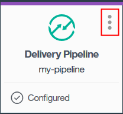

---

copyright:
  years: 2016

---

{:shortdesc: .shortdesc}
{:new_window: target="_blank"}

# 在 {{site.data.keyword.Bluemix_notm}} 專用上使用工具鏈
{: #toolchains-using_dedicated}

前次更新：2016 年 9 月 13 日
{: .last-updated}

在每日開發、部署及操作工作中，使用工具鏈較具生產力。設定工具鏈之後，即可新增、刪除或配置工具整合，以及管理對工具鏈的存取。
{: shortdesc}

## 配置工具整合
{: #configuring_a_tool_integration_dedicated}

如果您已在建立工具鏈時延遲配置工具整合，則會在其磚上顯示**配置**按鈕。如果您已在建立工具鏈時配置工具整合，則可以更新配置設定。

1. 在「儀表板」的 **DevOps** 標籤上，按一下工具鏈來開啟它的「工具整合」頁面。或者，在應用程式之「概觀」頁面的右上角，按一下**檢視工具鏈**。然後，按一下**工具整合**。
1. 如果您需要配置首次工具整合，請在其磚上按一下**配置**。

  

 完成工具整合的配置後，請按一下**儲存整合**。
 
1. 如果您需要更新工具整合的配置，請在其磚上按一下功能表來存取配置選項。

  
 
 完成設定的更新後，請按一下**儲存整合**。

## 新增工具整合
{: #adding_a_tool_integration_dedicated}

您可以新增及配置工具鏈的工具整合。

1. 在「儀表板」的 **DevOps** 標籤上，按一下工具鏈來開啟它的「工具整合」頁面。或者，在應用程式之「概觀」頁面的右上角，按一下**檢視工具鏈**。然後，按一下**工具整合**。
1. 若要查看要新增的工具整合清單，請按一下新增按鈕 (+)。
1. 按一下要新增的工具整合。
1. 輸入用來配置工具整合的任何必要資訊。 
1. 按一下**建立整合**，以將工具整合新增至您的工具鏈。

## 刪除工具整合
{: #deleting_a_tool_integration}

如果您從工具鏈中刪除工具整合，則無法復原刪除。 

1. 在「儀表板」的 **DevOps** 標籤上，按一下工具鏈來開啟它的「工具整合」頁面。或者，在應用程式之「概觀」頁面的右上角，按一下**檢視工具鏈**。然後，按一下**工具整合**。
1. 在要刪除之工具整合的磚上，按一下功能表來存取配置選項。
1. 若要從工具鏈中刪除工具整合，請按一下**刪除**。
1. 按一下**刪除**來進行確認。 

## 管理存取權
{: #managing_access_dedicated}

將使用者新增至與工具鏈相關聯的組織，即可將工具鏈存取權授與使用者。每一個工具鏈都會與特定組織相關聯，而且任何屬於該組織成員的使用者都可以存取相關聯的工具鏈。若要檢視您目前在其中工作的組織，請按一下功能表列中的**{{site.data.keyword.avatar}}**圖示 。若要存取一組不同的工具鏈，請切換至不同的組織。

當您將使用者新增至 {{site.data.keyword.Bluemix}} 組織及空間時，使用者可以使用其 {{site.data.keyword.Bluemix_notm}} ID 及密碼來登入 GitHub Enterprise。使用者登入時，就會建立他們的帳戶。當您將使用者新增至 {{site.data.keyword.Bluemix_notm}} 組織及空間時，並不會將他們自動新增至 GitHub Enterprise 儲存庫。必須由具有儲存庫管理專用權的人員來新增他們。如需相關資訊，請參閱[使用專用 GitHub Enterprise（在新視窗中開啟鏈結）](../services/ghededicated/index.html){: new_window}。

若要新增使用者，請遵循下列步驟： 

1. 在「儀表板」的 **DevOps** 標籤上，按一下工具鏈來開啟它的「工具整合」頁面。然後，按一下**管理**。或者，在應用程式之「概觀」頁面的右上角，按一下**檢視工具鏈**。然後，按一下**管理**。  
1. 按一下您組織的鏈結。 
1. 在「管理組織」頁面上，按一下**邀請使用者**，然後鍵入使用者的電子郵件位址。
1. 如果您要授與管理 {{site.data.keyword.Bluemix_notm}} 組織中使用者的進階許可權，請選取一個以上的**管理員**、**帳單管理員**或**審核員**勾選框。
1. 按一下**邀請**。
1. 按一下**儲存**。

## 刪除工具鏈
{: #deleting_a_toolchain_dedicated}

您可以刪除工具鏈，以及指定您要刪除哪一個相關聯的工具整合。當您刪除工具鏈時，無法復原刪除。

1. 在「儀表板」的 **DevOps** 標籤上，按一下工具鏈來開啟它的「工具整合」頁面。然後，按一下**管理**。或者，在應用程式之「概觀」頁面的右上角，按一下**檢視工具鏈**。然後，按一下**管理**。
1. 按一下**刪除工具鏈**，然後檢閱或調整所刪除的工具整合。
1. 鍵入工具鏈名稱，然後按一下**刪除**，來確認刪除。

 **提示**：當您刪除 GitHub Enterprise 工具整合時，不會從 GitHub Enterprise 中刪除相關聯的 GitHub Enterprise 儲存庫。您必須從 GitHub Enterprise 中手動移除儲存庫。
