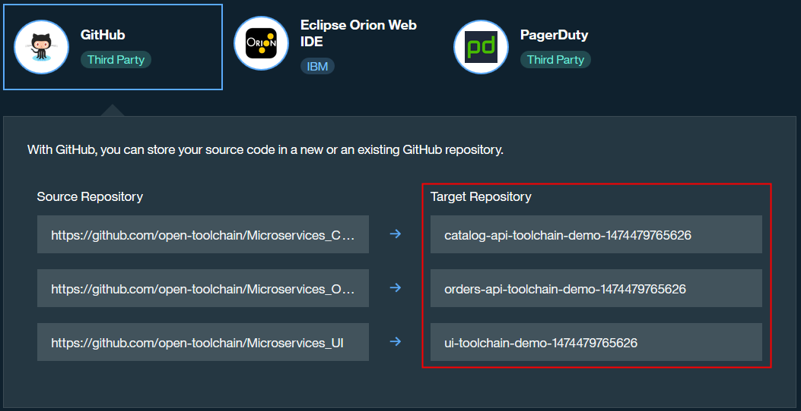
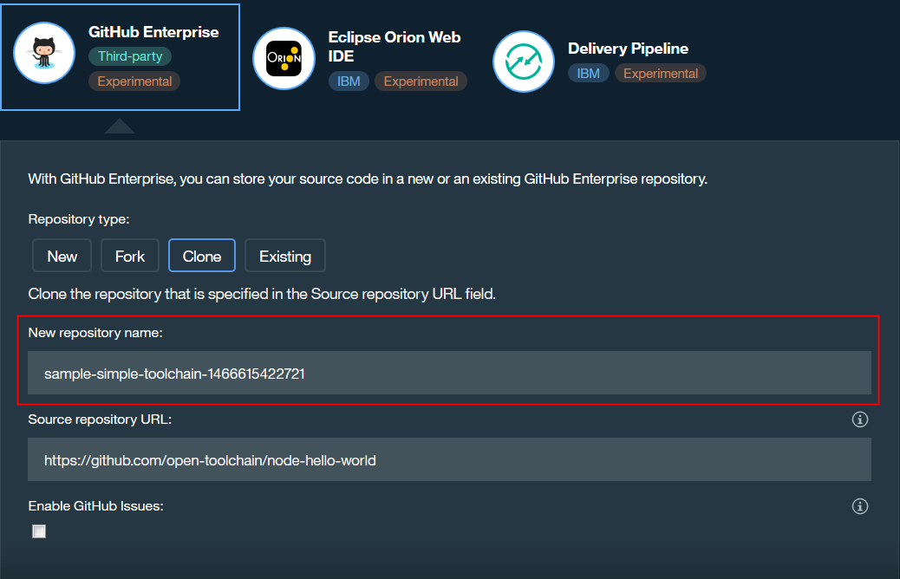

---

copyright:
  years: 2016

---

{:new_window: target="_blank"}
{:shortdesc: .shortdesc}
{:screen:.screen}
{:codeblock:.codeblock}

# Configuring tool integrations
{: #integrations}

Last updated: 2 November 2016
{: .last-updated}

You can configure tool integrations that support development, deployment, and operations tasks while you create a toolchain, or you can add and configure tool integrations to customize an existing toolchain.  
{:shortdesc}

**Important**: On {{site.data.keyword.Bluemix_notm}} Public, toolchains are available in the US South region only.

The tool integrations that are available to add and configure for your toolchain are different depending on whether you are using toolchains on {{site.data.keyword.Bluemix_notm}} Public or {{site.data.keyword.Bluemix_notm}} Dedicated. If you are using toolchains on {{site.data.keyword.Bluemix_notm}} Dedicated, the tool integrations that are available to you depend on how {{site.data.keyword.jazzhub_title}} was set up on your specific environment.

*Table 1. Tool integrations available for toolchains on {{site.data.keyword.Bluemix_notm}} Public and Dedicated*

|Tool integration |Available on {{site.data.keyword.Bluemix_notm}} Public	|Available on {{site.data.keyword.Bluemix_notm}} Dedicated (environment dependent)|
|:----------|:------------------------------|:------------------|
|{{site.data.keyword.deliverypipeline}} 		|Yes	   	|Yes  		|
|{{site.data.keyword.DRA_short}} 		|Yes		|No			|
|Eclipse Orion {{site.data.keyword.webide}}		|Yes		|Yes			|
|GitHub		|Yes		|Yes		|
|Dedicated GitHub Enterprise			|No		|Yes		|
|Other Tool			|Yes		|Yes		|
|PagerDuty			|Yes		|Yes		|
|Sauce Labs		|Yes		|No		|
|Slack			|Yes		|Yes		|

**Tip**: If you want to start developing with your source code on {{site.data.keyword.Bluemix_notm}} Public, configure the GitHub tool integration before you configure the {{site.data.keyword.deliverypipeline}}. If you want to start developing with your code on {{site.data.keyword.Bluemix_notm}} Dedicated, configure the {{site.data.keyword.ghe_short}} tool integration or the GitHub tool integration before you configure the {{site.data.keyword.deliverypipeline}}. 


## Configuring the delivery pipeline
{: #deliverypipeline}

The {{site.data.keyword.deliverypipeline}} automates the continuous deployment of your projects through sequences of stages that retrieve input and run jobs, such as builds, tests, and deployments. 

Configure the {{site.data.keyword.deliverypipeline}} to automate the continuous building, testing, and deployment of your apps: 

1. If you are configuring this tool integration as you are creating the toolchain, in the Configurable Integrations section, click **Delivery Pipeline**. Depending on the template that you use, different fields might be available. Review the default field values and if needed, change those settings.
1. If you have a toolchain on {{site.data.keyword.Bluemix_notm}} Public and are adding this tool integration to it, on the DevOps dashboard, on the **Toolchains** page, click the toolchain to open its Overview page. Alternatively, on your app's Overview page, on the Continuous Delivery tile, click **View Toolchain**. Then, click **Overview**. If you are using a toolchain on {{site.data.keyword.Bluemix_notm}} Dedicated, on the Dashboard, on the **DEVOPS** tab, click the toolchain to open its Tool Integrations page. Alternatively, on the upper-right corner of the app's Overview page, click **View Toolchain**. Then, click **Tool Integrations**. 
1. Click **Add a Tool**.
1. In the Tool Integrations section, click **Delivery Pipeline**.
1. Specify a name for your new pipeline.
1. If you plan to use your pipeline to deploy a user interface, select the **Viewable App** check box. All of the apps that your pipeline creates are shown in the **VIEW APP** list on the toolchain's Tool Integrations page.
1. Click **Create Integration** to add the {{site.data.keyword.deliverypipeline}} to your toolchain.
1. Click the tile for {{site.data.keyword.deliverypipeline}} to view the pipeline and configure it. To learn the basics of configuring a pipeline, see [Building and deploying pipelines (Link opens in a new window)](../services/DeliveryPipeline/build_deploy.html){: new_window}.

  **Tip**: If you want to trigger the pipeline when you push changes to your GitHub or {{site.data.keyword.ghe_short}} repository (repo), you must configure GitHub or {{site.data.keyword.ghe_short}} for your toolchain before you define the stages for your pipeline. The pipeline stages need the Git URLs for your repos. Each pipeline stage can refer to only one of the GitHub or {{site.data.keyword.ghe_short}} repos that is associated with your toolchain. For instructions to configure GitHub, see  [GitHub](#github) section. For instructions to configure Dedicated GitHub Enterprise, see [Getting started with {{site.data.keyword.ghe_long}} (Link opens in a new window)](../services/ghededicated/index.html){: new_window}.
  
1. Optional: If you are using a toolchain on {{site.data.keyword.Bluemix_notm}} Public and you want Sauce Labs to run tests on your app, configure the {{site.data.keyword.deliverypipeline}} to add a Sauce Labs test job. For instructions to configure the test job, see the [Configuring a Sauce Labs test job in your pipeline](#config_saucelabs) section.

### Configuring a Sauce Labs test job in your pipeline
{: #config_saucelabs}

Before you configure a Sauce Labs test job in your pipeline, you need a working pipeline that has stages to build and deploy your app, and you must configure Sauce Labs for your toolchain. For instructions to configure Sauce Labs, see the [Sauce Labs](#saucelabs) section.

Configure the {{site.data.keyword.deliverypipeline}} to add a Sauce Labs test job:

1. If you don't have a stage that deploys a test version of your app, create one.
1. In the stage, add a test job after the deploy job. By placing these jobs in the same stage, they can access the same set of environment properties.   
   

1. Configure the stage: 

  a. On the **ENVIRONMENT PROPERTIES** tab, create three properties: CF_APP_NAME, SAUCE_USERNAME, and SAUCE_ACCESS_KEY.
  
  b. Enter your Sauce Labs user name and access key. By doing so, you externalize those values so that you can use them in your tests.
  
1. Configure the deploy job. In the **Deploy Script** field, include this command: `export CF_APP_NAME="$CF_APP"`. That command exports the app name as an environment property.
1. Configure the test job. The values in the following image are examples. The **Service Instance**, **Target**, **Organization**, and **Space** fields are populated with the Sauce Labs user name, region, org, and space that you are using.  


  a. For the tester type, select **Sauce Labs**.
  
  b. For the service instance, select the Sauce Labs user name that you used when you configured Sauce Labs for your toolchain. 
  
   **Tip**: To see the user name and access key that you used when you configured Sauce Labs for your toolchain, click **Configure**. 
  
  c. In the **Test Execution Command** field, enter the commands that install the dependencies that are required by your tests and then run the tests. For example, for a Node.js app, you might enter these commands:
     ```
     npm install
     node_modules/grunt-cli/bin/grunt test:sauce:parallel
     ```
  
    d. If you want to see your test reports in the test job logs, select the **Enable Test Report** check box, and set the Test Result File Pattern to `test/*.xml`.
  
1. Click **SAVE**. Whenever your pipeline runs, your Sauce Labs tests run.

To learn more, see [Delivery Pipeline (Link opens in a new window)](https://www.ibm.com/devops/method/content/deliver/tool_build_and_deploy/){: new_window}.


## Adding {{site.data.keyword.DRA_short}}
{: #dra}

{{site.data.keyword.DRA_full}} collects and analyzes the results from unit tests, functional tests, and code coverage tools to determine whether your code meets predefined criteria at specified gates in your deployment process. If your code does not meet or exceed the criteria, the deployment is stopped to prevent risks from being released. You can use {{site.data.keyword.DRA_short}} as a safety net for your continuous delivery environment or as a way to implement and improve quality standards. 

 **Note**: This tool integration is preconfigured. It does not require any configuration parameters and you cannot reconfigure it.
 
Add {{site.data.keyword.DRA_short}} to maintain and improve the quality of your code in {{site.data.keyword.Bluemix_notm}} by monitoring your deployments to identify risks before they are released.

1. If you have a toolchain and are adding this tool integration to it, on the DevOps dashboard, on the **Toolchains** page, click the toolchain to open its Overview page. Alternatively, on the app's Overview page, on the Continuous Delivery tile, click **View Toolchain**. Then, click **Overview**. 
1. Click **Add a Tool**.
1. In the Tool Integrations section, click **DevOps Insights**. 
1. Click **Create Integration**.
1. Click the tile for {{site.data.keyword.DRA_short}}, and then complete the getting started steps: create criteria, connect the criteria to the pipeline, and run the pipeline. For more information, see [{{site.data.keyword.DRA_short}} (Link opens in a new window)](https://www.ibm.com/devops/method/content/deliver/tool_deployment_risk_analytics/){: new_window}.


## Adding the Eclipse Orion {{site.data.keyword.webide}}
{: #webide}

The Eclipse Orion {{site.data.keyword.webide}} is an integrated web-based environment where you can create, edit, run, debug, and complete source control tasks. You can seamlessly move from editing to running to submitting to deploying. 

 **Note**: This tool integration is preconfigured. It does not require any configuration parameters and you cannot reconfigure it.
 
To complete source control tasks, add the Eclipse Orion {{site.data.keyword.webide}} tool integration:

1. If you have a toolchain on {{site.data.keyword.Bluemix_notm}} Public and are adding this tool integration to it, on the DevOps dashboard, on the **Toolchains** page, click the toolchain to open its Overview page. Alternatively, on the app's Overview page, on the Continuous Delivery tile, click **View Toolchain**. Then, click **Overview**. If you are using a toolchain on {{site.data.keyword.Bluemix_notm}} Dedicated, on the Dashboard, on the **DEVOPS** tab, click the toolchain to open its Tool Integrations page. Alternatively, on the upper-right corner of the app's Overview page, click **View Toolchain**. Then, click **Tool Integrations**.
1. Click **Add a Tool**.
1. In the Tool Integrations section, click **Eclipse Orion Web IDE**. 
1. Click **Create Integration**.
1. Click the tile for the new Eclipse Orion {{site.data.keyword.webide}}. Your workspace is pre-populated with your GitHub or {{site.data.keyword.ghe_short}} repos. The repos that are associated with your current toolchain are highlighted.

To learn more, see [Editing code with the Eclipse Orion {{site.data.keyword.webide}} (Link opens in a new window)](../toolchains/web_ide.html){: new_window}.


## Configuring GitHub
{: #github}

GitHub is a web-based hosting service for Git repos. You can have both local and remote copies of your repos, which makes it easy to collaborate. 

GitHub Issues is a tracking tool that keeps your work and your plans all in one place. It is integrated with your development repo so that you can focus on important tasks.

Configure GitHub to manage your source code on the cloud:

1. If you are configuring this tool integration as you are creating the toolchain, follow these steps:

 a. In the Configurable Integrations section, click **GitHub**. If you are creating the toolchain on {{site.data.keyword.Bluemix_notm}} Public and you have not authorized {{site.data.keyword.Bluemix_notm}} to access GitHub, click **Authorize** to go to the GitHub website. If you don't have an active GitHub session, you are prompted to log in. Click **Authorize Application** to allow {{site.data.keyword.Bluemix_notm}} to access your GitHub account. If you have an active GitHub session but you haven't entered your password recently, you might be prompted to enter your GitHub password to confirm.
 
 b. Review the default target repo locations for the GitHub repos. Those repos are cloned from the sample repos. If needed, change the names of the target repos.
 
   
1. If you have a toolchain and are adding this tool integration to it, on the DevOps dashboard, on the **Toolchains** page, click the toolchain to open its Overview page. Alternatively, on the app's Overview page, on the Continuous Delivery tile, click **View Toolchain**. Then, click **Overview**. 
1. Click **Add a Tool**.
1. In the Tool Integrations section, click **GitHub**.
1. If you have a GitHub repo and want to use it, type the URL. For the repository type, click **Link**.
1. If you want to use a new GitHub repo, type a name for the GitHub repo, type the URL for the repo that you are cloning or forking, and select the repository type: 

 a. To create an empty repo, click **New**. 
 
 b. To create a copy of a GitHub repo, click **Clone**.
 
 c. To fork a GitHub repo so that you can contribute changes through pull requests, click **Fork**.
 
1. If you want to use GitHub's Issues for issue tracking, select the **Enable GitHub Issues** check box.
1. Click **Create Integration**.
1. Click the tile for the GitHub repo that you want to work with. The GitHub website opens, where you can view the contents of the repo.
 
  **Tip**: You can use the integrated source code management tools in Eclipse Orion {{site.data.keyword.webide}} to edit the GitHub repo and deploy an app from your workspace.

1. If you enabled GitHub Issues, click the tile for GitHub Issues to open it.

For more information, see [GitHub (Link opens in a new window)](https://www.ibm.com/devops/method/content/code/tool_github/){: new_window} and [GitHub Issues (Link opens in a new window)](https://www.ibm.com/devops/method/content/think/tool_github_issues/){: new_window}.


## Configuring Dedicated GitHub Enterprise
{: #configghe}

{{site.data.keyword.ghe_long}} is an on-premises, web-based hosting service for Git repos. Dedicated GitHub Enterprise is for {{site.data.keyword.Bluemix_notm}} Dedicated customers only. GitHub Issues is a tracking tool that keeps your work and your plans in one place. It is integrated with your development repo so that you can focus on important tasks. For more information about Dedicated GitHub Enterprise and GitHub Issues, see [Using Dedicated GitHub Enterprise (Link opens in a new window)](../services/ghededicated/index.html){: new_window} and [GitHub Issues (Link opens in a new window)](https://www.ibm.com/devops/method/content/think/tool_github_issues/){: new_window}.

You can configure {{site.data.keyword.ghe_short}} as a tool integration in your toolchain so that you can manage source code in your company's [{{site.data.keyword.Bluemix_notm}} Dedicated (Link opens in a new window)](../dedicated/index.html#dedicated){: new_window} instance.

1. If you are configuring this tool integration as you are creating the toolchain, follow these steps:

 a. Before you log in to Dedicated GitHub Enterprise for the first time, ask your company's region administrator to add your user ID to your {{site.data.keyword.Bluemix_notm}} Dedicated instance from your company's user registry by using LDAP. For information about setting up your {{site.data.keyword.ghe_short}} account, see [Using Dedicated GitHub Enterprise (Link opens in a new window)](../services/ghededicated/index.html){: new_window}.
 
 b. In the Configurable Integrations section, click **{{site.data.keyword.ghe_short}}**.    
 
 c. Review the default name for the new {{site.data.keyword.ghe_short}} repo. If needed, change the name of the new repo. The following image shows an example of a repo that is cloned from a sample repo. You can use an existing repo or a new repo. To use a new repo, you can create an empty repo, clone a repo, or fork a repo. 
 
   
1. If you have a toolchain on {{site.data.keyword.Bluemix_notm}} Public and are adding this tool integration to it, on the DevOps dashboard, on the **Toolchains** page, click the toolchain to open its Tool Integrations page. Alternatively, on your app's Overview page, on the Continuous Delivery tile, click **View Toolchain**. Then, click **Tool Integrations**. If you are using a toolchain on {{site.data.keyword.Bluemix_notm}} Dedicated, on the Dashboard, on the **DEVOPS** tab, click the toolchain to open its Tool Integrations page. Alternatively, on the upper-right corner of the app's Overview page, click **View Toolchain**. Then, click **Tool Integrations**.
1. Click the add button (+).
1. In the Tool Integrations section, click **{{site.data.keyword.ghe_short}}**.
1. If you have a {{site.data.keyword.ghe_short}} repo that you want to use, type the URL for the repo. For the repository type, click **Existing**.
1. If you want to use a new {{site.data.keyword.ghe_short}} repo, type a name for the repo, type the URL for the repo that you are cloning or forking, and select the repository type: 

 a. To create an empty repo, click **New**. 
 
 b. To create a copy of a repo, click **Clone**.
 
 c. To fork a repo so that you can contribute changes through pull requests, click **Fork**.
 
1. To use GitHub Issues for issue tracking, select the **Enable GitHub Issues** check box.
1. Click **Create Integration**.
1. Click the tile for the {{site.data.keyword.ghe_short}} repo that you want to work with. Your company's [{{site.data.keyword.Bluemix_notm}} Dedicated (Link opens in a new window)](../dedicated/index.html#dedicated){: new_window} instance opens, where you can view the contents of the repo.
 
  **Tip**: You can use the integrated source code management tools in Eclipse Orion {{site.data.keyword.webide}} to edit the {{site.data.keyword.ghe_short}} repo and deploy an app from your workspace.

1. If you enabled GitHub Issues, click the tile for GitHub Issues.

<!-- 8/23/2016: The GHE Dedicated content has been moved to docs-staging/services/ghededicated/index.md -->

## Configuring a custom tool (Other Tool)
{: #othertool}

If your team uses a tool that isn't included on the toolchains integrations list, you can integrate a custom tool. 

Configure a custom tool so that it works with other tools in your toolchain and is available to your team:

1. If you are configuring this tool integration as you are creating the toolchain, in the Configurable Integrations section, click **Other Tool**.
1. If you have a toolchain on {{site.data.keyword.Bluemix_notm}} Public and are adding this tool integration to it, on the DevOps dashboard, on the **Toolchains** page, click the toolchain to open its Overview page. Alternatively, on your app's Overview page, on the Continuous Delivery tile, click **View Toolchain**. Then, click **Overview**. If you are using a toolchain on {{site.data.keyword.Bluemix_notm}} Dedicated, on the Dashboard, on the **DEVOPS** tab, click the toolchain to open its Tool Integrations page. Alternatively, on the upper-right corner of the app's Overview page, click **View Toolchain**. Then, click **Tool Integrations**.
1. Click **Add a Tool**.
1. In the Tool Integrations section, click **Other Tool**.
1. Type the tool name.
1. Select the Lifecycle phase that is most closely associated with the tool. The lifecycle phase choice determines which category your tool is listed under on the Overview page.
1. Add an icon URL. The icon will appear on your tool's integration card.
1. Add a documentation URL.
1. Specify a tool instance name. For example: My Team Tool.
1. Add a tool instance URL. Clicking the tool integration card leads to the URL you list for the tool instance.
1. Add a description of your tool.
1. (Advanced) Add additional properties if required. For example, list any information or attributes that are required for your tool to integrate with other tools in your toolchain.  
1. Click **Create Integration**.

## Configuring PagerDuty
{: #pagerduty}

PagerDuty integrates data from multiple monitoring systems into a single view. When a problem occurs, PagerDuty ensures that the team member who is best able to fix it at the time is notified. If the team member does not respond to the problem, escalations can be configured to route it to secondary engineers or operations managers.

Configure PagerDuty to send notifications when pipeline stage failures occur so that you can fix problems faster and reduce downtime:

1. If you are configuring this tool integration as you are creating the toolchain, in the Configurable Integrations section, click **PagerDuty**.
1. If you have a toolchain on {{site.data.keyword.Bluemix_notm}} Public and are adding this tool integration to it, on the DevOps dashboard, on the **Toolchains** page, click the toolchain to open its Overview page. Alternatively, on your app's Overview page, on the Continuous Delivery tile, click **View Toolchain**. Then, click **Overview**. If you are using a toolchain on {{site.data.keyword.Bluemix_notm}} Dedicated, on the Dashboard, on the **DEVOPS** tab, click the toolchain to open its Tool Integrations page. Alternatively, on the upper-right corner of the app's Overview page, click **View Toolchain**. Then, click **Tool Integrations**. 
1. Click **Add a Tool**.
1. In the Tool Integrations section, click **PagerDuty**
1. Type the PagerDuty site name that is associated with your PagerDuty account. If you don't have a PagerDuty account, [register for one (Link opens in a new window)](https://signup.pagerduty.com/accounts/new){: new_window}.
1. Type the API access key for your PagerDuty account. For instructions to find the key, see [API Authentication (Link opens in a new window)](https://signup.pagerduty.com/accounts/new){: new_window}.
1. Type the name of your PagerDuty service.
1. Type the email address for the primary PagerDuty contact.
1. Type the phone number for the primary PagerDuty contact.
1. Click **Create Integration**.
1. Click the tile for PagerDuty to go to pagerduty.com. You can view the events that are associated with the PagerDuty service that you specified when you configured this tool integration for your toolchain. 

To learn more, see [PagerDuty (Link opens in a new window)](https://www.ibm.com/devops/method/content/manage/tool_pagerduty/){: new_window}.


## Configuring Sauce Labs
{: #saucelabs}

Sauce Labs runs functional unit tests. When a Sauce Labs test suite is configured as a test job in the {{site.data.keyword.deliverypipeline}}, the test suite can run tests against your web or mobile app as part of your continuous delivery process. These tests can provide valuable flow control for your projects, acting as gates to prevent the deployment of bad code.

Configure Sauce Labs to run automated functional tests on multiple operating systems and browsers so that you can emulate the way that a user might use a website or an application:

1. If you are configuring this tool integration as you are creating the toolchain, in the Configurable Integrations section, click **Sauce Labs**.
1. If you have a toolchain and are adding this tool integration to it, on the DevOps dashboard, on the **Toolchains** page, click the toolchain to open its Overview page. Alternatively, on the app's Overview page, on the Continuous Delivery tile, click **View Toolchain**. Then, click **Overview**. 
1. Click **Add a Tool**.
1. In the Tool Integrations section, click **Sauce Labs**.
1. Type the user name that is associated with your Sauce Labs account. You can [find your user name in the welcome message at the top of your Sauce Labs account page (Link opens in a new window)](https://saucelabs.com/account){: new_window}.
1. Type the access key for your Sauce Labs account. You can [find the key on your Sauce Labs account page (Link opens in a new window)](https://saucelabs.com/account){: new_window}.
1. Click **Create Integration**.
1. Click the tile for Sauce Labs to go to saucelabs.com and view the test activity for the toolchain.

 **Tip**: If you added a Sauce Labs test job to the {{site.data.keyword.deliverypipeline}}, you can select the service instance.

To learn more, see [Sauce Labs (Link opens in a new window)](https://www.ibm.com/devops/method/content/code/tool_sauce_labs/){: new_window}.


## Configuring Slack
{: #slack}

**Important**: Notifications that are posted to public Slack channels are visible to everyone on the team. Remember that you are responsible for the content that you post.

Slack is a cloud-based, real-time messaging and notification system. Slack provides persistent chat, which is a more interactive alternative to email for team collaboration. You can communicate with your team on a dedicated channel or on a set of channels that is directly related to your work. You can also share files and images through the channels or in direct messages between two or more people. The communications in direct messages and on channels are retained so that you can search them. 

Configure Slack to receive notifications about your toolchain from the tool integrations, such as test and deployment activities:

1. If you are configuring this tool integration as you are creating the toolchain, in the Configurable Integrations section, click **Slack**.
1. If you have a toolchain on {{site.data.keyword.Bluemix_notm}} Public and are adding this tool integration to it, on the DevOps dashboard, on the **Toolchains** page, click the toolchain to open its Overview page. Alternatively, on your app's Overview page, on the Continuous Delivery tile, click **View Toolchain**. Then, click **Overview**. If you are using a toolchain on {{site.data.keyword.Bluemix_notm}} Dedicated, on the Dashboard, on the **DEVOPS** tab, click the toolchain to open its Tool Integrations page. Alternatively, on the upper-right corner of the app's Overview page, click **View Toolchain**. Then, click **Tool Integrations**.
1. Click **Add a Tool**.
1. In the Tool Integrations section, click **Slack**.
1. Type the API authentication token for your Slack account. You must use a generated full-access token to authenticate with Slack. For instructions to find the token, see [Slack authentication (Link opens in a new window)](https://api.slack.com/web#authentication){: new_window}.
1. Type the name of the Slack channel that you want notifications to be sent to. If the channel that you specify doesn't exist, it is created. If the channel was archived, it is reactivated.
1. Click **Create Integration**.
1. Click the tile for Slack. You can view all of the activity for your toolchain in the configured Slack channel.

To learn more, see [Slack (Link opens in a new window)](https://www.ibm.com/devops/method/content/culture/tool_slack/){: new_window}.


# Related Links
{: #rellinks}

## Tutorials and Samples
{: #samples}

* [Create an application with three microservices (Beta) (Link opens in a new window)](https://www.ibm.com/devops/method/tutorials/tutorial_microservices_part1){:new_window}
* [Create a toolchain from a template on {{site.data.keyword.Bluemix_notm}} Dedicated (Beta) (Link opens in a new window)](https://www.ibm.com/devops/method/tutorials/tutorial_dedicated_toolchain_template_flow){:new_window}
* [Create a toolchain from an app on {{site.data.keyword.Bluemix_notm}} Dedicated (Beta) (Link opens in a new window)](https://www.ibm.com/devops/method/tutorials/tutorial_dedicated_toolchain_app_flow){:new_window}

## Related Links
{: #general}

* [Microservices toolchain (Beta) (Link opens in a new window)](https://www.ibm.com/devops/method/toolchains/microservices_toolchain){:new_window}
* [Simple toolchain (Beta) (Link opens in a new window)](https://www.ibm.com/devops/method/toolchains/simple_toolchain){:new_window}
* [IBM Bluemix Garage Method (Link opens in a new window)](https://www.ibm.com/devops/method){:new_window}
