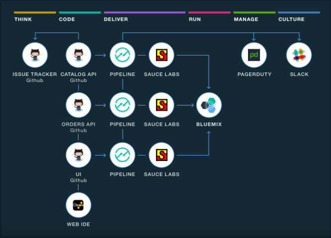

---

copyright:
  years: 2016

---
 
{:shortdesc: .shortdesc}
{:new_window: target="_blank"}

# Getting started with toolchains (Experimental)
{: #toolchains_getting_started}

*Last updated: 11 May 2016*  

A *toolchain* is a set of tool integrations that support development, deployment, and operations tasks. The collective power of a toolchain is greater than the sum of its individual tool integrations.
{: shortdesc}

You can create a toolchain in two ways: use a template to create a toolchain or create a toolchain from an app. Depending on the template or toolchain that you use, the toolchain might include a GitHub repository (repo) that is populated with app starter code and a preconfigured delivery pipeline. When you push changes to the toolchain's GitHub repo, the delivery pipeline automatically builds and deploys the app to {{site.data.keyword.Bluemix}}.

As a starting point, you can use a toolchain template to create a toolchain that has a specific set of tool integrations or an empty toolchain that you can add tool integrations to.

**Important**: This capability is experimental. Toolchains might not be stable and might change in ways that are not compatible with earlier versions. They are not recommended for use in production environments. To use toolchains, you must make a one-time [request for access](https://new-console.ng.bluemix.net/devops?cm_mmc=IBMBluemixGarageMethod-_-MethodSite-_-10-19-15::12-31-18-_-toolchains-welcome-page){: new_window}. Toolchains are available in the US South region only.

##Creating a toolchain from a template   
{: #creating_a_toolchain_from_a_template}

After your request to access toolchains is approved, you can use a template as a starting point to create a toolchain that includes a specific set of tool integrations.

1. On the DevOps dashboard, on the **Toolchains** tab, click **Create a Toolchain** to create your first toolchain. If you already have a toolchain, click the add button (+) to create another toolchain.
1. Click a toolchain template. For example, to use an online store sample to create the toolchain, click **Cloud-native toolchain for microservices**. 
1. On the toolchain creation page, review the diagram of the toolchain that you are about to create. The diagram shows each tool integration in its lifecycle phase in the toolchain. The diagram in the following image is an example. When you create a toolchain, the diagram shows each tool integration that is part of the toolchain.

1. Review the default information for the toolchain settings. The toolchain's name identifies it in {{site.data.keyword.Bluemix}}. If you already have a toolchain with that name, or if you want to use a different name, change the toolchain's name.  
1. In the Configurable Integrations section, select each tool integration that you want to configure for your toolchain. For information about configuring the tool integrations, see [Configuring tool integrations](../toolchains/toolchains_integrations.html){: new_window}.
1. Click **Create**.  Several steps run automatically to set up your toolchain:

 * The toolchain is created.
 * If you configured the Delivery Pipeline tool integration, the pipelines are triggered.
 * If you configured the Sauce Labs tool integration, the Sauce Labs integration is configured to add jobs to the pipelines and run tests.
 * If you configured the PagerDuty tool integration, the PagerDuty integration is configured to send notifications to the channel that you configured in Slack. These notifications indicate when a problem occurs.
 * If you configured the Slack tool integration, the Slack integration is configured to send notifications to the channel that you configured in Slack. These notifications indicate the progress of the deployment; for example, `Connected with Project XYZ`, `Pipeline Configured`, and `Stage 'build' started`.
 * If you configured the GitHub tool integration, the sample GitHub repo is cloned into your GitHub account.

##Creating a toolchain from an app
{: #creating_a_toolchain_from_an_app}

After your request to access toolchains is approved, you can create a toolchain from your app. The toolchain can support continuous development, deployment, monitoring, and more, and it is associated with your app. Each app can be associated with a toolchain. When you push changes to the toolchain's GitHub repo, the pipeline automatically builds and deploys the app.  

1. On your app's Overview page, on the Continuous Delivery tile, click **Add Toolchain**. Alternatively, in the Bluemix Classic Experience, click **ADD GIT**. Your app is configured for continuous delivery from a new GitHub repo that is populated with the app starter code.
1. On the toolchain creation page, review the diagram of the toolchain that you are about to create. The diagram shows each tool integration in its lifecycle phase in the toolchain.
1. Review the default information for the toolchain settings. The toolchain's name identifies it in {{site.data.keyword.Bluemix}}. If you already have a toolchain with that name, or if you want to use a different name, change the toolchain's name.
1. In the Configurable Integrations section, select each tool integration that you want to configure for your toolchain. For information about configuring the tool integrations, see [Configuring tool integrations](../toolchains/toolchains_integrations.html){: new_window}.
1. Click **Create**.  Several steps run automatically to set up your toolchain:

 * The toolchain is created.
 * If you configured the Delivery Pipeline tool integration, the pipelines are triggered.
 * If you configured the Sauce Labs tool integration, the Sauce Labs integration is configured to add jobs to the pipelines and run tests.
 * If you configured the PagerDuty tool integration, the PagerDuty integration is configured to send notifications to the channel that you configured in Slack. These notifications indicate when a problem occurs.
 * If you configured the Slack tool integration, the Slack integration is configured to send notifications to the channel that you configured in Slack. These notifications indicate the progress of the deployment; for example, `Connected with Project XYZ`, `Pipeline Configured`, and `Stage 'build' started`.
 * If you configured the GitHub tool integration, the sample GitHub repo is cloned into your GitHub account.

 
##Viewing a toolchain
{: #viewing_a_toolchain}

After the toolchain and all tool integrations are configured, the Tool Integrations page opens.

1. Review the page to see a visual representation of the toolchain for your app.
1. To access a tool integration that is in your toolchain, click the tool tile. 
 
 **Tip**: If you have more than one GitHub repo, you might have multiple tiles for the same tool integration because each repo needs its own pipeline.

 <!-- The toolchain in the following image is an example. When you create your own toolchain, the visual representation of the toolchain shows the tool integrations that you configure.
 -->

# Related Links
{: #rellinks}

## Tutorials and Samples
{: #samples}

* [Create an application with three microservices](https://www.ibm.com/devops/method/tutorials/tutorial_microservices_part1){:new_window}

## Related Links
{: #general}

* [Cloud-native toolchain for microservices (Experimental)](https://www.ibm.com/devops/method/toolchains/microservices_toolchain){:new_window}
* [Simple toolchain (Experimental)](https://www.ibm.com/devops/method/toolchains/simple_toolchain){:new_window}
* [IBM&reg; Bluemix&reg; Garage Method](https://www.ibm.com/devops/method){:new_window}
