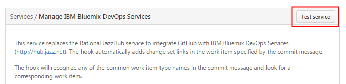

---

copyright:
  years: 2015, 2017
  
lastupdated: "2017-01-10"

---

{:tsSymptoms: .tsSymptoms} 
{:tsCauses: .tsCauses} 
{:tsResolve: .tsResolve} 
{:new_window: target="_blank"}  
{:shortdesc: .shortdesc}
{:codeblock: .codeblock} 


# 앱 관리 문제점 해결
{: #managingapps}


앱 관리와 관련된 일반적인 문제점으로는 앱을 업데이트할 수 없거나 2바이트 문자가 표시되지 않는 경우가 있습니다. 대부분 몇 가지 간단한 단계를 수행하여 이러한 문제점에서 복구할 수 있습니다.
{:shortdesc}


## 앱을 디버그 모드로 전환할 수 없음
{: #ts_debug}

JVM(Java Virtual Machine)이 버전 8 이하인 경우에는 디버그 모드를 사용하지 못할 수 있습니다.  

**애플리케이션 디버그 사용**을 선택한 이후, 도구는 해당 앱을 디버그 모드로 전환하려고 시도합니다. 그리고 Eclipse 워크벤치는 디버그 세션을 시작합니다. 도구에서 디버그 모드를 정상적으로 사용하는 경우, 웹 애플리케이션 상태는 `Updating mode`, `Developing` 및 `Debugging`을 표시합니다.
{: tsSymptoms}

하지만 도구에서 디버그 모드를 사용할 수 없는 경우, 웹 애플리케이션 상태는 `Updating mode` 및 `Developing`만 표시하며 `Debugging`은 표시하지 않습니다. 도구가 콘솔 보기에서 다음 오류 메시지를 표시할 수도 있습니다.

```
bluemixMgmgClient - ???? [pool-1-thread-1] .... ERROR --- ClientProxyImpl: Cannot create the websocket connections for MyWebProj
com.ibm.ws.cloudoe.management.client.exception.ApplicationManagementException: javax.websocket.DeploymentException: The HTTP request to initiate the  WebSocket connection failed
at com.ibm.ws.cloudoe.management.client.impl.ClientProxyImpl.onNewClientSocket(ClientProxyImpl.java:161)
at com.ibm.ws.cloudoe.management.client.impl.ClientProxyImpl$RunServerTask.run(ClientProxyImpl.java:267)
at java.util.concurrent.Executors$RunnableAdapter.call(Executors.java:522)
at java.util.concurrent.FutureTask.run(FutureTask.java:277)
at java.util.concurrent.ThreadPoolExecutor.runWorker(ThreadPoolExecutor.java:1153)
at java.util.concurrent.ThreadPoolExecutor$Worker.run(ThreadPoolExecutor.java:628)
at java.lang.Thread.run(Thread.java:785)
Caused by: javax.websocket.DeploymentException: The HTTP request to initiate the WebSocket connection failed
at  org.apache.tomcat.websocket.WsWebSocketContainer.connectToServer(WsWebSocketContainer.java:315)
at  com.ibm.ws.cloudoe.management.client.impl.ClientProxyImpl.onNewClientSocket(ClientProxyImpl.java:158)
... 6 more
Caused by: java.util.concurrent.TimeoutException
at org.apache.tomcat.websocket.AsyncChannelWrapperSecure$WrapperFuture.get(AsyncChannelWrapperSecure.java:505)
at org.apache.tomcat.websocket.WsWebSocketContainer.processResponse(WsWebSocketContainer.java:542)
at org.apache.tomcat.websocket.WsWebSocketContainer.connectToServer(WsWebSocketContainer.java:296)
... 7 more
[2016-01-15 13:33:51.075] bluemixMgmgClient - ????  [pool-1-thread-1] .... ERROR --- ClientProxyImpl: Cannot create the  websocket connections for MyWebProj
com.ibm.ws.cloudoe.management.client.exception.ApplicationManagementException: javax.websocket.DeploymentException: The HTTP request to initiate the  WebSocket connection failed
at com.ibm.ws.cloudoe.management.client.impl.ClientProxyImpl.onNewClientSocket(ClientProxyImpl.java:161)
at com.ibm.ws.cloudoe.management.client.impl.ClientProxyImpl$RunServerTask.run(ClientProxyImpl.java:267)
at java.util.concurrent.Executors$RunnableAdapter.call(Executors.java:522)
at java.util.concurrent.FutureTask.run(FutureTask.java:277)
at java.util.concurrent.ThreadPoolExecutor.runWorker(ThreadPoolExecutor.java:1153)
at java.util.concurrent.ThreadPoolExecutor$Worker.run(ThreadPoolExecutor.java:628)
at java.lang.Thread.run(Thread.java:785)
Caused by: javax.websocket.DeploymentException: The HTTP request to initiate the WebSocket connection failed
at org.apache.tomcat.websocket.WsWebSocketContainer.connectToServer(WsWebSocketContainer.java:315)
at com.ibm.ws.cloudoe.management.client.impl.ClientProxyImpl.onNewClientSocket(ClientProxyImpl.java:158)
... 6 more
Caused by: java.util.concurrent.TimeoutException
at org.apache.tomcat.websocket.AsyncChannelWrapperSecure$WrapperFuture.get(AsyncChannelWrapperSecure.java:505)
at org.apache.tomcat.websocket.WsWebSocketContainer.processResponse(WsWebSocketContainer.java:542)
at org.apache.tomcat.websocket.WsWebSocketContainer.connectToServer(WsWebSocketContainer.java:296)
... 7 more
```
 
IBM JVM 7, IBM JVM 8 및 Oracle JVM 8의 이전 버전 등의 JVM(Java Virtual Machine) 버전은 디버그 세션을 설정할 수 없습니다.
{: tsCauses}

워크벤치 JVM이 이 버전 중 하나인 경우에는 디버그 세션을 작성할 때 문제가 발생할 수 있습니다. 워크벤치 JVM 버전은 일반적으로 로컬 컴퓨터의 시스템 JVM입니다. 시스템 JVM은 실행 중인 {{site.data.keyword.Bluemix_notm}} Java&trade; 애플리케이션의 JVM과 다릅니다. {{site.data.keyword.Bluemix_notm}} Java 애플리케이션은 거의 항상 IBM JVM에서 실행되며, 가끔은 OpenJDK JVM에서 실행됩니다.
  
{{site.data.keyword.eclipsetoolsfull}}가 실행되는 Java의 버전을 확인하려면 다음 단계를 완료하십시오.
{: tsResolve}

  1. IBM Eclipse Tools for Bluemix에서 **도움말** > **Eclipse 정보** > **설치 세부사항** > **구성**을 선택하십시오.
  2. 목록에서 `eclipse.vm` 특성을 찾으십시오. 다음 행은 `eclipse.vm` 특성의 예입니다.
	
	```
	eclipse.vm=C:\Program Files\IBM\ibm-java-sdk-80-win-x86_64\bin\..\jre\bin\j9vm\jvm.dll
	```

  3. 명령행에서, Java 설치의 `bin` 디렉토리에서 `java -version`을 입력하십시오. IBM JVM 버전 정보가 표시됩니다.

워크벤치 JVM이 IBM JVM 7 또는 8, 또는 Oracle JVM 8의 이전 버전인 경우에는 다음 단계를 완료하여 Oracle JVM 8로 전환하십시오.

  1. Oracle JVM 8을 다운로드한 후에 이를 설치하십시오. 세부사항은 [Java SE Downloads ](http://www.oracle.com/technetwork/java/javase/downloads/index.html){: new_window}를 참조하십시오.
  2. Eclipse를 다시 시작하십시오.
  3. `eclipse.vm` 특성이 Oracle JVM 8의 새 설치를 지시하는지 확인하십시오.

  
## 삭제된 앱의 이름을 재사용할 수 없음
{: #ts_reuse_appname}
  
앱을 삭제한 후에는 앱 라우트를 삭제한 후에만 앱 이름을 재사용할 수 있습니다.  

앱 이름을 재사용하려고 하면 다음 메시지가 수신됩니다.
{: tsSymptoms}

`The name is already used by another app.`

앱이 삭제될 때 앱의 라우트(앱의 URL)는 자동으로 삭제되지 않습니다. 그러므로 앱 라우트를 재사용할 수 없습니다. 앱 라우트를 재사용할 수 있도록 라우트를 삭제하려면 앱이 작성된 영역으로 이동해야 합니다.
{: tsCauses}

다음 단계를 수행하여 사용하지 않는 라우트를 삭제하십시오.
{: tsResolve}

  1. 다음 명령을 입력하여 라우트가 현재 영역에 속하는지 확인하십시오.  
     ```
	 cf routes
	 ```
  2. 라우트가 현재 영역에 속하지 않는 경우에는 다음 명령을 입력하여 라우트가 속한 영역 또는 조직으로 전환하십시오. 
     ```
	 cf target -o org_name -s space_name
	 ```
  3. 다음 명령을 입력하여 앱 라우트를 삭제하십시오. 
     ```
	 cf delete-route domain_name -n host_name
	 ```
	 예를 들어, 다음과 같습니다.
	 ```
	 cf delete-route mybluemix.net -n app001
	 ```

## 조직에서 영역을 검색할 수 없음
{: #ts_retrieve_space}

현재 조직에 연관되어 있는 영역이 없는 경우 앱 또는 서비스를 작성할 수 없습니다.

Bluemix에서 앱을 작성하려고 할 때 다음과 같은 오류 메시지가 표시됩니다.
{: tsSymptoms}

`BXNUI0515E: 조직의 영역이 검색되지 않았습니다. 네트워크 연결 문제점이 발생하거나 현재 조직에 연관되어 있는 영역이 없습니다.`

이 오류는 영역이 아직 작성되지 않은 경우 카탈로그에서 앱 또는 서비스를 작성하려고 처음 시도할 때 종종 발생합니다.
{: tsCauses}

현재 조직에서 영역을 작성했는지 확인하십시오. 영역을 작성하려면 다음 방법 중 하나를 사용하십시오. 
{: tsResolve}

  * 메뉴 표시줄에서 **계정** &gt; **조직 관리**를 클릭하십시오. 영역을 작성할 조직을 선택한 다음 **영역 작성**을 클릭하십시오.
  * cf 명령행 인터페이스에서 `cf create-space <space_name> -o <organization_name>`을 입력하십시오.

다시 시도하십시오. 이 메시지가 다시 표시되면 [Bluemix 상태 ](http://ibm.biz/bluemixstatus){: new_window} 페이지로 이동하여 서비스나 컴포넌트에 문제가 있는지 확인하십시오.


## 요청된 조치를 수행할 수 없음
{: #ts_authority}

해당 액세스 권한이 없으면 조치를 완료하지 못할 수 있습니다.

서비스 인스턴스 또는 앱 인스턴스에 대해 조치를 수행하려 할 때 요청된 조치를 완료할 수 없고 다음 오류 메시지 중 하나가 표시됩니다. 
{: tsSymptoms}

`BXNUI0514E: <orgName> 조직의 영역에 대한 개발자가 아닙니다.`

`서버 오류, 상태 코드: 403, 오류 코드: 10003, 메시지: 요청된 조치를 수행할 권한이 없습니다.`

조치 수행에 필요한 적절한 수준의 권한이 없습니다.
{: tsCauses}

해당 권한 레벨을 확보하려면 다음 방법 중 하나를 사용하십시오. 
{: tsResolve}
 * 개발자 역할이 있는 다른 조직과 영역을 선택하십시오. 
 * 조직 관리자에게 문의하여 사용자의 역할을 개발자 역할로 변경하거나 영역을 작성한 다음 사용자에게 개발자 역할을 지정하십시오. 세부사항은 [조직 및 영역 관리](/docs/admin/orgs_spaces.html)를 참조하십시오.
 
## 권한 오류로 인해 {{site.data.keyword.Bluemix_notm}} 서비스에 액세스할 수 없음
{: #ts_vcap}

사용자 앱에서 서비스 신임 정보가 하드 코딩된 경우 사용자 앱이 {{site.data.keyword.Bluemix_notm}} 서비스에 액세스할 때 권한 오류가 발생합니다. 

{{site.data.keyword.Bluemix_notm}} 서비스와 통신하도록 사용자 앱을 구성한 다음 {{site.data.keyword.Bluemix_notm}}에 앱을 배치하십시오. 그러나 앱을 사용하여 {{site.data.keyword.Bluemix_notm}} 서비스에 액세스할 수는 없으며 권한 오류가 수신됩니다.
{: tsSymptoms}

앱에 하드 코딩된 신임 정보가 올바르지 않습니다. 서비스가 다시 작성될 때마다 이에 액세스하기 위한 신임 정보가 변경됩니다.
{: tsCauses}

앱에서 신임 정보를 하드 코딩하는 대신 VCAP_SERVICES 환경 변수의 연결 매개변수를 사용하십시오. VCAP_SERVICES 환경 변수를 통해 연결 매개변수를 사용하는 메소드는 프로그램 언어마다 다릅니다. 예를 들어, Node.js 앱의 경우에는 다음 명령을 사용할 수 있습니다. 
{: tsResolve}

```
process.env.VCAP_SERVICES
```
다른 프로그램 언어로 사용할 수 있는 명령에 대한 자세한 정보는 [Java ](http://docs.run.pivotal.io/buildpacks/java/java-tips.html#env-var){: new_window} 및 [Ruby ](http://docs.run.pivotal.io/buildpacks/ruby/ruby-tips.html#env-var){: new_window}를 참조하십시오.


## IBM Eclipse Tools for {{site.data.keyword.Bluemix_notm}}를 사용하여 앱을 배치할 수 없음
{: #ts_bm_tools_facet}

지원되지 않는 패싯이 Eclipse 프로젝트에 적용되는 경우 IBM Eclipse Tools for {{site.data.keyword.Bluemix_notm}}를 사용하여 사용자 앱을 {{site.data.keyword.Bluemix_notm}}에 배치할 수 없습니다. 

Cloud Foundry CLI를 사용하여 {{site.data.keyword.Bluemix_notm}}에 앱을 배치할 수 있습니다. 하지만 IBM Eclipse Tools for {{site.data.keyword.Bluemix_notm}}를 사용하여 앱을 {{site.data.keyword.Bluemix_notm}}에 배치할 수 없으며 다음과 같은 오류 메시지가 표시됩니다. `프로젝트 패싯 <facet_name>이 지원되지 않습니다.` 예를 들어, 다음과 같습니다.
{: tsSymptoms}
`프로젝트 패싯 Cloud Foundry Standalone Application 버전 1.0이 지원되지 않습니다.`

IBM Eclipse Tools for {{site.data.keyword.Bluemix_notm}}는 프로젝트 패싯 단위로 {{site.data.keyword.Bluemix_notm}} 런타임에 프로젝트를 맵핑합니다. 패싯은 Eclipse에서 Java EE 프로젝트의 요구사항을 정의하고, 서로 다른 런타임이 서로 다른 프로젝트와 연관될 수 있도록 런타임 구성의 일부로 사용됩니다. IBM Eclipse Tools for {{site.data.keyword.Bluemix_notm}}에서 지원하지 않는 프로젝트에 패싯이 적용되는 경우, IBM Eclipse Tools for {{site.data.keyword.Bluemix_notm}}를 사용하여 앱을 배치할 수 없습니다.
{: tsCauses}

IBM Eclipse Tools for {{site.data.keyword.Bluemix_notm}}를 사용하여 앱을 배치할 수 있으려면 Eclipse 프로젝트에서 패싯을 제거해야 합니다.
{: tsResolve} 

패싯을 제거하려면 IBM Eclipse Tools for {{site.data.keyword.Bluemix_notm}}에서 프로젝트에 대해 **프로젝트>특성>프로젝트 패싯**을 클릭하십시오. 그런 다음 지원되지 않는 패싯의 선택란을 선택 취소하십시오. 


## 502 잘못된 게이트웨이 오류가 수신됨
{: #ts_502_error}

{{site.data.keyword.Bluemix_notm}}에서 앱과 상호작용할 때 502 잘못된 게이트웨이 오류가 수신되면 {{site.data.keyword.Bluemix_notm}} 상태 페이지를 확인한 후 적절하게 조치를 취하십시오.

502 Bad Gateway로 시작하는 오류 메시지를 수신합니다. 예를 들어, `502 Bad Gateway: Registered endpoint failed to handle the request`가 표시될 수 있습니다.
{: tsSymptoms}

잘못된 게이트웨이 오류는 사이트를 호스팅하는 기본 서버의 데이터를 저장하고 릴레이하기 위해 프록시 서버를 사용하는 웹 사이트를 방문할 때 일반적으로 발생합니다. 기본 서버와 프록시 서버가 제대로 연결되지 않은 경우 브라우저 창에 HTTP 상태 코드 502가 표시됩니다. 이 상태 코드는 사이트의 기본 서버가 프록시 서버로부터 예상한 HTTP 구현을 수신하지 않았음을 나타냅니다.
{: tsCauses}

잘못된 게이트웨이 오류의 덜 일반적인 기타 원인은 ISP(Internet Service Provider) 드롭아웃, 잘못된 방화벽 구성 및 브라우저 캐시 오류입니다. 

{{site.data.keyword.Bluemix_notm}} 서비스의 작동이 중지된 것으로 의심되는 경우 먼저 [{{site.data.keyword.Bluemix_notm}} 상태 ](http://ibm.biz/bluemixstatus){: new_window} 페이지를 확인하십시오. 임시 해결책으로 다른 {{site.data.keyword.Bluemix_notm}} 지역의 서비스를 사용할 수 있습니다. 자세한 정보는 [다른 지역에서 서비스 사용 ](/docs/services/reqnsi.html#cross_region_service){: new_window}에서 볼 수 있습니다. 서비스 상태가 정상이면 다음의 단계를 수행하여 문제를 해결하십시오.
{: tsResolve}

  * 조치 재시도:
    * 키보드에서 F5를 누르거나 새로 고치기 단추를 클릭하여 페이지를 다시 로드하십시오. 이 단계가 작동하지 않는 경우에는 브라우저의 캐시 및 쿠키를 지운 후 다시 로드하십시오.
    * 다른 브라우저를 사용하십시오.
    * 라우터, 모뎀 및 컴퓨터를 다시 부팅하십시오. 이 디바이스를 다시 부팅하면 오류 502의 원인이 되는 다양한 오류를 정리할 수 있습니다. 
  * 대기한 후 나중에 다시 시도하십시오. 일부 경우에는 인터넷 서비스 제공업체 또는 {{site.data.keyword.Bluemix_notm}} 서비스에 일시적인 문제점이 발생할 수 있습니다. 일시적인 문제점이 해결될 때까지 대기할 수 있습니다.
  * 문제점이 계속 존재하면 {{site.data.keyword.Bluemix_notm}} 지원 센터에 문의하십시오. 자세한 정보는 [{{site.data.keyword.Bluemix_notm}} 지원에 문의 ](/docs/support/index.html#contacting-bluemix-support){: new_window}를 참조하십시오. 

## 디스크 할당량이 초과됨
{: #ts_disk_quota}

디스크 공간이 부족한 경우에는 디스크 할당량을 수동으로 수정하여 추가 디스크 공간을 얻을 수 있습니다.

디스크 공간이 부족하면 디스크 할당량이 초과되었다는 메시지가 표시됩니다. 이 문제점을 해결하기 위해 앱 인스턴스를 확장하여 추가 디스크 공간을 얻도록 시도했을 수 있습니다. 예를 들어, 앱 세부사항 페이지에서 메모리 할당량을 변경하여 256MB에서 1256MB로 확장했을 수 있습니다. 하지만 디스크 할당량은 동일하게 유지되었기 때문에 추가 디스크 공간을 얻지 못했습니다.
{: tsSymptoms}

하나의 앱에 대해 할당되는 기본 디스크 할당량은 1GB입니다. 추가 디스크 공간이 필요한 경우에는 디스크 할당량을 수동으로 지정해야 합니다.
{: tsCauses}

다음 방법 중 하나를 사용하여 디스크 할당량을 지정하십시오. 지정할 수 있는 최대 디스크 할당량은 2GB입니다. 2GB로도 충분하지 않은 경우에는 [오브젝트 저장소](/docs/services/ObjectStorage/index.html) 등의 외부 서비스를 사용해 보십시오.
{: tsResolve}

  * manifest.yml 파일에서 다음 항목을 추가하십시오. 
    ```
	disk_quota: <disk_quota>
	```
  * 앱을 {{site.data.keyword.Bluemix_notm}}에 푸시할 때 **-k** 옵션을 `cf push` 명령과 함께 사용하십시오. 
    ```
	cf push appname -p app_path -k <disk_quota>
	```


## Android 앱이 {{site.data.keyword.mobilepushshort}}를 받을 수 없음
{: #ts_push}

Google이 액세스할 수 없는 특정 지역의 Android 앱은 IBM {{site.data.keyword.mobilepushshort}} 서비스를 통해 전송하는 알림을 받을 수 없습니다. 이 경우 임시 해결책으로 써드파티 서비스를 사용합니다.

Bluemix 앱에 사용할 {{site.data.keyword.mobilepushshort}} 서비스를 바인딩하고 등록된 디바이스에 메시지를 전송합니다. 하지만 Android 플랫폼에서 개발된 앱이 특정 지역에서 알림을 수신할 수 없습니다.
{: tsSymptoms}

IBM {{site.data.keyword.mobilepushshort}} 서비스에서는 GCM(Google Cloud Messaging) 서비스를 사용하여 Android 플랫폼에서 개발되는 모바일 앱에 알림을 디스패치합니다. Android 앱이 알림을 수신하도록 설정하려면 모바일 앱이 GCM(Google Cloud Messaging) 서비스에 액세스할 수 있어야 합니댜. Android 앱이 GCM 서비스에 도달할 수 없는 지역에서는 Android 앱이 {{site.data.keyword.mobilepushshort}}를 받을 수 없습니다.
{: tsCauses}

임시 해결책으로 GCM 서비스에 의존하지 않는 써드파티 서비스를 사용하십시오. 예: [Pushy ](https://pushy.me){: new_window}, [igetui ](http://www.getui.com/){: new_window} 및 [jpush ](https://www.jpush.cn/){: new_window}.
{: tsResolve}


## 조직의 서비스 한계를 초과함
{: #ts_servicelimit}

평가판 계정 사용자인 경우 조직의 서비스 한계를 초과하면 {{site.data.keyword.Bluemix_notm}}에서 애플리케이션을 작성할 수 없습니다.

{{site.data.keyword.Bluemix_notm}}에서 애플리케이션을 작성하려고 할 때 다음과 같은 오류 메시지가 표시됩니다.
{: tsSymptoms}

`BXNUI2032E: <service_instances> 리소스가 작성되지 않았습니다. 리소스를 작성하기 위해 Cloud Foundry에 접속하는 중에 오류가 발생했습니다. Cloud Foundry 메시지: "조직의 서비스 한계를 초과했습니다."`

이 오류는 사용 중인 계정이 보유할 수 있는 서비스 인스턴스 수에 대한 한계를 초과한 경우에 발생합니다. 평가판 계정의 최대 서비스 인스턴스 수는 10입니다.
{: tsCauses} 

필요하지 않은 서비스 인스턴스를 삭제하거나, 보유할 수 있는 서비스 인스턴스 수에 대한 한계를 제거하십시오.
{: tsResolve}
 
  * 서비스 인스턴스를 삭제하려면 {{site.data.keyword.Bluemix_notm}} 콘솔 또는 명령행 인터페이스를 사용할 수 있습니다.
    {{site.data.keyword.Bluemix_notm}} 콘솔을 사용하여 서비스 인스턴스를 삭제하려면 다음 단계를 수행하십시오. 
	  1. {{site.data.keyword.Bluemix_notm}} 대시보드에서 삭제할 서비스를 클릭하십시오. 서비스가 표시됩니다.
	  2. 서비스 카드에서 **메뉴** 아이콘을 클릭하십시오. 
	  3. **서비스 삭제**를 클릭하십시오. 서비스 인스턴스를 삭제한 후에는 서비스 인스턴스가 바인딩되었던 애플리케이션을 다시 스테이징하라는 메시지가 표시됩니다.
    명령행 인터페이스를 사용하여 서비스 인스턴스를 삭제하려면 다음 단계를 수행하십시오.
	  1. `cf unbind-service <appname> <service_instance_name>`을 입력하여 애플리케이션에서 서비스 인스턴스의 바인드를 해제하십시오.
	  2. `cf delete-service <service_instance_name>`을 입력하여 서비스 인스턴스를 삭제하십시오.
	  3. 서비스 인스턴스를 삭제한 후에는 `cf restage <appname>`을 입력하여 서비스 인스턴스가 바인딩되었던 애플리케이션을 다시 스테이징할 수 있습니다.
  * 보유할 수 있는 서비스 인스턴스 수에 대한 한계를 제거하려면 평가판 계정을 유료 계정으로 변환하십시오. 평가판 계정을 유료 계정으로 변환하는 방법은 [플랜 변경 방법](/docs/pricing/index.html#changing)을 참조하십시오.

  
## {{site.data.keyword.Bluemix_notm}}에서 실행 파일을 실행할 수 없음
{: #ts_executable}

실행 파일이 다른 환경에서 개발되고 빌드된 경우 해당 실행 파일을 {{site.data.keyword.Bluemix_notm}}에서 실행할 수 없습니다. 

다른 환경에서 실행 파일을 개발하고 빌드한 경우 {{site.data.keyword.Bluemix_notm}}에서 이 실행 파일을 실행할 수 없습니다.
{: tsSymptoms}

{{site.data.keyword.Bluemix_notm}}로 푸시하려는 컨텐츠가 이미 실행 파일인 경우 이미 빌드되었으므로 {{site.data.keyword.Bluemix_notm}}에서 빌드할 필요가 없습니다. 이 경우 {{site.data.keyword.Bluemix_notm}}에서 실행 파일을 실행하는 데 빌드팩이 필요하지 않습니다. 그러나 빌드팩이 필요하지 않음을 {{site.data.keyword.Bluemix_notm}}에 명시적으로 표시해야 합니다.
{: tsCauses}

실행 파일을 {{site.data.keyword.Bluemix_notm}}로 푸시할 때 빌드팩이 필요하지 않음을 나타내는 null-buildpack을 지정해야 합니다. null-buildpack을 지정하려면 **-b** 옵션을 `cf push` 명령과 함께 사용하십시오.
{: tsResolve}

```
cf push appname -p app_path -c <start_command> -b <null-buildpack>
```
예를 들어, 다음과 같습니다.
```
cf push appname -p app_path -c ./RunMeNow -b https://github.com/ryandotsmith/null-buildpack
```

## 조직의 메모리 한계를 초과함
{: #ts_outofmemory}

평가판 계정 사용자인 경우 조직의 메모리 한계를 초과하면 {{site.data.keyword.Bluemix_notm}}에 앱을 배치할 수 없습니다. 앱에서 사용하는 메모리를 줄이거나, 계정의 메모리 할당량을 늘릴 수 있습니다. 

{{site.data.keyword.Bluemix_notm}}에 앱을 배치할 때 다음과 같은 오류 메시지가 표시됩니다.
{: tsSymptoms} 

`FAILED Server error, status code: 400, error code: 100005, message: You have exceeded your organization's memory limit.`

이 오류는 조직의 남아 있는 메모리의 양이 배치하려는 앱에 필요한 메모리의 양보다 적을 경우에 발생합니다. 평가판 계정의 최대 메모리 할당량은 2GB입니다.
{: tsCauses}

계정의 메모리 할당량을 늘리거나, 앱에서 사용하는 메모리를 줄일 수 있습니다.
{: tsResolve} 

  * 계정의 메모리 할당량을 늘리려면 평가판 계정을 유료 계정으로 변환하십시오. 평가판 계정을 유료 계정으로 변환하는 방법은 [유료 계정](/docs/pricing/index.html#pay-accounts)을 참조하십시오. 
  * 앱에서 사용하는 메모리를 줄이려면 {{site.data.keyword.Bluemix_notm}} 콘솔 또는 cf 명령행 인터페이스를 사용하십시오.
    
  
    {{site.data.keyword.Bluemix_notm}} 콘솔을 사용하는 경우 다음 단계를 수행하십시오. 
    
    1. {{site.data.keyword.Bluemix_notm}} 대시보드에서 애플리케이션을 선택하십시오. 앱 세부사항 페이지가 열립니다.
    2. 런타임 페이지에서 앱에 대한 최대 메모리 한계 또는 앱 인스턴스 수를 줄이거나 둘 다 줄일 수 있습니다.
    
    cf 명령행 인터페이스를 사용하는 경우 다음 단계를 완료하십시오.
    
    1. 앱에 사용 중인 메모리의 양을 확인하십시오.
	
	  ```
	  cf apps
	  ```
        
	  cf 앱 명령은 현재 영역에 배치된 앱을 모두 나열합니다. 각 앱의 상태도 표시됩니다.

	
    2. 앱에서 사용하는 메모리의 양을 줄이려면 앱 인스턴스 수 또는 최대 메모리 한계를 줄이거나 둘 다 줄이십시오.
	
	  ```
	  cf push appname -p app_path -i instance_number -m memory_limit
      ```
	
    3. 변경사항이 적용되도록 앱을 다시 시작하십시오.
  
    	  
## 앱이 자동으로 다시 시작되지 않음
{: #ts_apps_not_auto_restarted}

앱에 바인드된 서비스의 작동이 중지될 때 앱이 자동으로 다시 시작되지 않습니다.	  

앱에 바인드된 서비스가 충돌할 경우 가동 중단, 예외, 연결 실패 등의 문제점이 앱에서 발생할 수 있습니다. {{site.data.keyword.Bluemix_notm}}는 이러한 문제점에서 복구하기 위해 앱을 자동으로 다시 시작하지 않습니다.
{: tsSymptoms}

이 동작은 Cloud Foundry의 의도된 동작입니다.
{: tsCauses} 

명령행 인터페이스에 다음 명령을 입력하여 앱을 수동으로 다시 시작할 수 있습니다.
{: tsResolve}

```
cf push appname -p app_path
```
또한 가동 중단, 예외, 연결 실패 등의 문제점을 식별하고 이러한 문제점에서 복구하도록 앱을 코딩할 수 있습니다.

## 애플리케이션이 푸시될 때 사용자 정의 변수가 손실됨
{: #ts_varsnotretained}

앱을 IBM Eclipse Tools for {{site.data.keyword.Bluemix_notm}}에서 {{site.data.keyword.Bluemix_notm}}로 푸시하는 경우 Manifest 파일에 변수를 저장하지 않으면 지정한 값이 재설정됩니다.

앱을 IBM Eclipse Tools for {{site.data.keyword.Bluemix_notm}}에서 {{site.data.keyword.Bluemix_notm}}로 푸시한 후 지정한 변수가 손실됩니다.
{: tsSymptoms} 

지정한 변수는 Manifest 파일에 저장한 경우에만 저장됩니다.
{: tsCauses} 

앱을 IBM Eclipse Tools for {{site.data.keyword.Bluemix_notm}}에서 {{site.data.keyword.Bluemix_notm}}로 푸시하는 경우 애플리케이션 마법사의 애플리케이션 세부사항 페이지에서 **Manifest 파일에 저장** 선택란을 선택하십시오. 그러면 마법사에서 지정한 변수가 애플리케이션의 Manifest 파일에 저장됩니다. 다음에 마법사를 열면 변수가 자동으로 표시됩니다.
{: tsResolve}


## {{site.data.keyword.Bluemix_notm}} Live Sync 아이콘이 표시되지 않음
{: #ts_llz_lkb_3r}

IBM Bluemix DevOps Services에서 앱을 작성했지만 IBM Bluemix Live Sync 아이콘이 Web IDE에 표시되지 않습니다.

DevOps Services Web IDE에서 Node.js 앱을 편집할 때 {{site.data.keyword.Bluemix_notm}} 실시간 편집, 빠른 다시 시작 및 디버그 아이콘이 표시되지 않습니다.
{: tsSymptoms}

다음과 같은 경우 이 아이콘을 사용할 수 없습니다.
{: tsCauses}

  * `manifest.yml` 파일이 프로젝트의 최상위 레벨에 저장되지 않았습니다.
  * 앱이 프로젝트의 최상위 레벨이 아닌 서브디렉토리에 저장되었지만, 이 서브디렉토리의 경로가 `manifest.yml` 파일에 지정되어 있지 않습니다.
  * 앱에 `package.json` 파일이 없습니다.

다음 방법 중 하나를 사용하십시오.
{: tsResolve} 

  * `manifest.yml` 파일이 프로젝트의 최상위 레벨에 저장되지 않은 경우 여기에 저장하십시오.
  * 앱이 서브디렉토리에 저장된 경우 `manifest.yml` 파일에 서브디렉토리의 경로를 지정하십시오.
  ```
   path: path_to_application
   ```
  * 앱과 동일한 디렉토리에 `package.json` 파일을 작성하십시오.
  
  
## {{site.data.keyword.Bluemix_notm}}에서 조직을 찾을 수 없음
{: #ts_orgs}

{{site.data.keyword.Bluemix_notm}} 지역에서 작업할 때 {{site.data.keyword.Bluemix_notm}}에서 조직을 찾을 수 없습니다.

{{site.data.keyword.Bluemix_notm}} 콘솔에 로그인할 수는 있지만, cf 명령행 인터페이스 또는 Eclipse 플러그인을 사용하여 앱을 푸시할 수 없습니다.
{: tsSymptoms}

cf 명령행 인터페이스를 사용하여 애플리케이션을 {{site.data.keyword.Bluemix_notm}}로 푸시하려고 할 때 다음과 같은 오류 메시지가 표시되고 해당 메시지에 지정된 조직 이름도 함께 표시됩니다. 

`Error finding org`

`Organization not found`

Cloud Foundry Eclipse 플러그인을 사용하여 애플리케이션을 {{site.data.keyword.Bluemix_notm}}로 푸시하려고 할 때 다음과 같은 오류 메시지가 표시됩니다.

`cloudspace not found.`

이 문제점은 작업하는 지역의 API 엔드포인트를 지정하지 않은 경우에 발생합니다. 찾고 있는 조직이 다른 지역에 있을 수 있습니다.
{: tsCauses} 
  
cf 명령행 인터페이스를 사용하여 애플리케이션을 {{site.data.keyword.Bluemix_notm}}로 푸시한 경우 cf api 명령을 입력하고 지역의 API 엔드포인트를 지정하십시오. 예를 들어 다음 명령을 입력하여 {{site.data.keyword.Bluemix_notm}} 유럽 영국 지역에 연결하십시오.
{: tsResolve}

```
cf api https://api.eu-gb.bluemix.net
```
Eclipse 도구를 사용하여 애플리케이션을 {{site.data.keyword.Bluemix_notm}}로 푸시한 경우 먼저 {{site.data.keyword.Bluemix_notm}} 서버를 작성한 다음 조직이 작성된 {{site.data.keyword.Bluemix_notm}} 지역의 API 엔드포인트를 지정하십시오. Eclipse 도구에 대한 자세한 정보는 [IBM Eclipse Tools for Bluemix로 앱 배치](/docs/manageapps/eclipsetools/eclipsetools.html)를 참조하십시오.  
  
## 앱 라우트를 작성할 수 없음
{: #ts_hostistaken}

앱을 {{site.data.keyword.Bluemix_notm}}에 배치할 때 지정한 호스트 이름이 이미 사용 중일 경우 앱 라우트를 작성할 수 없습니다.

{{site.data.keyword.Bluemix_notm}}에 앱을 배치할 때 다음과 같은 오류 메시지가 표시됩니다. 
{: tsSymptoms} 

`Creating route hostname.domainname ... FAILED Server error, status code: 400, error code: 210003, message: The host is taken: hostname`

이 문제점은 지정한 호스트 이름이 이미 사용 중일 경우에 발생합니다.
{: tsCauses} 
  
지정한 호스트 이름은 사용 중인 도메인 내에서 고유해야 합니다. 다른 호스트 이름을 지정하려면 다음 방법 중 하나를 사용하십시오.
{: tsResolve} 

  * `manifest.yml` 파일을 사용하여 애플리케이션을 배치하는 경우 host 옵션에 호스트 이름을 지정하십시오.	 
    ```
    host: host_name	
	```
  * 명령 프롬프트에서 애플리케이션을 배치하는 경우 `cf push` 명령을 **-n** 옵션과 함께 사용하십시오. 
    ```
    cf push appname -p app_path -n host_name
    ```


## cf push 명령을 사용하여 WAR 앱을 푸시할 수 없음
{: #ts_cf_war}

앱 위치를 올바르게 지정하지 않은 경우 cf push 명령을 사용하여 아카이브된 웹 앱을 {{site.data.keyword.Bluemix_notm}}에 배치할 수 없습니다.

`cf push` 명령을 사용하여 WAR 앱을 {{site.data.keyword.Bluemix_notm}}에 업로드할 때 다음 오류 메시지가 표시됩니다.
{: tsSymptoms} 
`스테이징 오류: 스테이징에 실패하여 인스턴스를 가져올 수 없습니다.`
 
이 문제점은 WAR 파일을 지정하지 않았거나 WAR 파일의 경로를 지정하지 않은 경우에 발생할 수 있습니다.
{: tsCauses}
	
**-p** 옵션을 사용하여 WAR 파일을 지정하거나 WAR 파일의 경로를 추가하십시오. 예를 들어, 다음과 같습니다.
{: tsResolve}

```
cf push MyUniqueAppName01 -p app.war
```

```
cf push MyUniqueAppName02 -p "./app.war"
```
`cf push` 명령에 대한 자세한 정보를 보려면 `cf push -h`를 입력하십시오.


## 2바이트 문자는 Liberty 애플리케이션이 {{site.data.keyword.Bluemix_notm}}에 푸시될 때 적절히 표시되지 않음
{: #ts_doublebytes}

서블릿 또는 JSP 파일에 대해 유니코드 지원이 제대로 구성되지 않은 경우 2바이트 문자가 올바르게 표시되지 않을 수 있습니다.

Liberty 애플리케이션을 {{site.data.keyword.Bluemix_notm}}로 푸시할 때 앱 내에 지정된 2바이트 문자가 올바르게 표시되지 않습니다.
{: tsSymptoms}

이 문제점은 서블릿 또는 JSP 파일에 대해 유니코드 지원이 제대로 구성되지 않은 경우에 발생할 수 있습니다.
{: tsCauses}

서블릿 또는 JSP 파일에서 다음 코드를 사용할 수 있습니다.
{: tsResolve} 

  * 서블릿 소스 파일 
    ```
	response.setContentType("text/html; charset=UTF-8");
	```
  * In the JSP 
    ```
	<meta http-equiv="Content-Type" content="text/html; charset=UTF-8" />
	```


## Node.js 앱을 배치할 수 없음
{: #ts_nodejs_deploy}

Node.js 앱을 업데이트하거나 {{site.data.keyword.Bluemix_notm}}에 배치할 때 문제점이 발생할 수 있습니다.

Node.js 앱을 업데이트하거나 {{site.data.keyword.Bluemix_notm}}에 배치할 때 다음 오류 메시지 중 하나가 표시될 수 있습니다.
{: tsSymptoms} 

`An app was not successfully detected by any available buildpack.`

`Instance (index 0) failed to start accepting connections.`

`Cannot get instances since staging failed.`

가능한 원인은 다음과 같습니다.
{: tsCauses}
 
  * 시작 명령을 지정하지 않았습니다.
  * Node.js 앱을 배치하는 데 필요한 파일이 앱에서 누락되었거나 루트 디렉토리 이외의 다른 폴더에 있습니다.
	
문제점의 원인에 따라 다음 방법 중 하나를 사용하십시오.
{: tsResolve} 

  * 다음 방법 중 하나로 시작 명령을 지정하십시오. 
     * cf 명령행 인터페이스를 사용하십시오. 예를 들어, 다음과 같습니다.  
        ```
		cf push MyUniqueNodejs01 -p app_path -c "node app.js"
		```
    * [package.json ](https://docs.npmjs.com/json){: new_window} 파일을 사용하십시오. 예를 들어, 다음과 같습니다. 
	    ```
		{
      ...
  	   "scripts": {
	 		 "start": "node app.js"
 	   }
	}
	    ```
    * `manifest.yml` 파일을 사용하십시오. 예를 들어, 다음과 같습니다.  
	    ```
		applications:
  name: MyUniqueNodejs01
  ...
  command: node app.js
  ...
        ```

  * Node.js 빌드팩에서 앱을 인식할 수 있게 하려면 Node.js 앱에 `package.json` 파일이 있어야 합니다. 또한 이 파일이 앱의 루트 디렉토리에 있어야 합니다.	
    다음 예에서는 단순한 `package.json` 파일을 보여줍니다.  
	```
	{
        "name": "MyUniqueNodejs01",
        "version": "0.0.1",
        "description": "A sample package.json file",
        "dependencies": {
                "express": "3.4.x",
                "jade": "1.1.x"
        },
        "engines": {
                "node": "0.10.x"
        },
        "scripts": {
                  "start": "node app.js"
        }
 }
    ```
	
Node.js 앱에 대한 추가 팁은 [Tips for Node.js Applications](http://docs.cloudfoundry.org/buildpacks/node/node-tips.html {: new_window}를 참조하십시오.	


## {{site.data.keyword.Bluemix_notm}} Liberty 앱을 Bluemix DevOps Services에서 Eclipse로 가져온 후 `server.xml` 파일에서 구성 오류가 나타남
{: #ts_eclipse}

{{site.data.keyword.Bluemix_notm}} Liberty 앱을 IBM Bluemix DevOps Services에서 Eclipse로 가져온 후 `server.xml` 파일에 구성 오류가 표시될 경우, 프로젝트에서 `server.xml` 파일을 제거해야 할 수 있습니다. 

{{site.data.keyword.Bluemix_notm}} Liberty 앱을 {{site.data.keyword.Bluemix_notm}} DevOps Services에서 Eclipse로 가져온 후 Eclipse 문제점 보기의 `server.xml` 파일에 구성 오류가 표시됩니다.
{: tsSymptoms}

Liberty 앱이 {{site.data.keyword.Bluemix_notm}}로 푸시되면 Liberty 빌드팩은 `server.xml` 파일을 사용하여 앱을 구성하고 `runtime-vars.xml` 파일을 생성합니다. 앱을 Eclipse로 가져오면 `runtime-vars.xml` 파일이 로컬 환경에 없습니다.
{: tsCauses}

이 문제점은 프로젝트에서 server.xml 파일을 제거하여 해결할 수 있습니다. 앱을 WAR 앱으로 푸시하면 빌드팩이 동적으로 `server.xml` 파일을 작성합니다. 자세한 정보는 [Liberty for Java](/docs/runtimes/liberty/index.html)를 참조하십시오.
{: tsResolve}
	
	
## 사용자 정의 빌드팩을 사용하여 앱을 스테이징할 수 없음
{: #ts_bp_compilation}

빌드팩의 스크립트가 실행 가능하지 않을 경우 사용자 정의 빌드팩을 사용하여 앱을 {{site.data.keyword.Bluemix_notm}}에 배치할 수 없습니다.

사용자 정의 빌드팩을 사용하여 앱을 {{site.data.keyword.Bluemix_notm}}에 배치할 때 `The application failed to stage, so there are no instances to display.`라는 오류 메시지가 표시됩니다.
{: tsSymptoms} 

이 문제점은 발견 스크립트, 컴파일 스크립트, 릴리스 스크립트 등의 스크립트가 실행 가능하지 않을 경우에 발생합니다.
{: tsCauses}

[git update ](http://git-scm.com/docs/git-update-index){: new_window} 명령을 사용하여 각 스크립트의 권한을 실행 가능으로 변경할 수 있습니다. 예를 들어 `git update --chmod=+x script.sh`를 입력합니다.
{: tsResolve}
	
	
## DevOps 서비스에서 {{site.data.keyword.Bluemix_notm}}에 앱을 배치할 수 없음
{: #ts_devops_to_bm}

앱에 `manifest.yml` 파일이 없는 경우 앱을 IBM Bluemix DevOps Services에서 {{site.data.keyword.Bluemix_notm}}로 푸시할 수 없습니다.

앱을 DevOps Services에서 {{site.data.keyword.Bluemix_notm}}로 배치할 때 `Unable to detect a supported application type`이라는 오류 메시지가 표시될 수 있습니다.
{: tsSymptoms}

앱을 {{site.data.keyword.Bluemix_notm}}에 배치하려면 DevOps Services에 `manifest.yml` 파일이 필요하기 때문에 이 문제점이 발생합니다.
{: tsCauses}

이 문제점을 해결하려면 `manifest.yml` 파일을 작성해야 합니다. `manifest.yml` 파일을 작성하는 방법에 대한 자세한 정보는 [애플리케이션 Manifest](/docs/manageapps/depapps.html#appmanifest)를 참조하십시오.
{: tsResolve}	


## Meteor 앱을 푸시할 수 없음
{: #ts_meteor}

빌드팩을 올바르게 지정하지 않은 경우 Meteor 애플리케이션을 {{site.data.keyword.Bluemix_notm}}로 푸시할 수 없습니다.

Meteor 앱을 {{site.data.keyword.Bluemix_notm}}에 배치할 때 `The application failed to stage, so there are no instances to display.`라는 오류 메시지가 표시될 수 있습니다.
{: tsSymptoms}

이 문제점은 Meteor 앱에 기본 제공 빌드팩이 제공되지 않은 경우에 발생합니다. 사용자 정의 빌드팩을 사용해야 합니다.
{: tsCauses} 

Meteor 앱에 대해 사용자 정의 빌드팩을 사용하려면 다음 방법 중 하나를 사용하십시오.
{: tsResolve}

  * `manifest.yml` 파일을 사용하여 앱을 배치하는 경우 buildpack 옵션을 사용하여 사용자 정의 빌드팩의 URL 또는 이름을 지정하십시오. 예를 들어, 다음과 같습니다. 
  ```
buildpack: https://github.com/Sing-Li/bluemix-bp-meteor 
  ```
  * 명령 프롬프트에서 애플리케이션을 배치하는 경우 `cf push` 명령을 사용하되 **-b** 옵션을 사용하여 사용자 정의 빌드팩을 지정하십시오. 예를 들어, 다음과 같습니다. 
    ```
	cf push appname -p app_path -b https://github.com/Sing-Li/bluemix-bp-meteor
	```
    
## {{site.data.keyword.Bluemix_notm}}에 배치 단추로 앱이 배치되지 않음
{: #ts_deploybutton}

{{site.data.keyword.Bluemix_notm}}에 배치 단추를 클릭해도 Git 저장소가 복제되지 않거나 앱이 배치되지 않는 경우 다음 문제에 대한 문제점 해결 방법을 사용해 보십시오.
  * [Bluemix DevOps Services 프로젝트를 작성할 수 없음](#ts_project-cant-be-created)
  * [Git 저장소를 찾을 수 없어 DevOps Services에 복제할 수 없음](#ts_repo-not-found)
  * [Git 저장소가 DevOps Services에 복제되었지만 앱이 {{site.data.keyword.Bluemix_notm}}에 배치되지 않음](#ts_repo-cloned-app-not-deployed)

단추 작성 방법에 대한 자세한 정보는 {{site.data.keyword.Bluemix_notm}}에 배치 단추 작성을 참조하십시오.

### Bluemix DevOps Services 프로젝트를 작성할 수 없음
{: #ts_project-cant-be-created}

DevOps Services 프로젝트를 작성할 수 없다면 IBM {{site.data.keyword.Bluemix_notm}} 계정이 만료된 것일 수 있습니다.

**Bluemix에 배치** 단추를 클릭했지만 "프로젝트 작성" 단계가 성공적으로 완료되지 않았습니다.
{: tsSymptoms} 

{{site.data.keyword.Bluemix_notm}} 계정이 만료되었을 수 있습니다.
{: tsCauses} 

다음 방법 중 하나를 사용하십시오.
{: tsResolve}

  * {{site.data.keyword.Bluemix_notm}}에 로그인하여 자신의 계정 정보를 업데이트하십시오.
  * **Bluemix에 배치** 단추를 다시 클릭하십시오.

### Git 저장소를 찾을 수 없어 DevOps Services에 복제할 수 없음
{: #ts_repo-not-found}

Git 저장소가 복제되지 않은 경우 저장소 또는 단추 스니펫 관련 문제일 수 있습니다.

**Bluemix에 배치** 단추를 클릭했지만 Git 저장소를 찾을 수 없어 DevOps Services에 복제할 수 없습니다. "저장소 복제" 단계가 완료되지 않았습니다. 따라서 앱을 {{site.data.keyword.Bluemix_notm}}에 배치할 수 없습니다.
{: tsSymptoms} 

이 문제점은 다음과 같은 이유로 발생할 수 있습니다.
{: tsCauses} 

  * Git 저장소가 없거나 Git 저장소에 액세스할 수 없습니다.
  * 단추 스니펫에 대한 HTML 또는 마크다운에 문제가 있을 수 있습니다.
  * 특수 문자, 조회 매개변수 또는 URL의 단편으로 인해 Git 저장소에 올바르게 액세스할 수 없는 문제가 있을 수 있습니다.

다음 방법 중 하나를 사용하십시오.
{: tsResolve}

  * Git 저장소가 있고, 공개적으로 액세스할 수 있으며, URL이 올바른지 확인하십시오.
  * 스니펫에 HTML 또는 마크다운 오류가 있지 않은지 확인하십시오.
  * 특수 문자, 조회 매개변수 또는 단편으로 인해 Git 저장소 URL에 문제가 있는 경우, 단추 스니펫에서 URL을 인코딩하십시오.
  
### Git 저장소가 DevOps Services에 복제되었지만 앱이 {{site.data.keyword.Bluemix_notm}}에 배치되지 않음
{: #ts_repo-cloned-app-not-deployed}

앱이 배치되지 않은 경우 저장소의 코드와 관련한 문제가 발생할 수 있습니다.

**Bluemix에 배치** 단추를 클릭한 후 Git 저장소가 DevOps Services에 복제되었지만, 앱이 {{site.data.keyword.Bluemix_notm}}에 배치되지 않았습니다. "Bluemix에 배치" 단계가 완료되지 않았습니다.
{: tsSymptoms} 

이 문제점은 다음과 같은 이유로 발생할 수 있습니다.
{: tsCauses}  

  * {{site.data.keyword.Bluemix_notm}} 영역에 앱 배치에 필요한 충분한 공간이 없을 수 있습니다. 
  * 필수 서비스가 `manifest.yml` 파일에서 선언되지 않았을 수 있습니다.
  * 필수 서비스가 `manifest.yml` 파일에서 선언되었지만 해당 서비스가 이미 대상 영역에 있을 수 있습니다.
  * 저장소의 코드에 문제가 있을 수 있습니다.


문제를 진단하려면 배치에서 빌드 및 배치 로그를 검토하십시오.
  1. "Bluemix에 배치" 단계가 완료되지 않은 경우, 이전 "파이프라인 구성" 단계에 있는 링크를 클릭하여 Delivery Pipeline을 여십시오.
  2. 실패한 빌드 또는 배치 단계를 식별하십시오.
  3. 실패한 단계에서 **로그 및 히스토리 보기**를 클릭하십시오.
  4. 오류 메시지를 찾으십시오.
   
다음 방법 중 하나를 사용하십시오.
{: tsResolve}

  * {{site.data.keyword.Bluemix_notm}} 영역에 앱 배치에 필요한 충분한 공간이 없다고 오류 메시지에 표시된 경우 다른 영역을 대상으로 지정하십시오.
  * 필수 서비스가 `manifest.yml` 파일에서 선언되지 않았다고 오류 메시지에 표시된 경우 필수 서비스를 추가해야 한다는 사실을 저장소 소유자에게 알리십시오.
  * 필수 서비스가 이미 대상 영역에 있다고 오류 메시지에 표시된 경우 다른 영역을 사용하도록 선택하십시오.
  * 빌드와 관련하여 문제가 있다고 오류 메시지에 표시된 경우 앱 빌드를 방해하는 코드와 관련된 문제를 수정하십시오. 코드에 문제가 없는지 확인하려면 Git 명령을 사용하여 코드를 빌드하십시오.
    1. Git 저장소를 복제하십시오. 
    ```
    git clone <git_repository_URL>
    ```
    2. 앱 디렉토리를 여십시오. 
	```
	cd <appname>
	```
    3. 앱을 작성하십시오. 
	```
	<appname> create
	```
    4. 필요한 경우 추가 기능을 프로비저닝하십시오.
    5. 필요한 구성 변수를 추가하십시오.
    6. 코드를 푸시하십시오. 
	```
	git push <appname> master
	```
    7. 앱이 올바르게 빌드되었는지 확인하십시오.
    8. 필요한 경우 배치 후 명령을 실행하십시오. 
	```
	<appname> run
	```
    9. 앱을 열고 앱이 올바르게 작동하는지 확인하십시오. 
	```
	<appname> open
	```
	
## 실행 표시줄에서 앱을 배치할 수 없음
{: #ts_runbar}

노란색 "동기화되지 않음" 상태에서 배치에 실패합니다.
{: tsSymptoms} 

배치 중인 앱의 라우트가 실행 중인 다른 앱의 라우트와 동일합니다.
{: tsCauses}

라우트를 고유하게 변경하십시오.
{: tsResolve}

## Eclipse에서 실행 표시줄을 찾을 수 없음
{: #ts_runbar-missing}

Eclipse Orion {{site.data.keyword.webide}}에 실행 표시줄이 표시되지 않는 경우에는 다음 문제 중 하나가 발생한 것입니다.
{: tsCauses}

* {{site.data.keyword.jazzhub}}가 사용자 프로젝트를 프로젝트로 식별하지 않습니다.
*  {{site.data.keyword.jazzhub_short}}가 앱이 있는 폴더를 판별할 수 없습니다.
* {{site.data.keyword.jazzhub_short}}가 사용자 앱이 Node.js 앱임을 발견하지 못합니다.
   
다음 방법 중 하나를 적절하게 사용하십시오.
{: tsResolve}  

* {{site.data.keyword.jazzhub}}가 사용자 프로젝트를 프로젝트로 식별하지 않는 경우 프로젝트의 루트 디렉토리에 `project.json` 파일을 작성하십시오.
* {{site.data.keyword.jazzhub_short}}가 앱이 있는 폴더를 판별할 수 없고 앱이 프로젝트의 루트 디렉토리에 없는 경우 다음 단계 중 하나를 사용하십시오.
  * 프로젝트의 루트 디렉토리에 `manifest.yml` 파일을 작성한 다음 앱 위치를 가리키도록 파일을 편집하십시오(예: `path: path_to_your_app`).
  * 앱을 프로젝트의 루트 디렉토리로 이동하십시오.
* {{site.data.keyword.jazzhub_short}}가 사용자 앱이 Node.js 앱임을 발견하지 못하면 프로젝트의 앱 폴더에 `package.json` 파일을 작성하십시오.
  
## GitHub 훅이 작동하지 않음
{: #ts_githubhookisntworking}

커미트를 푸시할 때 작업-항목 링크를 작성하도록 GitHub 프로젝트를 구성한 경우 링크가 예상대로 작동하지 않습니다.
{: tsSymptoms}

다음 단계를 사용하여 문제점을 찾으십시오.
{: tsResolve}

1. GitHub 저장소에서 **설정**을 클릭하십시오.
   

2. **웹훅 & 서비스**를 클릭하십시오.
   

3. 메시지를 보려면 {{site.data.keyword.jazzhub}} 상태 아이콘 위로 마우스를 이동하십시오.
   

4. GitHub 메시지에 따라 오류를 해결하십시오. 

5. 수정사항이 작동하는지 확인하려면 다른 변경사항을 커미트하고 푸시하거나 {{site.data.keyword.jazzhub_short}}의 서비스 페이지로 이동한 후 **테스트 서비스**를 클릭하십시오.
   

6. 상태 아이콘을 다시 확인하여 오류가 없는지 확인하십시오.
   

자세한 정보는 [Setting up GitHub for Bluemix DevOps Services projects ](https://hub.jazz.net/docs/githubhooks/){: new_window}를 참조하십시오.
